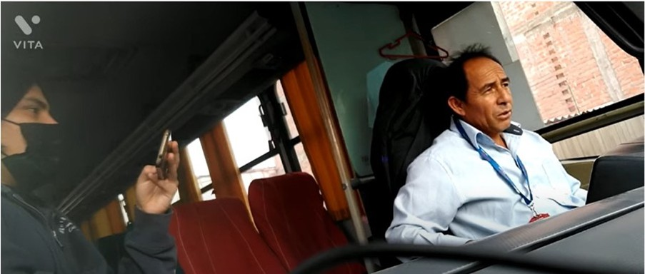
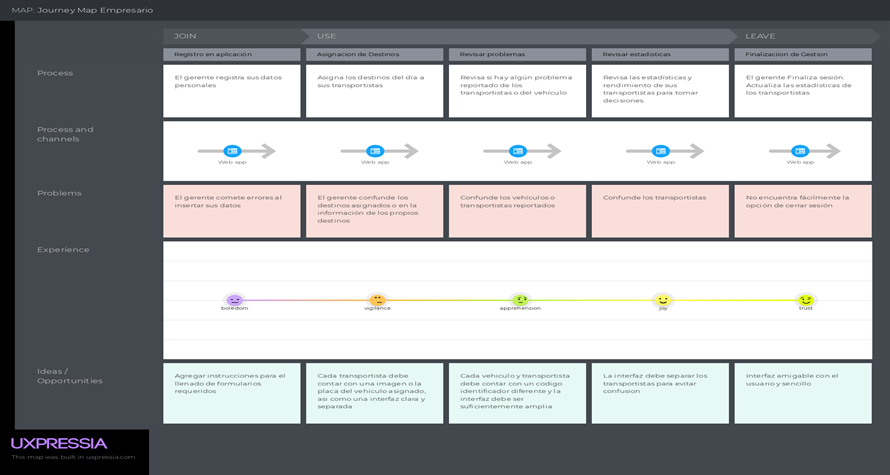

# Informe del Trabajo Final

**Universidad Peruana de Ciencias Aplicadas**

**Universidad Peruana de Ciencias Aplicadas**

**FACULTAD DE INGENIERÍA**

**2025-01**

**Diseños de Experimentos de Ingeniería de Software**

**Sección:** 4430

**Docente:** Juan Carlos Tinoco Licas

**Informe del Trabajo Final**

**Nombre del Startup:** NavCo

**Nombre del Producto:** Navex

**Integrantes:**

Pinto Fuentes Rivera, Alvaro Felipe - U202213384

Loarte Matos, Anthony Brahan - U20211D563

Bustamante Leveau, Cameron Charllotte - U20231A804

Armestar Heredia, Matias Gabriel - U20221A553

Chacon Martinez, Mauricio Sebastian - U202212911

 

**Registro de Versiones del Informe:**
 
En esta sección se resumen todas las modificaciones relevantes que sean realizadas sobre el informe durante el ciclo de vida del proyecto.
### Historial de versiones

| Versión | Fecha     | Autor(es)                                                                 | Descripción de modificación                                                             |
|:--------|:----------|:--------------------------------------------------------------------------|:-----------------------------------------------------------------------------------------|
| V0.1    | 23/04/25  | Pinto Fuentes Rivera, Alvaro Felipe - U202213384                         | Se describió la Startup y su producto creado.                                            |
| V0.2    | 23/04/25  | Loarte Matos, Anthony Brahan - U20211D563                                | Se describieron los antecedentes y problemática aplicando la técnica adecuada.          |
| V0.3    | 23/04/25  | Bustamante Leveau, Cameron Charllotte - U20231A804                       | Se añadió Lean UX Problem statement.                                                    |
| V0.4    | 23/04/25  | Chacon Martinez, Mauricio Sebastian - U202212911                         | Se añadió Lean UX Hipótesis.                                                            |
| V0.5    | 23/04/25  | Armestar Heredia, Matias Gabriel - U20221A553                            | Se agregó Lean UX Assumptions.                                                          |
| V0.6    | 24/04/25  | Armestar Heredia, Matias Gabriel - U20221A553                            | Lean UX canvas.                                                                         |
| V0.7    | 24/04/25  | Bustamante Leveau, Cameron Charllotte - U20231A804                       | Agregó Segmentos objetivos.                                                             |
| V0.8    | 24/04/25  | Loarte Matos, Anthony Brahan - U20211D563                                | Se añadió Análisis competitivo y estrategias frente a competidores.                     |
| V0.9    | 24/04/25  | Pinto Fuentes Rivera, Alvaro Felipe - U202213384                         | Se diseñó y realizó las entrevistas al segmento objetivo.                               |
| V0.10   | 24/04/25  | Chacon Martinez, Mauricio Sebastian - U202212911                         | Se hizo un análisis de las entrevistas realizadas.                                      |
| V0.11   | 24/04/25  | Bustamante Leveau, Cameron Charllotte - U20231A804                       | Se construyó un User Persona.                                                           |
| V0.12   | 24/04/25  | Armestar Heredia, Matias Gabriel - U20221A553                            | Se agregó el Task Matrix.                                                               |
| V0.13   | 25/04/25  | Pinto Fuentes Rivera, Alvaro Felipe - U202213384    Bustamante Leveau, Cameron Charllotte - U20231A804 | Se agregó el Journey Mapping.                                           |
| V0.14   | 25/04/25  | Chacon Martinez, Mauricio Sebastian - U202212911                         | Se agregó el mapa de empatía y el As-is Scenario Mapping.                               |
| V0.15   | 25/04/25  | Armestar Heredia, Matias Gabriel - U20221A553                            | Se agregó el To be Scenario Mapping.                                                    |
| V0.16   | 25/04/25  | Pinto Fuentes Rivera, Alvaro Felipe - U202213384                         | Se agregó los User Stories.                                                             |
| V0.17   | 25/04/25  | Chacon Martinez, Mauricio Sebastian - U202212911                         | Se agregó el Product Backlog.                                                           |
| V0.18   | 25/04/25  | Armestar Heredia, Matias Gabriel - U20221A553                            | Se agregaron wireframes y mockups.                                                      |
| V0.19   | 25/04/25  | Bustamante Leveau, Cameron Charllotte - U20231A804                       | Se agregaron wireframes y mockups.                                                      |
| V0.20   | 25/04/25  | Pinto Fuentes Rivera, Alvaro Felipe - U202213384                         | Se agregaron wireframes y mockups.                                                      |
| V1.0    | 25/04/25  | Chacon Martinez, Mauricio Sebastian - U202212911                         | Se agregó product implementation.                                                       |
| V1.1    | 25/04/25  | Bustamante Leveau, Cameron Charllotte - U20231A804                       | Se agregó product implementation.                                                       |
| V1.2    | 25/04/25  | Armestar Heredia, Matias Gabriel - U20221A553                            | Se agregó product implementation.                                                       |
| V1.3    | 25/04/25  | Pinto Fuentes Rivera, Alvaro Felipe - U202213384    Bustamante Leveau, Cameron Charllotte - U20231A804 | Se agregó product implementation.                                       |

 

**Project Report Collaboration Insights**
 
En esta sección el equipo indica el URL del repositorio para el Project Report en la organización de GitHub del equipo. Adicionalmente, para cada entrega explica cómo se han desarrollado las actividades de elaboración del informe y se presenta capturas en imagen de los analíticos de colaboración y commits en GitHub para el repositorio del informe, realizados por los miembros del equipo. Todos los miembros del equipo deben tener participación en la elaboración del informe. Esta sección debe ir expandiéndose con descripciones y evidencias en cada entrega. Lo descrito y evidenciado debe tener coherencia con el Registro de Versiones del Informe.

## ÍNDICE
# Índice

# **Tabla de Contenido**

- ## [Capítulo I: Introducción](#capítulo-i-introducción)
  - [1.1. Startup Profile](#11-startup-profile)
    - [1.1.1. Descripción de la Startup](#111-descripción-de-la-startup)
    - [1.1.2. Perfiles de integrantes del equipo](#112-perfiles-de-integrantes-del-equipo)
  - [1.2. Solution Profile](#12-solution-profile)
    - [1.2.1. Antecedentes y problemática](#121-antecedentes-y-problemática)
    - [1.2.2. Lean UX Process](#122-lean-ux-process)
      - [1.2.2.1. Lean UX Problem Statements](#1221-lean-ux-problem-statements)
      - [1.2.2.2. Lean UX Assumptions](#1222-lean-ux-assumptions)
      - [1.2.2.3. Lean UX Hypothesis Statements](#1223-lean-ux-hypothesis-statements)
      - [1.2.2.4. Lean UX Canvas](#1224-lean-ux-canvas)
  - [1.3. Segmento objetivo](#13-segmento-objetivo)

- ## [Capítulo II: Requirements Elicitation & Analysis](#capítulo-ii-requirements-elicitation--analysis)
  - [2.1. Competidores](#21-competidores)
    - [2.1.1. Análisis Competitivo](#211-análisis-competitivo)
    - [2.1.2. Estrategias y tácticas frente a competidores](#212-estrategias-y-tácticas-frente-a-competidores)
  - [2.2. Entrevistas](#22-entrevistas)
    - [2.2.1. Diseño de entrevistas](#221-diseño-de-entrevistas)
    - [2.2.2. Registro de entrevistas](#222-registro-de-entrevistas)
    - [2.2.3. Análisis de entrevistas](#223-análisis-de-entrevistas)
  - [2.3. Needfinding](#23-needfinding)
    - [2.3.1. User Personas](#231-user-personas)
    - [2.3.2. User Task Matrix](#232-user-task-matrix)
    - [2.3.3. User Journey Mapping](#233-user-journey-mapping)
    - [2.3.4. Empathy Mapping](#234-empathy-mapping)
    - [2.3.5. As-is Scenario Mapping](#235-as-is-scenario-mapping)
  - [2.4. Ubiquitous Language](#24-ubiquitous-language)

- ## [Capítulo III: Requirements Specification](#capítulo-iii-requirements-specification)
  - [3.2. User Stories](#32-user-stories)
  - [3.3. Product Backlog](#33-product-backlog)
  - [3.4. Impact Mapping](#34-impact-mapping)

- ## [Capítulo IV: Product Design](#capítulo-iv-product-design)
  - [4.1. Style Guidelines](#41-style-guidelines)
    - [4.1.1. General Style Guidelines](#411-general-style-guidelines)
    - [4.1.2. Web Style Guidelines](#412-web-style-guidelines)
    - [4.1.3. Mobile Style Guidelines](#413-mobile-style-guidelines)
      - [4.1.3.1. iOS Mobile Style Guidelines](#4131-ios-mobile-style-guidelines)
      - [4.1.3.2. Android Mobile Style Guidelines](#4132-android-mobile-style-guidelines)
  - [4.2. Information Architecture](#42-information-architecture)
    - [4.2.1. Organization Systems](#421-organization-systems)
    - [4.2.2. Labeling Systems](#422-labeling-systems)
    - [4.2.3. SEO Tags and Meta Tags](#423-seo-tags-and-meta-tags)
    - [4.2.4. Searching Systems](#424-searching-systems)
  - [4.3. Landing Page UI Design](#43-landing-page-ui-design)
    - [4.3.1. Landing Page Wireframe](#431-landing-page-wireframe)
    - [4.3.2. Landing Page Mock-up](#432-landing-page-mock-up)
  - [4.4. Mobile Applications UX/UI Design](#44-mobile-applications-uxui-design)
    - [4.4.1. Wireframes](#441-wireframes)
    - [4.4.2. Wireflow Diagrams](#442-wireflow-diagrams)
    - [4.4.3. Mock-ups](#443-mock-ups)
    - [4.4.4. User Flow Diagrams](#444-user-flow-diagrams)
  - [4.5. Mobile Applications Prototyping](#45-mobile-applications-prototyping)
    - [4.5.1. Android](#451-android)
    - [4.5.2. iOS](#452-ios)
  - [4.6. Web Applications UX/UI Design](#46-web-applications-uxui-design)
    - [5.1. Wireframes](#51-wireframes)
    - [5.1.1. Wireflow Diagrams](#511-wireflow-diagrams)
    - [5.1.2. Mock-ups](#512-mock-ups)
    - [5.1.3. User Flow Diagrams](#513-user-flow-diagrams)
  - [5.2. Web Applications Prototyping](#52-web-applications-prototyping)
  - [5.3. Domain-Driven Software Architecture](#53-domain-driven-software-architecture)
    - [5.3.1. Context Diagram](#531-context-diagram)
    - [5.3.2. Container Diagrams](#532-container-diagrams)
    - [5.3.3. Components Diagrams](#533-components-diagrams)
  - [5.4. Software Object-Oriented Design](#54-software-object-oriented-design)
    - [5.4.1. Class Diagrams](#541-class-diagrams)
    - [5.4.2. Class Dictionary](#542-class-dictionary)
  - [5.5. Database Design](#55-database-design)
    - [5.5.1. Relational/Non-Relational Database Diagram](#551-relationalnon-relational-database-diagram)

- ## [Capítulo V: Product Implementation](#capítulo-v-product-implementation)
  - [6.1. Software Configuration Management](#61-software-configuration-management)
    - [6.1.1. Environment Configuration](#611-environment-configuration)
    - [6.1.2. Source Code Management](#612-source-code-management)
    - [6.1.3. Style Guide & Conventions](#613-style-guide--conventions)
    - [6.1.4. Deployment Configuration](#614-deployment-configuration)
  - [6.2. Implementation & Deployment](#62-implementation--deployment)
    - [6.2.1. Sprint Backlogs](#621-sprint-backlogs)
    - [6.2.2. Landing Page Evidence](#622-landing-page-evidence)
    - [6.2.3. Web Application Evidence](#623-web-application-evidence)
    - [6.2.4. Mobile Application Evidence](#624-mobile-application-evidence)
    - [6.2.5. Backend Evidence](#625-backend-evidence)
    - [6.2.6. API Documentation](#626-api-documentation)
    - [6.2.7. Team Collaboration Insights](#627-team-collaboration-insights)
  - [6.3. Video About-the-Product](#63-video-about-the-product)

- ## [Conclusiones y Recomendaciones](#conclusiones-y-recomendaciones)
  - [Video About-the-Team](#video-about-the-team)
- ## [Bibliografía](#bibliografía)

## Student Outcome
El curso contribuye al cumplimiento del Student Outcome ABET: ABET – EAC - Student Outcome 4 Criterio: La capacidad de reconocer responsabilidades éticas y profesionales en
situaciones de ingeniería y hacer juicios informados, que deben considerar el
impacto de las soluciones de ingeniería en contextos globales, económicos,
ambientales y sociales.
| **Criterio Específico** | **Acciones Realizadas** | **Conclusiones** |
|-------------------------|--------------------------|------------------|
| **4.c.1** Reconoce responsabilidad ética y profesional en situaciones de ingeniería de software | **TB1 – Mauricio Sebastián Chacon Martinez:** En el desarrollo de NavEx, comprendí que como futuro ingeniero tengo la responsabilidad de tomar decisiones que no solo funcionen técnicamente, sino que también sean éticas. Me aseguré de cuidar los datos sensibles de los usuarios y pensé en cómo nuestra plataforma podía impactar positivamente en la organización del trabajo de los transportistas, sin perjudicar su bienestar. También reflexioné sobre cómo una mejor gestión de rutas puede reducir el impacto ambiental.  **TB1 – Alvaro Felipe Pinto Fuentes Rivera:**   **TB1 – Cameron Charllotte Bustamante Leveau:** Durante el desarrollo de NavEx, entendí que diseñar una buena experiencia de usuario implica también una responsabilidad ética. Al trabajar en la arquitectura de información y los lineamientos de estilo, busqué que nuestra plataforma fuera accesible y clara para todos los usuarios, evitando prácticas confusas o engañosas. A través del Empathy Mapping y el As-is Scenario Mapping, pude ponerme en el lugar de los transportistas, reconociendo la importancia de diseñar soluciones que respeten su tiempo, necesidades y bienestar. Entendí que, como futura ingeniera, mis decisiones deben priorizar siempre el respeto y la transparencia hacia los usuarios.  **TB1 – Armestar Heredia, Matias Gabriel:**   **TB1 – Anthony Brahan Loarte Matos:**  | Este proyecto nos permitió comprender que ser ingenieros no se trata solo de programar o diseñar soluciones funcionales, sino de pensar de manera crítica y responsable sobre cómo nuestras decisiones afectan a las personas, a las organizaciones y al entorno. Reconocer nuestras responsabilidades éticas y profesionales ha sido un aprendizaje clave que nos llevamos para nuestra futura vida profesional. |
| **4.c.2** Emite juicios informados considerando el impacto de las soluciones de ingeniería de software en contextos globales, económicos, ambientales y sociales | **TB1 – Mauricio Sebastián Chacon Martinez:** Al trabajar en NavEx, aprendí a tomar decisiones considerando cómo nuestra solución afecta más allá del entorno técnico. Pensé en el impacto económico que tiene para las empresas al optimizar costos, en el impacto social al facilitar el trabajo de los transportistas, y en el impacto ambiental al reducir rutas innecesarias. Cada decisión técnica fue tomada con una visión más amplia, evaluando sus consecuencias en distintos contextos.  **TB1 – Alvaro Felipe Pinto Fuentes Rivera:**   **TB1 – Cameron Charllotte Bustamante Leveau:** En NavEx, aplicando los principios de Ubiquitous Language y una correcta arquitectura de información, busqué que nuestra solución fuera intuitiva y eficiente, pensando en su impacto social y económico. Comprendí que una plataforma fácil de usar reduce errores operativos, optimiza tiempos de trabajo y contribuye a mejorar la calidad de vida de los transportistas. Además, desde la perspectiva ambiental, un sistema que permite gestionar rutas de manera más eficiente también ayuda a disminuir emisiones contaminantes. Cada decisión de diseño la tomé considerando no solo la usabilidad, sino también su efecto en un contexto más amplio.  **TB1 – Armestar Heredia, Matias Gabriel:**   **TB1 – Anthony Brahan Loarte Matos:**  | Aprendimos a tomar decisiones informadas considerando no solo la funcionalidad del software, sino también su impacto en diferentes dimensiones: económica, social, ambiental y global.

# 1. Capítulo I: Introducción
## 1.1 Startup Profile
## 1.1.1 Descripción de la Startup
NavEx es una solución digital integral desarrollada para enfrentar los retos de gestión en el ámbito del transporte empresarial. Su propósito es atender tanto a empresas que requieren administrar operaciones logísticas, como a transportistas que desean optimizar y organizar su trabajo de forma eficaz. La plataforma ofrece múltiples herramientas para la administración de flotas, tales como análisis de rendimiento, notificación de infracciones, registro de incidentes, monitoreo de entregas exitosas y gestión de destinos asignados. Todas estas funcionalidades están disponibles mediante planes de suscripción flexibles, ajustables a las características y dimensiones de cada organización. NavEx representa una solución centralizada y de fácil uso, que permite a sus usuarios supervisar y mejorar sus procesos de transporte, convirtiéndose en un recurso esencial para aumentar la eficiencia y el rendimiento operativo dentro del sector.

- Misión: En NavEx, nuestra misión es ofrecer una plataforma tecnológica integral que facilite y perfeccione la gestión del transporte empresarial. Nos esforzamos por brindar herramientas innovadoras y servicios de alta calidad que ayuden a nuestros clientes a optimizar su desempeño, reducir costos y asegurar una experiencia satisfactoria para sus propios usuarios.

- Visión: Queremos consolidarnos como la principal plataforma de gestión de transporte a nivel empresarial, destacando como un socio estratégico y confiable. Nuestra visión es revolucionar la industria logística mediante soluciones tecnológicas de vanguardia que fomenten el crecimiento, la sostenibilidad y el éxito de las empresas en un entorno global cada vez más exigente.

## 1.1.2 Perfiles de integrantes del equipo

| **Integrante**                             | Mauricio Sebastián Chacon Martinez  |
|--------------------------------------------|------------------------------------|
| **Código del Estudiante**                  | U202212911                         |
| **Carrera**                                | Ingeniería de Software             |
|                                            |                                    |
| Soy estudiante de 7mo ciclo de la carrera de Ingeniería de Software. Me apasiona la programación y tengo conocimientos en HTML, CSS, Javascript, y frameworks web como Vue, Angular y Astro. Me considero una persona responsable y comprometida con mi aprendizaje y desarrollo profesional. |  |
---

| **Integrante**                             | Alvaro Felipe Pinto Fuentes Rivera |
|--------------------------------------------|------------------------------------|
| **Código del Estudiante**                  | U202213384                         |
| **Carrera**                                | Ingeniería de Software             |
|                                            |                                    |
| Soy estudiante del séptimo ciclo de Ingeniería de Software con un buen manejo de lenguajes como C#, C++, HTML, CSS, Java y SQL. Me considero una persona proactiva y comprometida, capaz de adaptarse al trabajo en equipo y de aportar soluciones efectivas durante el desarrollo de proyectos. También me gusta contribuir con ideas que fortalezcan el enfoque técnico y creativo del grupo. |  |
---

| **Integrante**                             | Anthony Brahan Loarte Matos        |
|--------------------------------------------|------------------------------------|
| **Código del Estudiante**                  | U20211D563                         |
| **Carrera**                                | _( )_                              |
|                                            |                                    |
| _Sin descripción registrada._             |           |
---

| **Integrante**                             | Cameron Charllotte Bustamante Leveau |
|--------------------------------------------|--------------------------------------|
| **Código del Estudiante**                  | U20231A804                          |
| **Carrera**                                | Ingeniería de Software               |
|                                            |                                      |
| Me considero una persona creativa y versátil, con gusto por el trabajo en equipo y una fuerte motivación por aprender constantemente. Disfruto participar en proyectos diversos. Tengo conocimientos en C++, Python y otros lenguajes de programación, lo que me permite adaptarme con facilidad a distintos entornos tecnológicos. |  |
---

| **Integrante**                             | Armestar Heredia, Matias Gabriel    |
|--------------------------------------------|-------------------------------------|
| **Código del Estudiante**                  | U20221A553                          |
| **Carrera**                                | Ingeniería de Software              |
|                                            |                                     |
| _Sin descripción registrada._             |  |

## 1.2 Solution profile
## 1.2.1 Antecedentes y problematica

En el sector del transporte empresarial, la gestión eficiente de las flotas es un desafío constante. Los empresarios y transportistas se enfrentan a dificultades como la planificación de rutas, el seguimiento de vehículos, la programación de viajes y la gestión de costos. Aunque existen soluciones de software para la gestión de flotas, muchas de ellas no son lo suficientemente flexibles o integrales para satisfacer todas las necesidades de los usuarios. 
La falta de una solución de gestión de flotas integral y fácil de usar está afectando la eficiencia operativa, aumentando los costos y reduciendo la satisfacción del cliente en el sector del transporte empresarial. Utilizaremos la técnica de las 5W y 2Hs para desglosar el problema y entenderlo en detalle. Esta técnica nos proporcionará respuestas claras sobre qué, cuándo, dónde, quién, por qué, cómo y cuánto, lo que nos ayudará a encontrar soluciones efectivas.

**Tabla 1**

*Presentación del modelo de las preguntas 5 Ws y 2 Hs con la que se analizaron los antecedentes y la problemática que abarca nuestro proyecto*

| **Las 5Ws y 2Hs** | **Pregunta**                                | **Descripción**                                                                                                                                         |
|--------------------|---------------------------------------------|---------------------------------------------------------------------------------------------------------------------------------------------------------|
| **What?**         | ¿Cuál es el problema?                      | Existe una falta de eficiencia en la gestión de flotas de transporte empresarial, lo que resulta en costos elevados y disminución de la satisfacción del cliente. |
| **When?**         | ¿Cuándo estamos viendo el problema?         | Este problema se observa principalmente durante las horas pico de operación, cuando la demanda de transporte es alta y la planificación de rutas se vuelve más compleja. |
| **Where?**        | ¿Dónde estamos viendo los problemas?        | El problema se presenta en todo el proceso de gestión de flotas, desde la planificación de rutas hasta el seguimiento de vehículos y la programación de viajes. |
| **Who?**          | ¿A quién le sucede?                        | Este problema afecta tanto a los empresarios que necesitan administrar sistemas de transporte como a los transportistas que buscan una organización eficiente en sus operaciones. |
| **Why?**          | ¿Por qué sucede el problema?               | El problema surge debido a la falta de una solución de gestión de flotas integral y fácil de usar que pueda satisfacer todas las necesidades de los usuarios. |
| **How?**          | ¿Cómo se diferencia el problema del estado normal (óptimo)? | El problema se manifiesta en forma de costos operativos elevados, retrasos en las entregas, insatisfacción del cliente y dificultades en la planificación de rutas. |
| **How Much?**     | ¿Cuánto es el impacto financiero?           | El problema podría estar costando a las empresas miles de dólares cada mes en costos operativos adicionales y pérdida de clientes debido a la insatisfacción. |

## 1.2.2 Lean UX Process

El Lean UX es un proceso de diseño centrado en el usuario que adopta las metodologías ágiles para reducir los residuos y crear productos centrados en los usuarios. El Lean UX busca maximizar la eficiencia en el desarrollo de productos mediante la colaboración, minimizando el uso de tiempo, esfuerzo y recursos innecesarios. Esto se logra mediante la experimentación temprana y la construcción rápida, con el objetivo de obtener retroalimentación rápida del usuario. (Rámirez, 2023).

## 1.2.2.1 Lean UX Problem Statements

A pesar de la existencia de diversas soluciones de software para la gestión de flotas, muchas de ellas no logran cubrir completamente las necesidades reales de los usuarios en el sector del transporte empresarial. Actualmente, empresarios y transportistas se enfrentan a una brecha importante en el mercado: la ausencia de una plataforma de gestión de flotas que sea integral, flexible y verdaderamente fácil de usar. Esta carencia impacta negativamente en la eficiencia operativa, eleva los costos y disminuye la satisfacción del cliente.

Uno de los principales desafíos que enfrentan las empresas de transporte es la dificultad para organizar y controlar una gran cantidad de vehículos, lo que puede derivar en confusiones logísticas y errores en el transporte de cargas. Esto nos lleva a cuestionarnos:
¿Cómo podemos desarrollar una solución intuitiva y accesible que guíe a los usuarios paso a paso, facilitando la gestión detallada de cada unidad de la flota?

Además, la falta de actualizaciones periódicas en muchas aplicaciones del sector provoca una pérdida de interés por parte de los usuarios, quienes terminan migrando hacia otras alternativas más actualizadas.

¿Cómo podemos mantener una constancia en el desarrollo y despliegue de nuevas funcionalidades que mejoren continuamente la experiencia del usuario y fomenten su fidelidad?
 
Por otro lado, el uso de soluciones digitales de gestión de flotas aún no está generalizado en todos los segmentos del transporte de carga. Esta falta de adopción puede generar escepticismo e incluso resistencia al cambio.

¿Cómo podemos despertar el interés y generar confianza en nuestra solución, promoviendo su adopción en sectores que aún no han incorporado estas tecnologías, con el objetivo de incrementar nuestra base de usuarios?

## 1.2.2.2 Lean UX Assumptions
1. Contexto: Los empresarios y transportistas a menudo utilizan múltiples herramientas y procesos manuales para gestionar sus flotas debido a la falta de soluciones integradas. 
Assumption: Dado que muchos usuarios enfrentan dificultades con la gestión descentralizada de flotas, creemos que existe una necesidad de una plataforma integral que unifique todas las funciones de gestión de flotas en una sola solución.

2. Contexto: Los empresarios a menudo luchan por controlar los costos operativos y reducir los gastos innecesarios en la gestión de flotas. Assumption: Dado que el control de costos es una prioridad para los usuarios, creemos que una solución que ofrezca herramientas de análisis de costos y optimización de recursos será altamente valorada.

3. Contexto: La falta de informes detallados y análisis de datos dificulta la identificación de áreas de mejora en la gestión de flotas. Assumption: Dado que los usuarios necesitan información precisa y detallada sobre el rendimiento de sus flotas, creemos que una solución que proporcione informes personalizables y análisis avanzados será fundamental para la toma de decisiones informadas.

4. Contexto: La seguridad y privacidad de los datos son preocupaciones críticas para los usuarios al adoptar nuevas soluciones tecnológicas. Assumption: Dado que los usuarios son sensibles a la seguridad de los datos, creemos que una solución que garantice la protección y privacidad de la información del cliente será fundamental para generar confianza y adopción.

5. Contexto: Los usuarios a menudo enfrentan dificultades para adaptarse a nuevas tecnologías y plataformas debido a la complejidad y la curva de aprendizaje. Assumption: Dado que la facilidad de uso es crucial para la adopción de la plataforma, creemos que una solución intuitiva y fácil de usar será fundamental para la aceptación y satisfacción del usuario.

## 1.2.2.3 Lean UX Hypothesis Statements
1. **Creemos que** al ofrecer una plataforma integral que unifique todas las funciones de gestión de flotas en una sola solución, aumentaremos la eficiencia y la productividad de los empresarios y transportistas al reducir la complejidad y la fragmentación en sus procesos de gestión, sabremos que estamos en lo correcto cuando veamos un aumento en el número de usuarios que reportan una reducción significativa en el tiempo dedicado a la gestión de flotas, así como una disminución en los errores asociados con la gestión descentralizada. 

2. **Creemos que** el control de costos es una prioridad para los usuarios, por lo tanto, cuando proporcionemos herramientas de análisis de costos y optimización de recursos, aumentaremos la capacidad de los empresarios para controlar los gastos operativos y reducir los costos innecesarios en la gestión de flotas sabremos que estamos en lo correcto cuando observemos un aumento en la adopción de las herramientas de análisis de costos, así como una disminución en los costos operativos reportados por los usuarios. 

3. **Creemos que** al proporcionar informes personalizables y análisis avanzados sobre el rendimiento de las flotas, permitiremos a los usuarios identificar áreas de mejora y tomar decisiones informadas para optimizar sus operaciones y aumentar la eficiencia de sus flotas sabremos que estamos en lo correcto cuando recibamos comentarios positivos de los usuarios sobre la utilidad de los informes y análisis proporcionados, así como cuando observemos una mejora en los indicadores clave de rendimiento de las flotas gestionadas a través de nuestra plataforma. 

4. **Creemos que** al garantizar la protección y privacidad de la información del cliente en nuestra plataforma, generaremos confianza en los usuarios y promoveremos una mayor adopción de nuestra solución de gestión de flotas sabremos que estamos en lo correcto cuando observemos un aumento en la confianza y la satisfacción del usuario, así como una disminución en las preocupaciones relacionadas con la seguridad de los datos expresadas por los usuarios. 

5. **Creemos que** al ofrecer una solución intuitiva y fácil de usar, aumentaremos la aceptación y satisfacción del usuario al reducir la curva de aprendizaje y facilitar la adaptación a nuevas tecnologías y plataformas en el sector del transporte empresarial sabremos que estamos en lo correcto cuando observemos una disminución en las tasas de abandono del producto, así como un aumento en la tasa de retención de usuarios y una mayor participación en 
las funciones ofrecidas por la plataforma.

## 1.2.2.4 Lean UX Canvas
**Tabla 2**

*Modelo del Lean UX Canvas diseñado para el proyecto de NavEx*

| **1) Business problem**                                                                                     | **5) Solution ideas**                                                                                     | **2) Business outcomes**                                                                                  |
|-------------------------------------------------------------------------------------------------------------|-----------------------------------------------------------------------------------------------------------|-----------------------------------------------------------------------------------------------------------|
| En el sector del transporte empresarial, la gestión eficiente de las flotas es un desafío constante. Los empresarios y transportistas a menudo utilizan múltiples herramientas y procesos manuales para gestionar sus flotas debido a la falta de soluciones integradas. Esta gestión descentralizada de flotas puede llevar a ineficiencias operativas, aumento de costos y reducción de la satisfacción del cliente. Además, los cambios en el mercado y el comportamiento del cliente están aumentando la demanda de soluciones de gestión de flotas más eficientes y fáciles de usar. Los empresarios y transportistas necesitan una solución que les permita tener una visibilidad completa de sus flotas, controlar los costos operativos, identificar áreas de mejora y adaptarse rápidamente a los cambios. Sin embargo, muchas de las soluciones de software existentes para la gestión de flotas no satisfacen todas estas necesidades. Pueden ser difíciles de usar, no ofrecer todas las funciones necesarias o no ser lo suficientemente flexibles para adaptarse a las necesidades específicas de cada empresa. Por lo tanto, el problema empresarial que NavEx está tratando de resolver es la falta de una solución de gestión de flotas integral, flexible y fácil de usar que pueda satisfacer todas las necesidades de los empresarios y transportistas en el sector del transporte empresarial. NavEx aspira a llenar esta brecha en el mercado proporcionando una solución tecnológica que simplifique y optimice la gestión de flotas de transporte. | Algunas soluciones que podrían resolver el problema comercial y satisfacer las necesidades de los clientes al mismo tiempo:   1. **Interfaz de Usuario Intuitiva**:  Desarrollar una interfaz de usuario que sea fácil de navegar y usar. Esto puede incluir tutoriales interactivos, asistencia en la aplicación y una interfaz de usuario limpia y minimalista.   2. **Funcionalidades Avanzadas de Gestión de Flotas**: Implementar una variedad de características para la gestión de flotas, como estadísticas de rendimiento, reporte de infracciones, registro de incidencias, seguimiento de envíos exitosos y control de sitios enviados. Estas características deben ser personalizables para adaptarse a las necesidades específicas de cada empresa.    3. **Informes Personalizables**: Proporcionar informes detallados y personalizables que ayuden a los empresarios a tomar decisiones informadas. Esto puede incluir análisis de costos, informes de rendimiento y análisis de tendencias.   4. **Seguridad de Datos**: Garantizar la seguridad y privacidad de los datos de los usuarios. Esto puede incluir el uso de encriptación de datos, autenticación de dos factores y políticas de privacidad claras.   5. **Soporte al Cliente**: Ofrecer soporte al cliente de alta calidad para ayudar a los usuarios a resolver problemas y responder a preguntas. Esto puede incluir chat en vivo, soporte por correo electrónico y una base de conocimientos en línea.   6. **Integraciones con Otras Plataformas**: Permitir la integración con otras plataformas y herramientas que los usuarios ya estén utilizando. Esto puede facilitar la adopción de la plataforma y mejorar la eficiencia operativa.   7. **Planes de Suscripción Flexibles**: Ofrecer planes de suscripción flexibles que se adapten a las necesidades y al tamaño de cada empresa. Esto puede incluir planes gratuitos, planes premium y opciones de personalización. | Para NavEx, los resultados comerciales pueden ser medidos a través de varias métricas clave que indican el éxito del cliente y la resolución del problema comercial.   1. **Eficiencia Operativa**: Medir la mejora en la eficiencia operativa de las flotas de transporte de los usuarios. Esto podría ser a través de la reducción en el tiempo de inactividad de los vehículos, el aumento en el número de envíos exitosos, o la disminución en el tiempo necesario para planificar y programar los viajes.   2. **Reducción de Costos**: Medir la reducción en los costos operativos de los usuarios. Esto podría ser a través de la disminución en los costos de combustible, mantenimiento, o infracciones.   3. **Satisfacción del Cliente**: Medir la satisfacción del cliente a través de encuestas y comentarios. Esto podría incluir la facilidad de uso de la plataforma, la utilidad de las características ofrecidas, y la calidad del soporte al cliente.   4. **Retención de Usuarios**: Medir la tasa de retención de usuarios. Un aumento en la retención de usuarios indica que los usuarios encuentran valor en la plataforma y continúan utilizándose a largo plazo.   5. **Crecimiento de Usuarios**: Medir el crecimiento en el número de usuarios o empresas que utilizan la plataforma. Esto indica que la plataforma está ganando tracción en el mercado.   6. **Uso de la Plataforma**: Medir el uso de las diferentes características de la plataforma. Esto puede ayudar a identificar qué características son más valiosas para los usuarios y dónde se pueden hacer mejoras. |

| **3) User and customers**                                                                                   | **4) User benefits**                                                                                      |                                                                                                           |
|-------------------------------------------------------------------------------------------------------------|-----------------------------------------------------------------------------------------------------------|-----------------------------------------------------------------------------------------------------------|
| Para NavEx, los usuarios y clientes pueden ser categorizados de la siguiente manera:  1. **Empresarios**: Son los que probablemente comprarán el servicio. Son los propietarios de empresas que necesitan administrar sistemas de transporte. Estos usuarios estarán interesados en las capacidades de gestión de flotas de la plataforma, así como en las estadísticas de rendimiento y los informes detallados que pueden ayudarles a tomar decisiones informadas.   2. **Transportistas**: Son los usuarios finales que utilizan la plataforma a diario. Estos usuarios buscan eficiencia y organización en sus operaciones de transporte. Necesitarán funciones como el registro de incidencias, el seguimiento de envíos exitosos y el control de sitios enviados.   3. **Administradores de Sistemas**: Son los que configuran y mantienen la plataforma. Estos usuarios necesitarán acceso a funciones de administración y configuración para asegurarse de que la plataforma se adapta a las necesidades específicas de su empresa.   4. **Analistas de Datos**: Estos usuarios podrían estar interesados en los datos recopilados por la plataforma para realizar análisis y generar informes que ayuden a la empresa a tomar decisiones estratégicas. | 1. **Eficiencia Operativa Mejorada**: Al utilizar NavEx, los usuarios pueden mejorar la eficiencia de sus operaciones de transporte. Esto se traduce en un mejor uso de los recursos, menos tiempo perdido en tareas administrativas y más tiempo para centrarse en el crecimiento del negocio.   2. **Reducción de Costos**: NavEx puede ayudar a los usuarios a reducir costos al proporcionar herramientas para optimizar el uso de la flota, reducir el tiempo de inactividad y minimizar las infracciones.   3. **Toma de Decisiones Informada**: Con los informes detallados y las estadísticas de rendimiento que ofrece NavEx, los usuarios pueden tomar decisiones más informadas sobre la gestión de su flota.   4. **Satisfacción del Cliente Mejorada** : Al mejorar la eficiencia y la fiabilidad de las operaciones de transporte, los usuarios pueden mejorar la satisfacción de sus propios clientes.|

| **6) Hypotheses**                                                                                           | **7) What’s the most important thing we need to learn first?**                                            | **8) What’s the least amount of work we need to do to learn the next most important thing?**              |
|-------------------------------------------------------------------------------------------------------------|-----------------------------------------------------------------------------------------------------------|-----------------------------------------------------------------------------------------------------------|
| 1. Creemos que la eficiencia operativa se logrará si los empresarios obtienen una mejor visibilidad y control de sus flotas con la funcionalidad avanzada de gestión de flotas.    2. Creemos que la reducción de costos se logrará si los transportistas obtienen una mayor eficiencia en sus operaciones de transporte con el registro de incidencias y el seguimiento de envíos exitosos.    3. Creemos que la satisfacción del cliente se logrará si los desarrolladores obtienen una plataforma adaptable a las necesidades específicas de su empresa con las funciones de administración y configuración    4. Creemos que la retención de usuarios se logrará si los desarrolladores, analistas de datos obtienen informes detallados y personalizables con la función de informes personalizables.    5. Creemos que el crecimiento de usuarios se logrará si los empresarios obtienen una plataforma fácil de adoptar y que mejora la eficiencia operativa con la integración con otras plataformas.    6. Creemos que el uso de la plataforma se incrementará si los usuarios obtienen un soporte al cliente de alta calidad con el soporte al cliente ofrecido.    7. Creemos que la mejora en la eficiencia operativa se conseguirá si los empresarios obtienen una toma de decisiones más informada con la función de informes detallados y estadísticas de rendimiento ofrecidos en los planes de suscripción flexibles de NavEx | En las etapas iniciales de nuestro proyecto, es crucial identificar los supuestos más riesgosos en nuestras hipótesis. Esto nos permite enfocarnos en mitigar esos riesgos y validar nuestras ideas de manera efectiva.    1. El supuesto más riesgoso asociado con la Hipótesis 1 es que los empresarios realmente necesitan y valoran una funcionalidad avanzada de gestión de flotas.    2. El supuesto más riesgoso asociado con la Hipótesis 2 es que los transportistas encuentren útil y mejoren su eficiencia con el registro de incidencias y el seguimiento de envíos exitosos.    3. El supuesto más riesgoso asociado con la Hipótesis 3 es que los administradores de sistemas necesiten y utilicen funciones de administración y configuración.    4. El supuesto más riesgoso asociado con la Hipótesis 4 es que los analistas de datos necesiten y utilicen informes detallados y personalizables.    5. El supuesto más riesgoso asociado con la Hipótesis 5 es que los empresarios estén dispuestos a adoptar una nueva plataforma y que ésta mejore su eficiencia operativa.    6. El supuesto más riesgoso asociado con la Hipótesis 6 es que los usuarios valoren y utilicen el soporte al cliente ofrecido    En esta etapa inicial del proyecto, nuestro enfoque se centra en identificar y mitigar los riesgos para valorar en lugar de en la viabilidad absoluta de cada hipótesis. Esto nos permite abordar los desafíos más críticos y validar nuestras ideas de manera efectiva.El supuesto más riesgoso en este momento se relaciona con la Hipótesis 1, donde la necesidad y valoración real de una funcionalidad avanzada de gestión de flotas por parte de los empresarios podrían determinar el éxito o el fracaso de nuestra solución. Si este supuesto resulta ser incorrecto, nuestra idea principal de proporcionar una solución de gestión de flotas integral, flexible y fácil de usar podría fracasar. | Para validar nuestra suposición más arriesgada, que los empresarios realmente necesitan y valoran una funcionalidad avanzada de gestión de flotas, proponemos los siguientes experimentos con la menor cantidad de trabajo posible:    1. Entrevistas con empresarios: Realizaremos entrevistas con un pequeño grupo de empresarios en el sector del transporte. Durante estas entrevistas, preguntaremos sobre sus necesidades actuales, los desafíos que enfrentan con las soluciones existentes y qué características valorarán en una nueva solución. Esto nos permitirá validar si realmente necesitan y valorarán una funcionalidad avanzada de gestión de flotas.    2. Encuestas: Diseñaremos una encuesta corta y la enviaremos a un grupo más amplio de empresarios. La encuesta incluirá preguntas sobre sus necesidades actuales, los desafíos que enfrentan y qué características les gustaría ver en una nueva solución de gestión de flotas.    3. Producto Mínimo Viable (MVP): Desarrollaremos un MVP que incluya la funcionalidad avanzada de gestión de flotas y lo proporcionaremos a un pequeño grupo de empresarios para que lo prueben. Recogeremos sus comentarios y observaremos cómo utilizan el MVP para validar nuestra suposición.    El objetivo de estos experimentos es aprender lo más rápido posible con la menor cantidad de trabajo. Por lo tanto, hemos diseñado nuestros experimentos de manera que podamos obtener resultados rápidamente y hacer ajustes según sea necesario." |

## 1.3 Segmento objetivo

Según Kingsnorth (2019), un segmento objetivo se refiere a un grupo específico de consumidores dentro de un mercado más amplio que comparten características o necesidades similares. Estas características pueden incluir variables demográficas, geográficas, psicográficas y conductuales.
El proceso de segmentación de mercados implica identificar y dividir el mercado total en segmentos más pequeños y homogéneos con el objetivo de diseñar estrategias de marketing más efectivas y dirigidas. Al enfocarse en segmentos específicos, las empresas pueden adaptar sus productos, mensajes y canales de marketing para satisfacer las necesidades y preferencias de esos grupos de consumidores de manera más precisa.
En el caso de las secciones y la problemática que abarca nuestro proyecto, después de un proceso de análisis, hemos conseguido determinar los siguientes segmentos objetivos:

1. Empresarios: Este segmento está compuesto por propietarios de empresas que gestionan flotas de transporte en diversos sectores como logística, transporte de mercancías y transporte de pasajeros. Los empresarios, cuyas edades suelen oscilar entre los 30 y los 60 años, pueden ser tanto hombres como mujeres y suelen tener un alto nivel educativo, con títulos en administración de empresas o campos relacionados. En este contexto, según un informe de Infobae, una empresa de transporte en Perú reveló que el 70% de sus ingresos corresponde a empresas y atienden alrededor de 2 mil empresas mensualmente. Además, un estudio de flotas y movilidad reveló que más de un tercio de las empresas peruanas ya han adaptado o están considerando adaptar su política de movilidad debido al teletrabajo.

2. Transportistas:  En el próspero mercado de transporte de carga por carretera en Perú, estimado en 8,31 mil millones de dólares en 2024 y proyectado a crecer a 10,75 mil millones en 2029 con una tasa anual del 6,5%, se encuentra un segmento fundamental: los transportistas. Este grupo, que incluye a conductores y operadores de vehículos de flota, se enfrenta a la necesidad de gestionar eficientemente sus tareas diarias de transporte. Las características demográficas de los transportistas varían ampliamente, con edades que van desde los 20 hasta los 60 años, predominantemente hombres aunque con una creciente presencia femenina. Además, todos ellos requieren licencias de conducir válidas y experiencia en la conducción de vehículos de flota.
# Capítulo II: Requirements Elicitation & Analysis

## Competidores

> **TRACK-POD:** Track-POD se destaca como un software de entrega
> avanzado que ofrece una experiencia todo en uno para el monitoreo
> eficiente del rendimiento del conductor y la confirmación de entrega
> en tiempo real. Su aplicación electrónica de prueba de entrega y su
> solución móvil proporcionan a los usuarios las herramientas necesarias
> para optimizar sus operaciones de entrega y mejorar la satisfacción
> del cliente. Con un enfoque en la simplicidad y la eficacia, Track-POD
> es una opción sólida para aquellos que buscan mejorar la eficiencia de
> su cadena de suministro.
>
> **ONFLEET:** Onfleet ofrece un moderno software de gestión de entregas
> diseñado para simplificar y optimizar las operaciones de mensajería
> local. Su plataforma incluye intuitivas aplicaciones de teléfonos
> inteligentes para conductores, un panel web en tiempo real para
> distribuidores y notificaciones automáticas por mensajes SMS para
> mantener a los clientes informados sobre el estado de sus entregas.
> Con características centradas en la eficiencia y el análisis, Onfleet
> es una opción confiable para aquellos que buscan una solución completa
> y fácil de usar para la gestión de entregas.
>
> **DISPATCH SCIENCE:** Dispatch Science ofrece un sistema de gestión de
> entregas integral diseñado para satisfacer las necesidades de
> expedidores, transportistas y empresas de mensajería. Su plataforma
> administra, optimiza y automatiza una amplia gama de procesos,
> incluidos precios, facturación, distribución, enrutamiento y
> seguimiento en tiempo real. Con un enfoque en la personalización y la
> escalabilidad, Dispatch Science es una opción ideal para aquellos que
> buscan una solución flexible y adaptable para la gestión de entregas
> en constante evolución.

### Análisis Competitivo

##### **Tabla 3**

##### *Análisis Competitivo organizado para todos los competidores potenciales de NavEx*

|  Competitive Analysis Landscape |  |  |  |  |  |  |
| :---- | :---- | :---- | :---- | :---- | :---- | :---- |
| ¿Por qué llevar a cabo este análisis? |  | Este análisis tiene como finalidad examinar en profundidad las funcionalidades clave y las propuestas de valor de otras compañías que buscan resolver la misma necesidad que nosotros. De esta manera, podremos identificar una estrategia sólida y coherente que nos permita destacar frente a la competencia.  |  |  |  |  |
|  |  |  |  |  |  |  |
| Empresas |  |  | NavEx | Onfleet | Track-POD | Dispatch Science |
| Perfil | Overview |  | NavEx es una plataforma desarrollada con el propósito de facilitar la gestión eficiente de flotas de transporte en distintos ámbitos empresariales. Ofrece un conjunto completo de funciones y recursos enfocados en mejorar tanto la operatividad como el desempeño de las flotas. | Onfleet es una reconocida plataforma SaaS especializada en la gestión de entregas de última milla. Brinda una solución completa que permite a las empresas administrar de manera eficiente sus operaciones logísticas y el manejo de sus flotas. | Track-POD es una herramienta digital enfocada en la optimización de rutas y trayectos de vehículos, creada para mejorar el rendimiento logístico y aumentar la eficiencia en los procesos de entrega. | Dispatch Science es una solución integral orientada a la administración de entregas, pensada para empresas de transporte y cargadores. Su objetivo es facilitar y automatizar procesos como la gestión de pedidos, la logística de transporte y el monitoreo en tiempo real. |
|  | Ventaja competitiva  |  | Se distingue por proporcionar información detallada sobre la flota, lo que facilita un monitoreo preciso del rendimiento a lo largo del tiempo. | Brinda a los mensajeros una gestión y análisis efectivos de sus entregas locales, lo que mejora la eficiencia operativa y optimiza la satisfacción del cliente. | Ofrece una herramienta avanzada para la planificación de rutas que facilita la organización de múltiples entregas y proporciona una aplicación de prueba de entrega electrónica para los conductores. | Ofrece una solución integral para la gestión de entregas, abarcando desde la planificación hasta el seguimiento en tiempo real, lo que mejora la eficiencia operativa y ayuda a reducir los costos. |
| Perfil de Marketing | Mercado objetivo |  | Está orientada tanto a conductores como a compañías que administran flotas de transporte en diversos sectores industriales y comerciales. | Está centrada en conductores y empresas dedicadas a gestionar entregas en la etapa final del proceso logístico, conocida como última milla. | Está enfocado en conductores y empresas que necesitan una planificación óptima de rutas y gestión logística para sus operaciones de transporte. | Está orientado a cargadores y transportistas que requieren una solución integral para la administración de entregas y operaciones logísticas. |
|  | Estrategias de marketing |  | Las estrategias de marketing de NavEx abarcan la creación de contenido relevante, presencia en su sitio web y en redes sociales, promociones, y publicidad segmentada, todo con el objetivo de incrementar la visibilidad y fomentar la adopción de la plataforma. | Emplea estrategias de marketing de contenido, publicidad digital y redes sociales para promover su plataforma y atraer nuevos clientes. | Se da a conocer mediante marketing de contenido, presencia en línea y publicidad digital, con el objetivo de atraer a conductores y empresas interesados en mejorar su logística de entregas. | Utiliza marketing de contenido, publicidad digital y relaciones públicas para conectar con cargadores y transportistas, y mostrarles el valor de su plataforma. |
| Perfil de Producto | Productos & Servicios |  | NavEx proporciona una plataforma completa para la administración de flotas, que integra funciones como monitoreo en tiempo real, reportes detallados y herramientas analíticas para mejorar el control y la eficiencia operativa. | Ofrece una sólida aplicación móvil junto con una plataforma web para gestionar entregas, incorporando funcionalidades de seguimiento, alertas en tiempo real y análisis de datos. | Proporciona una app móvil enfocada en la optimización de rutas y entregas, complementada con una plataforma web orientada a la administración logística. | Cuenta con una aplicación móvil y una plataforma web completa para la gestión de entregas, que abarca planificación de rutas, monitoreo en tiempo real y elaboración de reportes. |
|  | Precios y Costos |  | Ofrece varios planes de suscripción, cada uno con funcionalidades específicas según el nivel de pago seleccionado. | Presenta una estructura de precios clara, que incluye una opción gratuita y una versión premium destinada a empresas que requieren funciones más avanzadas. | Ofrece una versión gratuita con funcionalidades esenciales, así como una suscripción premium que brinda acceso a herramientas adicionales y soporte prioritario. | Incluye una versión gratuita con funciones limitadas y una suscripción premium que proporciona acceso completo a todas las características, además de soporte especializado. |
|  | Canales de distribución  |  | Está disponible para los usuarios a través de su página web oficial. | Se distribuye a través de plataformas de aplicaciones móviles y su sitio web, asegurando que los usuarios puedan acceder desde diversos dispositivos. | Está accesible en plataformas de aplicaciones móviles y en la web, lo que facilita el acceso de los usuarios desde cualquier dispositivo. | Se distribuye mediante plataformas de aplicaciones móviles y en la web, garantizando una amplia disponibilidad para los usuarios. |
|  Análisis SWOT | Fortalezas |  | \- Actualizaciones periódicas para optimizar la funcionalidad y reforzar la seguridad. | \- Ofrece precios y características de manera clara y accesible. \- Facilita la interacción entre conductores y despachadores. | \- Mejora la eficiencia de las rutas a diario, optimizando cada vez más el proceso. \- Plataforma web y aplicación móvil intuitivas y fáciles de usar. | \- Ofrece la capacidad de gestionar todos los aspectos. \- Proporciona un valor único y excepcional. |
|  | Debilidades |  | \- Falta de algunas funcionalidades específicas que podrían ser esenciales para ciertos usuarios.  | \- La optimización de rutas está enfocada solo en entregas de última milla, lo que no la hace adecuada para todos los tipos de transporte. | \- Restricciones en la cantidad de rutas que se pueden agregar al mismo tiempo. \- Algunas funciones pueden resultar complicadas de usar para usuarios sin experiencia técnica. | \- Algunas funciones pueden ser complejas para usuarios sin conocimientos técnicos. \- La amplia variedad de características puede resultar abrumadora para los usuarios novatos. |
|  | Oportunidades |  | \- Expansión hacia otras áreas de gestión empresarial, como la administración de activos y la logística de almacenes. | \- Optimización constante de la experiencia del usuario y las funcionalidades de la plataforma. | \- Expansión del mercado de entregas y logística impulsada por el crecimiento del comercio electrónico y la creciente demanda de servicios de entrega rápida. | \- Posibilidad de expandirse a nuevos mercados verticales y regionales, aprovechando la flexibilidad de la plataforma. |
|  | Amenazas |  | \- Competencia de empresas consolidadas con una mayor participación de mercado y más recursos. \- Podría demandar actualizaciones constantes para seguir siendo competitivos en el mercado cambiante. | \- Competencia de plataformas de gestión de entregas tanto consolidadas como emergentes. \- Existen otras aplicaciones con precios más bajos. | \- Posible competencia de soluciones logísticas integradas proporcionadas por grandes corporaciones tecnológicas. | \- Riesgo de que competidores más pequeños y ágiles imiten el modelo de negocio. \- Posible alteración de las regulaciones que afectan el transporte y las entregas. |

### 

### Estrategias y tácticas frente a competidores

> Se presenta un estudio del entorno competitivo en el que opera NavEx,
> acompañado de una serie de estrategias iniciales orientadas a
> enfrentar a los competidores, aumentar el valor entregado a los
> usuarios y posicionar a la startup para lograr un crecimiento
> sostenible. A través de un enfoque en la diferenciación, la capacidad
> de adaptación, la expansión del mercado y la colaboración con aliados
> estratégicos, NavEx busca consolidarse como una solución líder e
> innovadora en el ámbito de la gestión de flotas y operaciones
> logísticas.

1.  **Diferenciación del Producto**

- Estrategia: Resaltar los elementos únicos de NavEx que la hacen
  destacar frente a otras plataformas, como el análisis detallado de
  flotas y las mejoras continuas.

- Tácticas: Ejecutar campañas de marketing enfocadas en los atributos
  exclusivos de la plataforma. Realizar presentaciones en vivo y ofrecer
  periodos de prueba sin costo para demostrar su valor agregado a
  potenciales clientes.

2.  **Mejora Constante y Adaptabilidad**

- Estrategia: Permanecer flexible ante los cambios del mercado mediante
  actualizaciones regulares y mejoras continuas.

- Tácticas: Implementar un sistema de retroalimentación directa con los
  usuarios para recoger sugerencias y opiniones. Utilizar analíticas de
  uso para detectar áreas de mejora y aplicar cambios rápidamente.

3.  **Expansión de Mercado**

- Estrategia: Ampliar la base de usuarios y aumentar la participación en
  el mercado a través de una mayor presencia y alcance estratégico.

- Tácticas: Diseñar campañas de marketing digital segmentadas para
  industrias específicas como la logística, transporte corporativo o
  distribución. Participar en ferias, congresos y colaborar con
  organizaciones del sector para aumentar el reconocimiento de marca.

4.  **Alianzas Estratégicas y Colaboración**

- Estrategia: Forjar asociaciones con empresas que ofrezcan servicios
  complementarios para expandir las capacidades y el alcance de NavEx.

- Tácticas: Buscar integraciones con proveedores tecnológicos y de
  servicios logísticos para desarrollar soluciones combinadas.
  Aprovechar oportunidades de co-marketing y co-branding que permitan
  acceder a nuevas audiencias mediante alianzas.

5.  **Optimización de Costos y Valor Percibido**

- Estrategia: Presentar una propuesta de valor sólida y competitiva que
  combine tecnología avanzada con precios atractivos.

- Tácticas: Realizar análisis comparativos con otras plataformas del
  mercado para asegurar que NavEx represente una mejor relación
  calidad-precio. Implementar modelos de precios flexibles y promociones
  que incentiven tanto la adquisición como la fidelización de clientes.

6.  **Innovación y nuevas funcionalidades**

- Estrategia: Mantener un enfoque en la innovación continua mediante el
  desarrollo de nuevas características y servicios que respondan a las
  necesidades del mercado.

- Tácticas: Investigar tendencias tecnológicas y nuevas demandas en la
  industria del transporte. Priorizar el desarrollo de funciones que
  ofrezcan ventajas competitivas y respondan a necesidades emergentes de
  los usuarios.

## Entrevistas

Según lo aclarado por Folgueiras (2016), la entrevista es un tipo y/o
modelo de técnica de recopilación de información, con la cual se busca
obtener datos de forma oral y personalizada sobreopiniones,
acontecimientos, ideas, experiencias y cualquier otro tipo de
información relevante para un objetivo especial, el cual normalmente es
para un caso de estudio o para el proyecto de solución de alguna
problemática presentada.. Tanto si se elabora dentro de una
investigación, como si se diseña al margen de un estudio sistematizado,
tiene unas mismas características y pasos a seguir para mantener la base
primordial de obtención de información relevante y utilizable para el
trabajo.

### Diseño de entrevistas

> Con el objetivo de recopilar y organizar adecuadamente la información
> recabada en las entrevistas, se decidió establecer un banco de
> preguntas diseñado específicamente para nuestro segmento de mercado
> previamente identificado. Este conjunto de preguntas está orientado a
> obtener datos concretos y relevantes, adaptándose tanto al perfil del
> entrevistado como a la problemática investigada, con miras a
> desarrollar una posible solución a través de nuestro producto.

**EMPRESARIOS**

1\. ¿Cuál es su nombre y qué edad tiene? ¿En qué distrito vive?

2\. ¿Cuál es su estado civil? Indicar si tienes hijos.

3\. ¿Cuánto tiempo de experiencia tiene en esa función?

> 4\. ¿Cómo realiza actualmente la gestión de vehículos, conductores y
> rutas en su empresa?
>
> 5\. ¿Qué herramientas o sistemas utiliza actualmente para administrar
> su flota de transporte?

6\. ¿Qué funcionalidades le gustaría ver en una herramienta de gestión
de flotas ideal?

> 7\. ¿Cómo cree que una solución tecnológica podría mejorar la
> eficiencia operativa de su empresa en términos de gestión de flotas?
>
> 8\. ¿Cuáles son sus preocupaciones principales en cuanto a seguridad y
> cumplimiento normativo en la gestión de flotas?
>
> 9\. ¿Qué impacto cree que tendría una solución de gestión de flotas
> eficiente en la rentabilidad de su empresa?
>
> 10\. ¿Qué tan dispuesto estaría a adoptar una nueva solución
> tecnológica para la gestión de flotas en su empresa?
>
> 11\. ¿Qué características específicas le resultarían más útiles para
> mejorar la gestión de su flota?
>
> 12\. ¿Cómo evaluaría el éxito de una solución de gestión de flotas una
> vez implementada en su empresa?
>
> 13\. ¿Tiene alguna experiencia previa con soluciones similares? ¿Qué
> lecciones ha aprendido de esa experiencia?

**TRANSPORTISTAS**

1\. ¿Cuál es su nombre y qué edad tiene? ¿En qué distrito vive?

2\. ¿Cuál es su estado civil? Indicar si tienes hijos.

3\. ¿Para qué empresa trabaja? ¿Y a qué se dedica dentro de la empresa?

4\. ¿Cuánto tiempo de experiencia tiene en esa función?

5\. ¿Qué requisitos pide la empresa para que puedan trabajar en ella?

6\. ¿Cuántos viajes al día realiza un vehículo de la empresa?

7\. ¿Cómo recibe el conductor la información de los viajes que tiene que
realizar?

> 8\. ¿Cómo se comunica la empresa con los conductores de los buses en
> cualquier momento?

9\. ¿Cómo gestionan los viajes y las rutas que deben realizar los buses?

> 10\. ¿Cómo gestiona el mantenimiento de los buses y con qué frecuencia
> se hace dicho proceso?

11\. ¿Qué aspectos cambiaria de la empresa donde trabaja para hacerla
más eficiente?

> 12\. ¿Esta usted familiarizado con el manejo de aplicaciones móviles
> para el rubro transporte?
>
> 13\. ¿Estaría dispuesto a usar alternativas tecnológicas como
> aplicaciones que le faciliten la gestión de su trabajo?

14\. ¿Qué dispositivos tecnológicos usan en su vida diaria y para el
trabajo?

> 15\. ¿Qué medios (tv, redes sociales, chats con amigos) utiliza para
> enterarse de nuevas noticias (problemas sociales, oportunidades de
> negocio, paro de transporte, etc.)?
>
> 16\. A lo largo de su experiencia, ¿Cuáles son los principales
> problemas o dificultades que encuentra en el país que perjudican su
> trabajo?

17\. Finalmente, ¿En qué planes o proyectos personales se visualiza en
el futuro?

### Registro de entrevistas 

**Segmento 1: EMPRESARIOS**

**Entrevista N°1:**

**Figura 1.**

> *Imagen de presentación de la primera entrevista realizada.*

*Nota.* La persona que se encuentra a la derecha es el entrevistador,
integrante del grupo, mientras que la persona a la izquierda es el
entrevistado.

> **Datos principales:**
>
> \- **Nombre completo del entrevistado:** Marco Tarazona
>
> \- **Edad:** 57 años
>
> \- **Distrito:** Puente Piedra
>
> \- Link:
> [[https://upcedupe-my.sharepoint.com/entrevistas]{.underline}](https://upcedupe-my.sharepoint.com/entrevistas)
>
> \- Inicio de la entrevista: 0:00
>
> \- **Duración:** 2:10 min

**- RESUMEN:**

Marco tiene más de 15 años de experiencia gestionando flotas de
transporte. Trabaja como gestor de camiones para trasladar materiales de
construcción. Normalmente para la asignación de entregas a cada
conductor lo hace verbalmente o en otros casos mediante
whatsapp.Actualmente en su trabajo no cuentan con una herramienta o
sistema que les facilite la gestión de transportes. Considera que le
sería muy útil una aplicación para el asignamiento de cada
transportista. Por último, nos comentó que estaría dispuesto a la
implementación de la app en la empresa.

**Entrevista N°2:**

**Figura 2.**

> *Imagen de presentación de la segunda entrevista realizada.*

> *Nota.* La persona que se muestra en la grabación es el entrevistado.
>
> **Datos principales:**
>
> \- **Nombre completo delentrevistado:** Gilver Flores
>
> \- **Edad:** 48 años
>
> \- **Distrito:** Villa El Salvador
>
> \- **Link:**
> [https://upcedupe-my.sharepoint.com/entrevistas]{.underline}
>
> \- **Inicio de la entrevista:** 2:10 min
>
> \- **Duración:** 7:53 min

\- RESUMEN:

Gilver Flores es un empresario con una década de experiencia en la
gestión de flotas de transporte, valora el rastreo por GPS para la
seguridad y la puntualidad, y utiliza WhatsApp para coordinar con los
conductores. Está abierto a adoptar nuevas tecnologías para mejorar la
competitividad y la responsabilidad de su empresa, y ve el valor en
características como la optimización de la asignación de rutas. Reconoce
la importancia de un mantenimiento de vehículos efectivo y cree que la
optimización de las rutas y los sistemas de seguimiento de mantenimiento
virtual pueden mejorar las operaciones. Evalúa el éxito de las
soluciones de gestión de flotas en función de cómo mejoran la
puntualidad y las prácticas de mantenimiento preventivo.

**Entrevista N°3:**

**Figura 3.**

*Imagen de presentación de la primera entrevista realizada.*

*Nota.* La persona que se muestra en la imagen es el entrevistado.

> **Datos principales:**
>
> \- **Nombre completo del entrevistado:** Abraham Quenta
>
> \- **Edad:** 28 años
>
> \- **Provincia:** Tacna
>
> \- **Link:**
> [[https://upcedupe-my.sharepoint.com/entrevistas]{.underline}](https://upcedupe-my.sharepoint.com/entrevistas)
>
> \- **Inicio de la entrevista:** 7:53 min
>
> \- **Duración:** 16:21 min

\- RESUMEN:

Abraham Quenta es un emprendedor en el sector del transporte con 6 años
de experiencia,gestiona su empresa utilizando Excel para tareas como la
emisión de billetes y WhatsApp para la comunicación interna. Desea un
sistema donde los pasajeros pueden reservar asientos y donde pueda
rastrear la ubicación de los conductores durante los viajes. Considera
que la implementación de una aplicación con estas características es
crucial para la eficiencia operativa. Enfatiza la importancia de cumplir
con las regulaciones de entidades como la ATU y el Ministerio de
Transporte. Finalmente, destaca la importancia de tener información
actualizada sobre el mantenimiento del vehículo integrada en un sistema
de seguimiento.

**Segmento 2: TRANSPORTISTAS**

**Entrevista N°1:**

**Figura 4.**

*Imagen de presentación de la primera entrevista realizada a nuestro
segundo segmento objetivo.*

> **Datos principales:**
>
> \- **Nombre completo del entrevistado:** Ricardo Chate Flores
>
> \- **Edad:** 45 años
>
> \- **Distrito:** Cercado de Lima
>
> \- **Link:**
> [[https://upcedupe-my.sharepoint.com/entrevistas]{.underline}](https://upcedupe-my.sharepoint.com/entrevistas)
>
> \- **Inicio de entrevista:** 16:21 min
>
> \- **Duración:** 26:26 min

\- RESUMEN:

Ricardo es un experimentado conductor de autobuses, con más de 25 años
de experiencia en el transporte personal y turismo. Trabaja para la
empresa Arellano, que presta servicios a empresas como Gloria, Textil
Creditex y Faber-Castell. Además de su función como conductor, Gilbert
también desempeña el rol de supervisor de la flota de buses. En cuanto a
la comunicación, utiliza celulares con WhatsApp para coordinar con los
conductores y la empresa. La gestión de viajes y rutas se realiza a
través de una secretaria que asigna las rutas a cada conductor. En
cuanto a tecnología, utiliza una aplicación móvil para conocer la ruta
asignada. Gilbert está dispuesto a adoptar nuevastecnologías para
mejorar la eficiencia en su trabajo, destacando la importancia de
mejorar la comunicación en la empresa y la implementación de tecnología
para agilizar procesos

**Entrevista N°2:**

**Figura 5.**

*Imagen de presentación de la segunda entrevista realizada a nuestro
segundo segmento objetivo.*

> **Datos principales:**
>
> \- **Nombre completo del entrevistado:** Víctor Cuba Bautista
>
> \- **Edad:** 42 años
>
> \- **Distrito:** Villa el Salvador
>
> \- **Link:**
> [https://upcedupe-my.sharepoint.com/entrevistas]{.underline}
>
> \- **Inicio de entrevista:** 26:26 min
>
> \- **Duración:** 31:37 min

\- RESUMEN:

Víctor Fogotista, con 25 años de experiencia como conductor, trabaja
para una empresa que ofrece servicio trupal. Utiliza WhatsApp como
principal medio de comunicación con la empresa y los conductores. Los
viajes son programados por la empresa, y el mantenimiento de los buses
se basa en un calendario establecido por kilometraje. Víctor está
familiarizado con aplicaciones como Uber y Waze, y utiliza GPS y
WhatsApp en su vida diaria para el trabajo. Sugiere mejorarla
comunicación y la calidad del servicio en la empresa.

**Entrevista N°3:**

**Figura 6.**

*Imagen de presentación de la tercera entrevista realizada a nuestro
segundo segmento objetivo.*

> **Datos principales:**
>
> \- **Nombre completo del entrevistado:** Martín Merino Ávila
>
> \- **Edad:** 50 años
>
> \- **Distrito:** Villa el Salvador
>
> \- **Link:**
> [[https://upcedupe-my.sharepoint.com/entrevistas]{.underline}](https://upcedupe-my.sharepoint.com/entrevistas)
>
> \- **Inicio de entrevista:** 31:37 min
>
> \- **Duración:** 39:39 min

\- RESUMEN:

Martín Merino Ávila, con 35 años de experiencia como conductor, trabaja
para Serellano de Personal de SACA, una empresa dedicada al transporte
de personal. Utiliza WhatsApp y GPS como principales herramientas de
comunicación y control en su trabajo. Los viajes y rutas son programados
por la empresa, y el mantenimiento de los buses se basa en un calendario
establecido por kilometraje. Martín está dispuesto a utilizar nuevas
tecnologías para mejorar la gestión de su trabajo, y sugiere mejorar la
flota de buses y el trato al cliente en la empresa. Tiene planes futuros
de tener su propio auto y posiblemente una flotilla de taxis.

### Análisis de entrevistas

> **EMPRESARIOS**
>
> Para el análisis de las entrevistas, se pueden identificar varias
> características comunes entre los entrevistados que son relevantes
> para la construcción de los arquetipos de usuarios en el segmento
> objetivo de empresarios. A continuación, se presenta un análisis de
> estas características:
>
> ● Todos los entrevistados llevan una media de aproximadamente de 25
> años de experiencia.
>
> ● Los entrevistados tienen empresas de transporte que ofrecen
> servicios tanto para el transporte personal como para el turismo.
>
> ● El WhatsApp es el medio de comunicación más utilizado por los
> empresarios para comunicar a sus trabajadores las rutas y envíos que
> fueron asignados.
>
> ● Algunos empresarios también utilizan aplicaciones móviles para
> confirmar que llegó la entrega.
>
> ● El mantenimiento de los buses se realiza de manera preventiva,
> basado en un calendario establecido por kilometraje.
>
> ● La empresa gestiona el mantenimiento en coordinación con los
> conductores y el personal de mecánica.
>
> ● Los empresarios están dispuestos a utilizar aplicaciones móviles
> para mejorar la gestión de su trabajo.
>
> ● Los empresarios están en busca de mejoras en la comunicación dentro
> de la empresa.
>
> ● La edad de los entrevistados se encuentra en el rango de 30 a 55
> años.

**TRANSPORTISTAS**

Para el análisis de las entrevistas, se pueden identificar varias
características comunes entre los entrevistados que son relevantes para
la construcción de los arquetipos de usuarios en el segmento objetivo de
transportistas. A continuación, se presenta un análisis de estas
características:

> ● Todos los entrevistados tienen una amplia experiencia como
> conductores de autobuses, con una media de aproximadamente 28.3 años
> de experiencia.
>
> ● Los entrevistados trabajan para empresas de transporte que ofrecen
> servicios tanto para el transporte personal como para el turismo.
>
> ● Además de conducir, algunos entrevistados también tienen roles de
> supervisión dentro de la empresa.
>
> ● El WhatsApp es el medio de comunicación más utilizado por los
> conductores para comunicarse tanto entre ellos como con la empresa.
>
> ● Algunos conductores también utilizan aplicaciones móviles para
> controlar el tiempo de salida y la ubicación de los buses en tiempo
> real.
>
> ● Los viajes y las rutas son asignados por la empresa, generalmente a
> través de un programador o una secretaria.
>
> ● Las rutas pueden ser fijas o rotativas, dependiendo de la empresa y
> las necesidades del servicio.
>
> ● El mantenimiento de los buses se realiza de manera preventiva,
> basado en un calendario establecido por kilometraje.
>
> ● La empresa gestiona el mantenimiento en coordinación con los
> conductores y el personal de mecánica.
>
> ● Los conductores están familiarizados y dispuestos a utilizar
> aplicaciones móviles para mejorar la gestión de su trabajo.
>
> ● Los conductores sugieren mejoras en la comunicación dentro de la
> empresa y en la calidad del servicio prestado, destacando la
> importancia del trato al cliente.
>
> ● La implementación de nuevas tecnologías, como aplicaciones que
> faciliten la gestión de rutas y mantenimiento, es vista como una
> oportunidad para mejorar la eficiencia en el trabajo.
>
> ● La edad de los entrevistados se encuentra en el rango de 40 a 50
> años.
>
> ● La mayoría de nuestros entrevistados reside en el distrito de Villa
> el Salvador, como también en el Cercado de Lima. Además, el 100% de
> nuestros entrevistados vive con su familia.

- El 100% de entrevistados cree que la comunicación debe ser mejorada
  dentro de la empresa y la consideran vital para un buen desempeño.

## Needfinding

Según lo señalado por Patnaik (2017), la metodología del Needfinding se
concentra principalmente en la acción de descubrir las necesidades,
tanto explícitas como implícitas, de los segmentos objetivos
seleccionados con el fin de poder crear soluciones adecuadas. Para esto,
es necesario ver más allá de todo lo tangible y concentrarse en ideas
más abstractas y conceptos más amigables para todos los usuarios.

Para reconocer las demandas de los usuarios, empleamos diversos
enfoques. Primero, segmentamos a los usuarios en diferentes categorías y
generamos perfiles que representan a nuestro público objetivo, mediante
la creación de User Persona. Esto nos permitió agrupar las necesidades
específicas de cada tipo de usuario. Luego, para corroborar y validar
las necesidades que habíamos determinado previamente para cada categoría
de usuario, realizamos entrevistas con representantes de los dos
conjuntos de usuarios que habíamos identificado utilizando los User
Persona.

### User Personas

> Los User Personas son representaciones ficticias pero realistas de los
> usuarios ideales. Se basan en datos reales y ayudan a entender mejor
> quiénes son los usuarios, qué necesitan, qué los motiva y qué desafíos
> enfrentan. Sirven para tomar decisiones centradas en el usuario
> durante el diseño del producto.
>
> La creación de User Personas es un paso clave para entender a fondo
> las necesidades, retos y expectativas de los distintos segmentos de
> usuarios dentro del contexto de nuestra aplicación NavEx, orientada a
> ofrecer soluciones tecnológicas para academias deportivas. Estas
> personas funcionan como representaciones ficticias, pero basadas en
> datos reales, que reflejan el perfil de los usuarios con los que
> interactuamos en el entorno empresarial.
>
> En nuestro caso, estas fichas se construyeron a partir de entrevistas
> realizadas a conductores de autobuses, permitiendo detectar patrones
> comunes y aspectos relevantes para desarrollar arquetipos sólidos. La
> representación visual y detallada de cada persona facilita al equipo
> de diseño y desarrollo generar empatía y tomar decisiones centradas en
> el usuario.

###### **Figura 1**

###### User Persona del primer segmento objetivo: Conductor

> 

###### **Figura 2**

###### User Persona del segundo segmento objetivo: Empresarios

##### {width="5.893994969378828in" height="8.52969050743657in"}

### User Task Matrix

> Una Matriz de Tareas de Usuario es una herramienta utilizada en el
> diseño de experiencia de usuario (UX) y desarrollo de productos para
> organizar y visualizar las tareas que los usuarios realizan en un
> sistema o plataforma. Esta matriz ayuda a identificar las diversas
> acciones que los usuarios llevarán a cabo en el producto, así como la
> frecuencia y la importancia de cada una de estas tareas (Patnaik,
> 2017).

###### **Figura 3**

###### User Task Matrix para el primer y segundo User Persona

> 
> **Diferencias:** Los empresarios se
> centran más en tareas relacionadas con la gestión general de la flota,
> como monitoreo del rendimiento, registro de incidencias y
> planificación de rutas.
>
> Los transportistas, por otro lado, se centran en tareas más
> operativas, como seguimiento de envíos, mantenimiento de vehículos y
> comunicación con conductores.
>
> **Coincidencias:** Ambos grupos reconocen la importancia de la
> seguridad en la gestión de flotas, lo que se refleja en tareas como el
> registro de incidencias y la implementación de medidas de seguridad.
> Tanto los empresarios como los transportistas valoran la eficiencia
> operativa, como se evidencia en tareas como el monitoreo del
> rendimiento y la planificación de rutas.

### User Journey Mapping

> El User Journey Mapping consiste en trazar el recorrido completo que
> hace un usuario para alcanzar un objetivo, desde el primer contacto
> hasta la solución del problema. Ayuda a identificar puntos de dolor,
> momentos clave y oportunidades de mejora en la experiencia del usuario

##### 

###### **Figura 4**

###### User Journey Mapping del primer User Persona

> 

###### **Figura 5**

###### User Journey Mapping del segundo User Persona

### Empathy Mapping

> Empathy Mapping es una técnica visual que permite ponerse en el lugar
> del usuario. Se explora qué piensa, siente, dice y hace el usuario
> para comprender mejor su perspectiva. Ayuda a desarrollar soluciones
> más humanas y empáticas.

###### **Figura 6**

###### User Empathy Mapping del primer User Persona

###### **Figura 7**

###### User Empathy Mapping del segundo User Persona

### As-is Scenario Mapping

> El As-is Scenario Mapping es una técnica empleada en el diseño de
> experiencia de usuario (UX) y en el análisis de procesos con el
> objetivo de comprender y representar gráficamente cómo funciona un
> sistema, producto o servicio en su estado actual. El término
> *\"as-is\"* hace referencia precisamente a esto: a documentar el
> proceso tal como ocurre en la realidad, sin proponer aún cambios o
> mejoras. Este tipo de mapeo consiste en la elaboración de un esquema
> visual que detalla todas las etapas, acciones, decisiones e
> interacciones que componen un proceso. A través de este enfoque, se
> identifican los puntos de contacto entre el usuario y el sistema, lo
> que permite obtener una visión clara de la experiencia actual y
> detectar posibles ineficiencias, cuellos de botella o áreas de mejora.

##### 

###### **Figura 8**

###### As-is Scenario Mapping del primer User Persona

###### **Figura 9**

###### As-is Scenario Mapping del segundo User Persona

## Ubiquitous Language

> Ubiquitous Language (o *Lenguaje Ubicuo*) es un conjunto de términos
> compartidos y consistentes que se utilizan en todo un equipo de
> desarrollo (diseñadores, programadores, analistas, stakeholders, etc.)
> para describir el dominio del problema. Es muy común en metodologías
> como *Domain-Driven Design (DDD)*.
<table border="1" cellpadding="8" cellspacing="0">
  <thead>
    <tr>
      <th>Término</th>
      <th>Definición</th>
    </tr>
  </thead>
  <tbody>
    <tr>
      <td>Administrador</td>
      <td>Persona encargada de gestionar la academia y supervisar la flota de transporte.</td>
    </tr>
    <tr>
      <td>Transportista</td>
      <td>Encargado de operar los vehículos, realizar rutas y reportar incidencias.</td>
    </tr>
    <tr>
      <td>Conductor</td>
      <td>Persona que conduce los autobuses y está en contacto directo con los atletas.</td>
    </tr>
    <tr>
      <td>Unidad (Vehículo)</td>
      <td>Autobús o transporte asignado para movilizar a los atletas.</td>
    </tr>
    <tr>
      <td>Ruta</td>
      <td>Trayecto predefinido que sigue una unidad para trasladar usuarios.</td>
    </tr>
    <tr>
      <td>Incidencia</td>
      <td>Evento anómalo o problema reportado durante el servicio de transporte.</td>
    </tr>
    <tr>
      <td>Planificación de Rutas</td>
      <td>Proceso de definir y optimizar los recorridos de los vehículos.</td>
    </tr>
    <tr>
      <td>Panel de Control</td>
      <td>Interfaz dentro de la aplicación que muestra métricas y estado de la flota.</td>
    </tr>
  </tbody>
</table>
