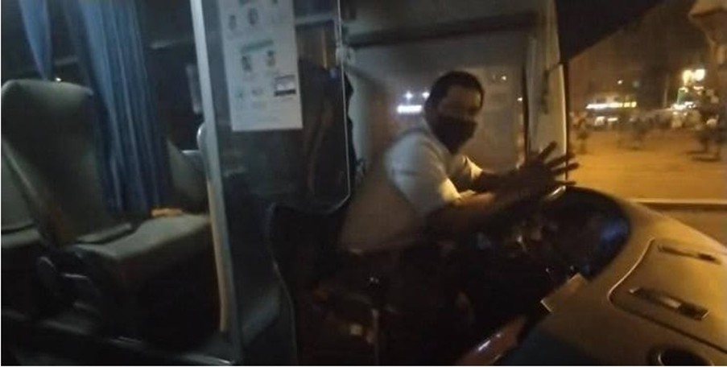

# Capítulo II: Requirements Elicitation & Analysis

## Competidores

> **TRACK-POD:** Track-POD se destaca como un software de entrega
> avanzado que ofrece una experiencia todo en uno para el monitoreo
> eficiente del rendimiento del conductor y la confirmación de entrega
> en tiempo real. Su aplicación electrónica de prueba de entrega y su
> solución móvil proporcionan a los usuarios las herramientas necesarias
> para optimizar sus operaciones de entrega y mejorar la satisfacción
> del cliente. Con un enfoque en la simplicidad y la eficacia, Track-POD
> es una opción sólida para aquellos que buscan mejorar la eficiencia de
> su cadena de suministro.
>
> **ONFLEET:** Onfleet ofrece un moderno software de gestión de entregas
> diseñado para simplificar y optimizar las operaciones de mensajería
> local. Su plataforma incluye intuitivas aplicaciones de teléfonos
> inteligentes para conductores, un panel web en tiempo real para
> distribuidores y notificaciones automáticas por mensajes SMS para
> mantener a los clientes informados sobre el estado de sus entregas.
> Con características centradas en la eficiencia y el análisis, Onfleet
> es una opción confiable para aquellos que buscan una solución completa
> y fácil de usar para la gestión de entregas.
>
> **DISPATCH SCIENCE:** Dispatch Science ofrece un sistema de gestión de
> entregas integral diseñado para satisfacer las necesidades de
> expedidores, transportistas y empresas de mensajería. Su plataforma
> administra, optimiza y automatiza una amplia gama de procesos,
> incluidos precios, facturación, distribución, enrutamiento y
> seguimiento en tiempo real. Con un enfoque en la personalización y la
> escalabilidad, Dispatch Science es una opción ideal para aquellos que
> buscan una solución flexible y adaptable para la gestión de entregas
> en constante evolución.

### Análisis Competitivo

##### **Tabla 3**

##### *Análisis Competitivo organizado para todos los competidores potenciales de NavEx*

|  Competitive Analysis Landscape |  |  |  |  |  |  |
| :---- | :---- | :---- | :---- | :---- | :---- | :---- |
| ¿Por qué llevar a cabo este análisis? |  | Este análisis tiene como finalidad examinar en profundidad las funcionalidades clave y las propuestas de valor de otras compañías que buscan resolver la misma necesidad que nosotros. De esta manera, podremos identificar una estrategia sólida y coherente que nos permita destacar frente a la competencia.  |  |  |  |  |
|  |  |  |  |  |  |  |
| Empresas |  |  | NavEx | Onfleet | Track-POD | Dispatch Science |
| Perfil | Overview |  | NavEx es una plataforma desarrollada con el propósito de facilitar la gestión eficiente de flotas de transporte en distintos ámbitos empresariales. Ofrece un conjunto completo de funciones y recursos enfocados en mejorar tanto la operatividad como el desempeño de las flotas. | Onfleet es una reconocida plataforma SaaS especializada en la gestión de entregas de última milla. Brinda una solución completa que permite a las empresas administrar de manera eficiente sus operaciones logísticas y el manejo de sus flotas. | Track-POD es una herramienta digital enfocada en la optimización de rutas y trayectos de vehículos, creada para mejorar el rendimiento logístico y aumentar la eficiencia en los procesos de entrega. | Dispatch Science es una solución integral orientada a la administración de entregas, pensada para empresas de transporte y cargadores. Su objetivo es facilitar y automatizar procesos como la gestión de pedidos, la logística de transporte y el monitoreo en tiempo real. |
|  | Ventaja competitiva  |  | Se distingue por proporcionar información detallada sobre la flota, lo que facilita un monitoreo preciso del rendimiento a lo largo del tiempo. | Brinda a los mensajeros una gestión y análisis efectivos de sus entregas locales, lo que mejora la eficiencia operativa y optimiza la satisfacción del cliente. | Ofrece una herramienta avanzada para la planificación de rutas que facilita la organización de múltiples entregas y proporciona una aplicación de prueba de entrega electrónica para los conductores. | Ofrece una solución integral para la gestión de entregas, abarcando desde la planificación hasta el seguimiento en tiempo real, lo que mejora la eficiencia operativa y ayuda a reducir los costos. |
| Perfil de Marketing | Mercado objetivo |  | Está orientada tanto a conductores como a compañías que administran flotas de transporte en diversos sectores industriales y comerciales. | Está centrada en conductores y empresas dedicadas a gestionar entregas en la etapa final del proceso logístico, conocida como última milla. | Está enfocado en conductores y empresas que necesitan una planificación óptima de rutas y gestión logística para sus operaciones de transporte. | Está orientado a cargadores y transportistas que requieren una solución integral para la administración de entregas y operaciones logísticas. |
|  | Estrategias de marketing |  | Las estrategias de marketing de NavEx abarcan la creación de contenido relevante, presencia en su sitio web y en redes sociales, promociones, y publicidad segmentada, todo con el objetivo de incrementar la visibilidad y fomentar la adopción de la plataforma. | Emplea estrategias de marketing de contenido, publicidad digital y redes sociales para promover su plataforma y atraer nuevos clientes. | Se da a conocer mediante marketing de contenido, presencia en línea y publicidad digital, con el objetivo de atraer a conductores y empresas interesados en mejorar su logística de entregas. | Utiliza marketing de contenido, publicidad digital y relaciones públicas para conectar con cargadores y transportistas, y mostrarles el valor de su plataforma. |
| Perfil de Producto | Productos & Servicios |  | NavEx proporciona una plataforma completa para la administración de flotas, que integra funciones como monitoreo en tiempo real, reportes detallados y herramientas analíticas para mejorar el control y la eficiencia operativa. | Ofrece una sólida aplicación móvil junto con una plataforma web para gestionar entregas, incorporando funcionalidades de seguimiento, alertas en tiempo real y análisis de datos. | Proporciona una app móvil enfocada en la optimización de rutas y entregas, complementada con una plataforma web orientada a la administración logística. | Cuenta con una aplicación móvil y una plataforma web completa para la gestión de entregas, que abarca planificación de rutas, monitoreo en tiempo real y elaboración de reportes. |
|  | Precios y Costos |  | Ofrece varios planes de suscripción, cada uno con funcionalidades específicas según el nivel de pago seleccionado. | Presenta una estructura de precios clara, que incluye una opción gratuita y una versión premium destinada a empresas que requieren funciones más avanzadas. | Ofrece una versión gratuita con funcionalidades esenciales, así como una suscripción premium que brinda acceso a herramientas adicionales y soporte prioritario. | Incluye una versión gratuita con funciones limitadas y una suscripción premium que proporciona acceso completo a todas las características, además de soporte especializado. |
|  | Canales de distribución  |  | Está disponible para los usuarios a través de su página web oficial. | Se distribuye a través de plataformas de aplicaciones móviles y su sitio web, asegurando que los usuarios puedan acceder desde diversos dispositivos. | Está accesible en plataformas de aplicaciones móviles y en la web, lo que facilita el acceso de los usuarios desde cualquier dispositivo. | Se distribuye mediante plataformas de aplicaciones móviles y en la web, garantizando una amplia disponibilidad para los usuarios. |
|  Análisis SWOT | Fortalezas |  | \- Actualizaciones periódicas para optimizar la funcionalidad y reforzar la seguridad. | \- Ofrece precios y características de manera clara y accesible. \- Facilita la interacción entre conductores y despachadores. | \- Mejora la eficiencia de las rutas a diario, optimizando cada vez más el proceso. \- Plataforma web y aplicación móvil intuitivas y fáciles de usar. | \- Ofrece la capacidad de gestionar todos los aspectos. \- Proporciona un valor único y excepcional. |
|  | Debilidades |  | \- Falta de algunas funcionalidades específicas que podrían ser esenciales para ciertos usuarios.  | \- La optimización de rutas está enfocada solo en entregas de última milla, lo que no la hace adecuada para todos los tipos de transporte. | \- Restricciones en la cantidad de rutas que se pueden agregar al mismo tiempo. \- Algunas funciones pueden resultar complicadas de usar para usuarios sin experiencia técnica. | \- Algunas funciones pueden ser complejas para usuarios sin conocimientos técnicos. \- La amplia variedad de características puede resultar abrumadora para los usuarios novatos. |
|  | Oportunidades |  | \- Expansión hacia otras áreas de gestión empresarial, como la administración de activos y la logística de almacenes. | \- Optimización constante de la experiencia del usuario y las funcionalidades de la plataforma. | \- Expansión del mercado de entregas y logística impulsada por el crecimiento del comercio electrónico y la creciente demanda de servicios de entrega rápida. | \- Posibilidad de expandirse a nuevos mercados verticales y regionales, aprovechando la flexibilidad de la plataforma. |
|  | Amenazas |  | \- Competencia de empresas consolidadas con una mayor participación de mercado y más recursos. \- Podría demandar actualizaciones constantes para seguir siendo competitivos en el mercado cambiante. | \- Competencia de plataformas de gestión de entregas tanto consolidadas como emergentes. \- Existen otras aplicaciones con precios más bajos. | \- Posible competencia de soluciones logísticas integradas proporcionadas por grandes corporaciones tecnológicas. | \- Riesgo de que competidores más pequeños y ágiles imiten el modelo de negocio. \- Posible alteración de las regulaciones que afectan el transporte y las entregas. |

### 

### Estrategias y tácticas frente a competidores

> Se presenta un estudio del entorno competitivo en el que opera NavEx,
> acompañado de una serie de estrategias iniciales orientadas a
> enfrentar a los competidores, aumentar el valor entregado a los
> usuarios y posicionar a la startup para lograr un crecimiento
> sostenible. A través de un enfoque en la diferenciación, la capacidad
> de adaptación, la expansión del mercado y la colaboración con aliados
> estratégicos, NavEx busca consolidarse como una solución líder e
> innovadora en el ámbito de la gestión de flotas y operaciones
> logísticas.

1.  **Diferenciación del Producto**

- Estrategia: Resaltar los elementos únicos de NavEx que la hacen
  destacar frente a otras plataformas, como el análisis detallado de
  flotas y las mejoras continuas.

- Tácticas: Ejecutar campañas de marketing enfocadas en los atributos
  exclusivos de la plataforma. Realizar presentaciones en vivo y ofrecer
  periodos de prueba sin costo para demostrar su valor agregado a
  potenciales clientes.

2.  **Mejora Constante y Adaptabilidad**

- Estrategia: Permanecer flexible ante los cambios del mercado mediante
  actualizaciones regulares y mejoras continuas.

- Tácticas: Implementar un sistema de retroalimentación directa con los
  usuarios para recoger sugerencias y opiniones. Utilizar analíticas de
  uso para detectar áreas de mejora y aplicar cambios rápidamente.

3.  **Expansión de Mercado**

- Estrategia: Ampliar la base de usuarios y aumentar la participación en
  el mercado a través de una mayor presencia y alcance estratégico.

- Tácticas: Diseñar campañas de marketing digital segmentadas para
  industrias específicas como la logística, transporte corporativo o
  distribución. Participar en ferias, congresos y colaborar con
  organizaciones del sector para aumentar el reconocimiento de marca.

4.  **Alianzas Estratégicas y Colaboración**

- Estrategia: Forjar asociaciones con empresas que ofrezcan servicios
  complementarios para expandir las capacidades y el alcance de NavEx.

- Tácticas: Buscar integraciones con proveedores tecnológicos y de
  servicios logísticos para desarrollar soluciones combinadas.
  Aprovechar oportunidades de co-marketing y co-branding que permitan
  acceder a nuevas audiencias mediante alianzas.

5.  **Optimización de Costos y Valor Percibido**

- Estrategia: Presentar una propuesta de valor sólida y competitiva que
  combine tecnología avanzada con precios atractivos.

- Tácticas: Realizar análisis comparativos con otras plataformas del
  mercado para asegurar que NavEx represente una mejor relación
  calidad-precio. Implementar modelos de precios flexibles y promociones
  que incentiven tanto la adquisición como la fidelización de clientes.

6.  **Innovación y nuevas funcionalidades**

- Estrategia: Mantener un enfoque en la innovación continua mediante el
  desarrollo de nuevas características y servicios que respondan a las
  necesidades del mercado.

- Tácticas: Investigar tendencias tecnológicas y nuevas demandas en la
  industria del transporte. Priorizar el desarrollo de funciones que
  ofrezcan ventajas competitivas y respondan a necesidades emergentes de
  los usuarios.

## Entrevistas

Según lo aclarado por Folgueiras (2016), la entrevista es un tipo y/o
modelo de técnica de recopilación de información, con la cual se busca
obtener datos de forma oral y personalizada sobreopiniones,
acontecimientos, ideas, experiencias y cualquier otro tipo de
información relevante para un objetivo especial, el cual normalmente es
para un caso de estudio o para el proyecto de solución de alguna
problemática presentada.. Tanto si se elabora dentro de una
investigación, como si se diseña al margen de un estudio sistematizado,
tiene unas mismas características y pasos a seguir para mantener la base
primordial de obtención de información relevante y utilizable para el
trabajo.

### Diseño de entrevistas

> Con el objetivo de recopilar y organizar adecuadamente la información
> recabada en las entrevistas, se decidió establecer un banco de
> preguntas diseñado específicamente para nuestro segmento de mercado
> previamente identificado. Este conjunto de preguntas está orientado a
> obtener datos concretos y relevantes, adaptándose tanto al perfil del
> entrevistado como a la problemática investigada, con miras a
> desarrollar una posible solución a través de nuestro producto.

**EMPRESARIOS**

1\. ¿Cuál es su nombre y qué edad tiene? ¿En qué distrito vive?

2\. ¿Cuál es su estado civil? Indicar si tienes hijos.

3\. ¿Cuánto tiempo de experiencia tiene en esa función?

> 4\. ¿Cómo realiza actualmente la gestión de vehículos, conductores y
> rutas en su empresa?
>
> 5\. ¿Qué herramientas o sistemas utiliza actualmente para administrar
> su flota de transporte?

6\. ¿Qué funcionalidades le gustaría ver en una herramienta de gestión
de flotas ideal?

> 7\. ¿Cómo cree que una solución tecnológica podría mejorar la
> eficiencia operativa de su empresa en términos de gestión de flotas?
>
> 8\. ¿Cuáles son sus preocupaciones principales en cuanto a seguridad y
> cumplimiento normativo en la gestión de flotas?
>
> 9\. ¿Qué impacto cree que tendría una solución de gestión de flotas
> eficiente en la rentabilidad de su empresa?
>
> 10\. ¿Qué tan dispuesto estaría a adoptar una nueva solución
> tecnológica para la gestión de flotas en su empresa?
>
> 11\. ¿Qué características específicas le resultarían más útiles para
> mejorar la gestión de su flota?
>
> 12\. ¿Cómo evaluaría el éxito de una solución de gestión de flotas una
> vez implementada en su empresa?
>
> 13\. ¿Tiene alguna experiencia previa con soluciones similares? ¿Qué
> lecciones ha aprendido de esa experiencia?

**TRANSPORTISTAS**

1\. ¿Cuál es su nombre y qué edad tiene? ¿En qué distrito vive?

2\. ¿Cuál es su estado civil? Indicar si tienes hijos.

3\. ¿Para qué empresa trabaja? ¿Y a qué se dedica dentro de la empresa?

4\. ¿Cuánto tiempo de experiencia tiene en esa función?

5\. ¿Qué requisitos pide la empresa para que puedan trabajar en ella?

6\. ¿Cuántos viajes al día realiza un vehículo de la empresa?

7\. ¿Cómo recibe el conductor la información de los viajes que tiene que
realizar?

> 8\. ¿Cómo se comunica la empresa con los conductores de los buses en
> cualquier momento?

9\. ¿Cómo gestionan los viajes y las rutas que deben realizar los buses?

> 10\. ¿Cómo gestiona el mantenimiento de los buses y con qué frecuencia
> se hace dicho proceso?

11\. ¿Qué aspectos cambiaria de la empresa donde trabaja para hacerla
más eficiente?

> 12\. ¿Esta usted familiarizado con el manejo de aplicaciones móviles
> para el rubro transporte?
>
> 13\. ¿Estaría dispuesto a usar alternativas tecnológicas como
> aplicaciones que le faciliten la gestión de su trabajo?

14\. ¿Qué dispositivos tecnológicos usan en su vida diaria y para el
trabajo?

> 15\. ¿Qué medios (tv, redes sociales, chats con amigos) utiliza para
> enterarse de nuevas noticias (problemas sociales, oportunidades de
> negocio, paro de transporte, etc.)?
>
> 16\. A lo largo de su experiencia, ¿Cuáles son los principales
> problemas o dificultades que encuentra en el país que perjudican su
> trabajo?

17\. Finalmente, ¿En qué planes o proyectos personales se visualiza en
el futuro?

### Registro de entrevistas 

**Segmento 1: EMPRESARIOS**

**Entrevista N°1:**

**Figura 1.**

> *Imagen de presentación de la primera entrevista realizada.*

*Nota.* La persona que se encuentra a la derecha es el entrevistador,
integrante del grupo, mientras que la persona a la izquierda es el
entrevistado.

> **Datos principales:**
>
> \- **Nombre completo del entrevistado:** Marco Tarazona
>
> \- **Edad:** 57 años
>
> \- **Distrito:** Puente Piedra
>
> \- Link:
> [[https://upcedupe-my.sharepoint.com/entrevistas]{.underline}](https://upcedupe-my.sharepoint.com/entrevistas)
>
> \- Inicio de la entrevista: 0:00
>
> \- **Duración:** 2:10 min

**- RESUMEN:**

Marco tiene más de 15 años de experiencia gestionando flotas de
transporte. Trabaja como gestor de camiones para trasladar materiales de
construcción. Normalmente para la asignación de entregas a cada
conductor lo hace verbalmente o en otros casos mediante
whatsapp.Actualmente en su trabajo no cuentan con una herramienta o
sistema que les facilite la gestión de transportes. Considera que le
sería muy útil una aplicación para el asignamiento de cada
transportista. Por último, nos comentó que estaría dispuesto a la
implementación de la app en la empresa.

**Entrevista N°2:**

**Figura 2.**

> *Imagen de presentación de la segunda entrevista realizada.*

> *Nota.* La persona que se muestra en la grabación es el entrevistado.
>
> **Datos principales:**
>
> \- **Nombre completo delentrevistado:** Gilver Flores
>
> \- **Edad:** 48 años
>
> \- **Distrito:** Villa El Salvador
>
> \- **Link:**
> [https://upcedupe-my.sharepoint.com/entrevistas]{.underline}
>
> \- **Inicio de la entrevista:** 2:10 min
>
> \- **Duración:** 7:53 min

\- RESUMEN:

Gilver Flores es un empresario con una década de experiencia en la
gestión de flotas de transporte, valora el rastreo por GPS para la
seguridad y la puntualidad, y utiliza WhatsApp para coordinar con los
conductores. Está abierto a adoptar nuevas tecnologías para mejorar la
competitividad y la responsabilidad de su empresa, y ve el valor en
características como la optimización de la asignación de rutas. Reconoce
la importancia de un mantenimiento de vehículos efectivo y cree que la
optimización de las rutas y los sistemas de seguimiento de mantenimiento
virtual pueden mejorar las operaciones. Evalúa el éxito de las
soluciones de gestión de flotas en función de cómo mejoran la
puntualidad y las prácticas de mantenimiento preventivo.

**Entrevista N°3:**

**Figura 3.**

*Imagen de presentación de la primera entrevista realizada.*

*Nota.* La persona que se muestra en la imagen es el entrevistado.

> **Datos principales:**
>
> \- **Nombre completo del entrevistado:** Abraham Quenta
>
> \- **Edad:** 28 años
>
> \- **Provincia:** Tacna
>
> \- **Link:**
> [[https://upcedupe-my.sharepoint.com/entrevistas]{.underline}](https://upcedupe-my.sharepoint.com/entrevistas)
>
> \- **Inicio de la entrevista:** 7:53 min
>
> \- **Duración:** 16:21 min

\- RESUMEN:

Abraham Quenta es un emprendedor en el sector del transporte con 6 años
de experiencia,gestiona su empresa utilizando Excel para tareas como la
emisión de billetes y WhatsApp para la comunicación interna. Desea un
sistema donde los pasajeros pueden reservar asientos y donde pueda
rastrear la ubicación de los conductores durante los viajes. Considera
que la implementación de una aplicación con estas características es
crucial para la eficiencia operativa. Enfatiza la importancia de cumplir
con las regulaciones de entidades como la ATU y el Ministerio de
Transporte. Finalmente, destaca la importancia de tener información
actualizada sobre el mantenimiento del vehículo integrada en un sistema
de seguimiento.

**Segmento 2: TRANSPORTISTAS**

**Entrevista N°1:**

**Figura 4.**

*Imagen de presentación de la primera entrevista realizada a nuestro
segundo segmento objetivo.*

> **Datos principales:**
>
> \- **Nombre completo del entrevistado:** Ricardo Chate Flores
>
> \- **Edad:** 45 años
>
> \- **Distrito:** Cercado de Lima
>
> \- **Link:**
> [[https://upcedupe-my.sharepoint.com/entrevistas]{.underline}](https://upcedupe-my.sharepoint.com/entrevistas)
>
> \- **Inicio de entrevista:** 16:21 min
>
> \- **Duración:** 26:26 min

\- RESUMEN:

Ricardo es un experimentado conductor de autobuses, con más de 25 años
de experiencia en el transporte personal y turismo. Trabaja para la
empresa Arellano, que presta servicios a empresas como Gloria, Textil
Creditex y Faber-Castell. Además de su función como conductor, Gilbert
también desempeña el rol de supervisor de la flota de buses. En cuanto a
la comunicación, utiliza celulares con WhatsApp para coordinar con los
conductores y la empresa. La gestión de viajes y rutas se realiza a
través de una secretaria que asigna las rutas a cada conductor. En
cuanto a tecnología, utiliza una aplicación móvil para conocer la ruta
asignada. Gilbert está dispuesto a adoptar nuevastecnologías para
mejorar la eficiencia en su trabajo, destacando la importancia de
mejorar la comunicación en la empresa y la implementación de tecnología
para agilizar procesos

**Entrevista N°2:**

**Figura 5.**

*Imagen de presentación de la segunda entrevista realizada a nuestro
segundo segmento objetivo.*

> **Datos principales:**
>
> \- **Nombre completo del entrevistado:** Víctor Cuba Bautista
>
> \- **Edad:** 42 años
>
> \- **Distrito:** Villa el Salvador
>
> \- **Link:**
> [https://upcedupe-my.sharepoint.com/entrevistas]{.underline}
>
> \- **Inicio de entrevista:** 26:26 min
>
> \- **Duración:** 31:37 min

\- RESUMEN:

Víctor Fogotista, con 25 años de experiencia como conductor, trabaja
para una empresa que ofrece servicio trupal. Utiliza WhatsApp como
principal medio de comunicación con la empresa y los conductores. Los
viajes son programados por la empresa, y el mantenimiento de los buses
se basa en un calendario establecido por kilometraje. Víctor está
familiarizado con aplicaciones como Uber y Waze, y utiliza GPS y
WhatsApp en su vida diaria para el trabajo. Sugiere mejorarla
comunicación y la calidad del servicio en la empresa.

**Entrevista N°3:**

**Figura 6.**

*Imagen de presentación de la tercera entrevista realizada a nuestro
segundo segmento objetivo.*

> **Datos principales:**
>
> \- **Nombre completo del entrevistado:** Martín Merino Ávila
>
> \- **Edad:** 50 años
>
> \- **Distrito:** Villa el Salvador
>
> \- **Link:**
> [[https://upcedupe-my.sharepoint.com/entrevistas]{.underline}](https://upcedupe-my.sharepoint.com/entrevistas)
>
> \- **Inicio de entrevista:** 31:37 min
>
> \- **Duración:** 39:39 min

\- RESUMEN:

Martín Merino Ávila, con 35 años de experiencia como conductor, trabaja
para Serellano de Personal de SACA, una empresa dedicada al transporte
de personal. Utiliza WhatsApp y GPS como principales herramientas de
comunicación y control en su trabajo. Los viajes y rutas son programados
por la empresa, y el mantenimiento de los buses se basa en un calendario
establecido por kilometraje. Martín está dispuesto a utilizar nuevas
tecnologías para mejorar la gestión de su trabajo, y sugiere mejorar la
flota de buses y el trato al cliente en la empresa. Tiene planes futuros
de tener su propio auto y posiblemente una flotilla de taxis.

### Análisis de entrevistas

> **EMPRESARIOS**
>
> Para el análisis de las entrevistas, se pueden identificar varias
> características comunes entre los entrevistados que son relevantes
> para la construcción de los arquetipos de usuarios en el segmento
> objetivo de empresarios. A continuación, se presenta un análisis de
> estas características:
>
> ● Todos los entrevistados llevan una media de aproximadamente de 25
> años de experiencia.
>
> ● Los entrevistados tienen empresas de transporte que ofrecen
> servicios tanto para el transporte personal como para el turismo.
>
> ● El WhatsApp es el medio de comunicación más utilizado por los
> empresarios para comunicar a sus trabajadores las rutas y envíos que
> fueron asignados.
>
> ● Algunos empresarios también utilizan aplicaciones móviles para
> confirmar que llegó la entrega.
>
> ● El mantenimiento de los buses se realiza de manera preventiva,
> basado en un calendario establecido por kilometraje.
>
> ● La empresa gestiona el mantenimiento en coordinación con los
> conductores y el personal de mecánica.
>
> ● Los empresarios están dispuestos a utilizar aplicaciones móviles
> para mejorar la gestión de su trabajo.
>
> ● Los empresarios están en busca de mejoras en la comunicación dentro
> de la empresa.
>
> ● La edad de los entrevistados se encuentra en el rango de 30 a 55
> años.

**TRANSPORTISTAS**

Para el análisis de las entrevistas, se pueden identificar varias
características comunes entre los entrevistados que son relevantes para
la construcción de los arquetipos de usuarios en el segmento objetivo de
transportistas. A continuación, se presenta un análisis de estas
características:

> ● Todos los entrevistados tienen una amplia experiencia como
> conductores de autobuses, con una media de aproximadamente 28.3 años
> de experiencia.
>
> ● Los entrevistados trabajan para empresas de transporte que ofrecen
> servicios tanto para el transporte personal como para el turismo.
>
> ● Además de conducir, algunos entrevistados también tienen roles de
> supervisión dentro de la empresa.
>
> ● El WhatsApp es el medio de comunicación más utilizado por los
> conductores para comunicarse tanto entre ellos como con la empresa.
>
> ● Algunos conductores también utilizan aplicaciones móviles para
> controlar el tiempo de salida y la ubicación de los buses en tiempo
> real.
>
> ● Los viajes y las rutas son asignados por la empresa, generalmente a
> través de un programador o una secretaria.
>
> ● Las rutas pueden ser fijas o rotativas, dependiendo de la empresa y
> las necesidades del servicio.
>
> ● El mantenimiento de los buses se realiza de manera preventiva,
> basado en un calendario establecido por kilometraje.
>
> ● La empresa gestiona el mantenimiento en coordinación con los
> conductores y el personal de mecánica.
>
> ● Los conductores están familiarizados y dispuestos a utilizar
> aplicaciones móviles para mejorar la gestión de su trabajo.
>
> ● Los conductores sugieren mejoras en la comunicación dentro de la
> empresa y en la calidad del servicio prestado, destacando la
> importancia del trato al cliente.
>
> ● La implementación de nuevas tecnologías, como aplicaciones que
> faciliten la gestión de rutas y mantenimiento, es vista como una
> oportunidad para mejorar la eficiencia en el trabajo.
>
> ● La edad de los entrevistados se encuentra en el rango de 40 a 50
> años.
>
> ● La mayoría de nuestros entrevistados reside en el distrito de Villa
> el Salvador, como también en el Cercado de Lima. Además, el 100% de
> nuestros entrevistados vive con su familia.

- El 100% de entrevistados cree que la comunicación debe ser mejorada
  dentro de la empresa y la consideran vital para un buen desempeño.

## Needfinding

Según lo señalado por Patnaik (2017), la metodología del Needfinding se
concentra principalmente en la acción de descubrir las necesidades,
tanto explícitas como implícitas, de los segmentos objetivos
seleccionados con el fin de poder crear soluciones adecuadas. Para esto,
es necesario ver más allá de todo lo tangible y concentrarse en ideas
más abstractas y conceptos más amigables para todos los usuarios.

Para reconocer las demandas de los usuarios, empleamos diversos
enfoques. Primero, segmentamos a los usuarios en diferentes categorías y
generamos perfiles que representan a nuestro público objetivo, mediante
la creación de User Persona. Esto nos permitió agrupar las necesidades
específicas de cada tipo de usuario. Luego, para corroborar y validar
las necesidades que habíamos determinado previamente para cada categoría
de usuario, realizamos entrevistas con representantes de los dos
conjuntos de usuarios que habíamos identificado utilizando los User
Persona.

### User Personas

> Los User Personas son representaciones ficticias pero realistas de los
> usuarios ideales. Se basan en datos reales y ayudan a entender mejor
> quiénes son los usuarios, qué necesitan, qué los motiva y qué desafíos
> enfrentan. Sirven para tomar decisiones centradas en el usuario
> durante el diseño del producto.
>
> La creación de User Personas es un paso clave para entender a fondo
> las necesidades, retos y expectativas de los distintos segmentos de
> usuarios dentro del contexto de nuestra aplicación NavEx, orientada a
> ofrecer soluciones tecnológicas para academias deportivas. Estas
> personas funcionan como representaciones ficticias, pero basadas en
> datos reales, que reflejan el perfil de los usuarios con los que
> interactuamos en el entorno empresarial.
>
> En nuestro caso, estas fichas se construyeron a partir de entrevistas
> realizadas a conductores de autobuses, permitiendo detectar patrones
> comunes y aspectos relevantes para desarrollar arquetipos sólidos. La
> representación visual y detallada de cada persona facilita al equipo
> de diseño y desarrollo generar empatía y tomar decisiones centradas en
> el usuario.

###### **Figura 1**

###### User Persona del primer segmento objetivo: Conductor

> 

###### **Figura 2**

###### User Persona del segundo segmento objetivo: Empresarios

##### {width="5.893994969378828in" height="8.52969050743657in"}

### User Task Matrix

> Una Matriz de Tareas de Usuario es una herramienta utilizada en el
> diseño de experiencia de usuario (UX) y desarrollo de productos para
> organizar y visualizar las tareas que los usuarios realizan en un
> sistema o plataforma. Esta matriz ayuda a identificar las diversas
> acciones que los usuarios llevarán a cabo en el producto, así como la
> frecuencia y la importancia de cada una de estas tareas (Patnaik,
> 2017).

###### **Figura 3**

###### User Task Matrix para el primer y segundo User Persona

> 
> **Diferencias:** Los empresarios se
> centran más en tareas relacionadas con la gestión general de la flota,
> como monitoreo del rendimiento, registro de incidencias y
> planificación de rutas.
>
> Los transportistas, por otro lado, se centran en tareas más
> operativas, como seguimiento de envíos, mantenimiento de vehículos y
> comunicación con conductores.
>
> **Coincidencias:** Ambos grupos reconocen la importancia de la
> seguridad en la gestión de flotas, lo que se refleja en tareas como el
> registro de incidencias y la implementación de medidas de seguridad.
> Tanto los empresarios como los transportistas valoran la eficiencia
> operativa, como se evidencia en tareas como el monitoreo del
> rendimiento y la planificación de rutas.

### User Journey Mapping

> El User Journey Mapping consiste en trazar el recorrido completo que
> hace un usuario para alcanzar un objetivo, desde el primer contacto
> hasta la solución del problema. Ayuda a identificar puntos de dolor,
> momentos clave y oportunidades de mejora en la experiencia del usuario

##### 

###### **Figura 4**

###### User Journey Mapping del primer User Persona

> 

###### **Figura 5**

###### User Journey Mapping del segundo User Persona

