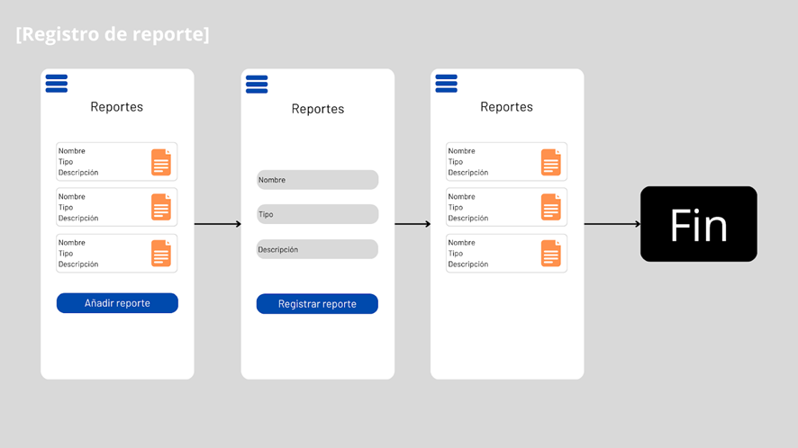

# Informe del Trabajo Final

**Universidad Peruana de Ciencias Aplicadas**

**Universidad Peruana de Ciencias Aplicadas**

**FACULTAD DE INGENIERÍA**

**2025-01**

**Diseños de Experimentos de Ingeniería de Software**

**Sección:** 4430

**Docente:** Juan Carlos Tinoco Licas

**Informe del Trabajo Final**

**Nombre del Startup:** NavCo

**Nombre del Producto:** Navex

**Integrantes:**

Pinto Fuentes Rivera, Alvaro Felipe - U202213384

Loarte Matos, Anthony Brahan - U20211D563

Bustamante Leveau, Cameron Charllotte - U20231A804

Armestar Heredia, Matias Gabriel - U20221A553

Chacon Martinez, Mauricio Sebastian - U202212911

 

**Registro de Versiones del Informe:**
 
En esta sección se resumen todas las modificaciones relevantes que sean realizadas sobre el informe durante el ciclo de vida del proyecto.
### Historial de versiones

| Versión | Fecha     | Autor(es)                                                                 | Descripción de modificación                                                             |
|:--------|:----------|:--------------------------------------------------------------------------|:-----------------------------------------------------------------------------------------|
| V0.1    | 23/04/25  | Pinto Fuentes Rivera, Alvaro Felipe - U202213384                         | Se describió la Startup y su producto creado.                                            |
| V0.2    | 23/04/25  | Loarte Matos, Anthony Brahan - U20211D563                                | Se describieron los antecedentes y problemática aplicando la técnica adecuada.          |
| V0.3    | 23/04/25  | Bustamante Leveau, Cameron Charllotte - U20231A804                       | Se añadió Lean UX Problem statement.                                                    |
| V0.4    | 23/04/25  | Chacon Martinez, Mauricio Sebastian - U202212911                         | Se añadió Lean UX Hipótesis.                                                            |
| V0.5    | 23/04/25  | Armestar Heredia, Matias Gabriel - U20221A553                            | Se agregó Lean UX Assumptions.                                                          |
| V0.6    | 24/04/25  | Armestar Heredia, Matias Gabriel - U20221A553                            | Lean UX canvas.                                                                         |
| V0.7    | 24/04/25  | Bustamante Leveau, Cameron Charllotte - U20231A804                       | Agregó Segmentos objetivos.                                                             |
| V0.8    | 24/04/25  | Loarte Matos, Anthony Brahan - U20211D563                                | Se añadió Análisis competitivo y estrategias frente a competidores.                     |
| V0.9    | 24/04/25  | Pinto Fuentes Rivera, Alvaro Felipe - U202213384                         | Se diseñó y realizó las entrevistas al segmento objetivo.                               |
| V0.10   | 24/04/25  | Chacon Martinez, Mauricio Sebastian - U202212911                         | Se hizo un análisis de las entrevistas realizadas.                                      |
| V0.11   | 24/04/25  | Bustamante Leveau, Cameron Charllotte - U20231A804                       | Se construyó un User Persona.                                                           |
| V0.12   | 24/04/25  | Armestar Heredia, Matias Gabriel - U20221A553                            | Se agregó el Task Matrix.                                                               |
| V0.13   | 25/04/25  | Pinto Fuentes Rivera, Alvaro Felipe - U202213384    Bustamante Leveau, Cameron Charllotte - U20231A804 | Se agregó el Journey Mapping.                                           |
| V0.14   | 25/04/25  | Chacon Martinez, Mauricio Sebastian - U202212911                         | Se agregó el mapa de empatía y el As-is Scenario Mapping.                               |
| V0.15   | 25/04/25  | Armestar Heredia, Matias Gabriel - U20221A553                            | Se agregó el To be Scenario Mapping.                                                    |
| V0.16   | 25/04/25  | Pinto Fuentes Rivera, Alvaro Felipe - U202213384                         | Se agregó los User Stories.                                                             |
| V0.17   | 25/04/25  | Chacon Martinez, Mauricio Sebastian - U202212911                         | Se agregó el Product Backlog.                                                           |
| V0.18   | 25/04/25  | Armestar Heredia, Matias Gabriel - U20221A553                            | Se agregaron wireframes y mockups.                                                      |
| V0.19   | 25/04/25  | Bustamante Leveau, Cameron Charllotte - U20231A804                       | Se agregaron wireframes y mockups.                                                      |
| V0.20   | 25/04/25  | Pinto Fuentes Rivera, Alvaro Felipe - U202213384                         | Se agregaron wireframes y mockups.                                                      |
| V1.0    | 25/04/25  | Chacon Martinez, Mauricio Sebastian - U202212911                         | Se agregó product implementation.                                                       |
| V1.1    | 25/04/25  | Bustamante Leveau, Cameron Charllotte - U20231A804                       | Se agregó product implementation.                                                       |
| V1.2    | 25/04/25  | Armestar Heredia, Matias Gabriel - U20221A553                            | Se agregó product implementation.                                                       |
| V1.3    | 25/04/25  | Pinto Fuentes Rivera, Alvaro Felipe - U202213384    Bustamante Leveau, Cameron Charllotte - U20231A804 | Se agregó product implementation.                                       |

 

**Project Report Collaboration Insights**
 
En esta sección el equipo indica el URL del repositorio para el Project Report en la organización de GitHub del equipo. Adicionalmente, para cada entrega explica cómo se han desarrollado las actividades de elaboración del informe y se presenta capturas en imagen de los analíticos de colaboración y commits en GitHub para el repositorio del informe, realizados por los miembros del equipo. Todos los miembros del equipo deben tener participación en la elaboración del informe. Esta sección debe ir expandiéndose con descripciones y evidencias en cada entrega. Lo descrito y evidenciado debe tener coherencia con el Registro de Versiones del Informe.

## ÍNDICE
# Índice

# **Tabla de Contenido**

- ## [Capítulo I: Introducción](#capítulo-i-introducción)
  - [1.1. Startup Profile](#11-startup-profile)
    - [1.1.1. Descripción de la Startup](#111-descripción-de-la-startup)
    - [1.1.2. Perfiles de integrantes del equipo](#112-perfiles-de-integrantes-del-equipo)
  - [1.2. Solution Profile](#12-solution-profile)
    - [1.2.1. Antecedentes y problemática](#121-antecedentes-y-problemática)
    - [1.2.2. Lean UX Process](#122-lean-ux-process)
      - [1.2.2.1. Lean UX Problem Statements](#1221-lean-ux-problem-statements)
      - [1.2.2.2. Lean UX Assumptions](#1222-lean-ux-assumptions)
      - [1.2.2.3. Lean UX Hypothesis Statements](#1223-lean-ux-hypothesis-statements)
      - [1.2.2.4. Lean UX Canvas](#1224-lean-ux-canvas)
  - [1.3. Segmento objetivo](#13-segmento-objetivo)

- ## [Capítulo II: Requirements Elicitation & Analysis](#capítulo-ii-requirements-elicitation--analysis)
  - [2.1. Competidores](#21-competidores)
    - [2.1.1. Análisis Competitivo](#211-análisis-competitivo)
    - [2.1.2. Estrategias y tácticas frente a competidores](#212-estrategias-y-tácticas-frente-a-competidores)
  - [2.2. Entrevistas](#22-entrevistas)
    - [2.2.1. Diseño de entrevistas](#221-diseño-de-entrevistas)
    - [2.2.2. Registro de entrevistas](#222-registro-de-entrevistas)
    - [2.2.3. Análisis de entrevistas](#223-análisis-de-entrevistas)
  - [2.3. Needfinding](#23-needfinding)
    - [2.3.1. User Personas](#231-user-personas)
    - [2.3.2. User Task Matrix](#232-user-task-matrix)
    - [2.3.3. User Journey Mapping](#233-user-journey-mapping)
    - [2.3.4. Empathy Mapping](#234-empathy-mapping)
    - [2.3.5. As-is Scenario Mapping](#235-as-is-scenario-mapping)
  - [2.4. Ubiquitous Language](#24-ubiquitous-language)

- ## [Capítulo III: Requirements Specification](#capítulo-iii-requirements-specification)
  - [3.2. User Stories](#32-user-stories)
  - [3.3. Product Backlog](#33-product-backlog)
  - [3.4. Impact Mapping](#34-impact-mapping)

- ## [Capítulo IV: Product Design](#capítulo-iv-product-design)
  - [4.1. Style Guidelines](#41-style-guidelines)
    - [4.1.1. General Style Guidelines](#411-general-style-guidelines)
    - [4.1.2. Web Style Guidelines](#412-web-style-guidelines)
    - [4.1.3. Mobile Style Guidelines](#413-mobile-style-guidelines)
      - [4.1.3.1. iOS Mobile Style Guidelines](#4131-ios-mobile-style-guidelines)
      - [4.1.3.2. Android Mobile Style Guidelines](#4132-android-mobile-style-guidelines)
  - [4.2. Information Architecture](#42-information-architecture)
    - [4.2.1. Organization Systems](#421-organization-systems)
    - [4.2.2. Labeling Systems](#422-labeling-systems)
    - [4.2.3. SEO Tags and Meta Tags](#423-seo-tags-and-meta-tags)
    - [4.2.4. Searching Systems](#424-searching-systems)
  - [4.3. Landing Page UI Design](#43-landing-page-ui-design)
    - [4.3.1. Landing Page Wireframe](#431-landing-page-wireframe)
    - [4.3.2. Landing Page Mock-up](#432-landing-page-mock-up)
  - [4.4. Mobile Applications UX/UI Design](#44-mobile-applications-uxui-design)
    - [4.4.1. Wireframes](#441-wireframes)
    - [4.4.2. Wireflow Diagrams](#442-wireflow-diagrams)
    - [4.4.3. Mock-ups](#443-mock-ups)
    - [4.4.4. User Flow Diagrams](#444-user-flow-diagrams)
  - [4.5. Mobile Applications Prototyping](#45-mobile-applications-prototyping)
    - [4.5.1. Android](#451-android)
    - [4.5.2. iOS](#452-ios)
  - [4.6. Web Applications UX/UI Design](#46-web-applications-uxui-design)
    - [5.1. Wireframes](#51-wireframes)
    - [5.1.1. Wireflow Diagrams](#511-wireflow-diagrams)
    - [5.1.2. Mock-ups](#512-mock-ups)
    - [5.1.3. User Flow Diagrams](#513-user-flow-diagrams)
  - [5.2. Web Applications Prototyping](#52-web-applications-prototyping)
  - [5.3. Domain-Driven Software Architecture](#53-domain-driven-software-architecture)
    - [5.3.1. Context Diagram](#531-context-diagram)
    - [5.3.2. Container Diagrams](#532-container-diagrams)
    - [5.3.3. Components Diagrams](#533-components-diagrams)
  - [5.4. Software Object-Oriented Design](#54-software-object-oriented-design)
    - [5.4.1. Class Diagrams](#541-class-diagrams)
    - [5.4.2. Class Dictionary](#542-class-dictionary)
  - [5.5. Database Design](#55-database-design)
    - [5.5.1. Relational/Non-Relational Database Diagram](#551-relationalnon-relational-database-diagram)

- ## [Capítulo V: Product Implementation](#capítulo-v-product-implementation)
  - [6.1. Software Configuration Management](#61-software-configuration-management)
    - [6.1.1. Environment Configuration](#611-environment-configuration)
    - [6.1.2. Source Code Management](#612-source-code-management)
    - [6.1.3. Style Guide & Conventions](#613-style-guide--conventions)
    - [6.1.4. Deployment Configuration](#614-deployment-configuration)
  - [6.2. Implementation & Deployment](#62-implementation--deployment)
    - [6.2.1. Sprint Backlogs](#621-sprint-backlogs)
    - [6.2.2. Landing Page Evidence](#622-landing-page-evidence)
    - [6.2.3. Web Application Evidence](#623-web-application-evidence)
    - [6.2.4. Mobile Application Evidence](#624-mobile-application-evidence)
    - [6.2.5. Backend Evidence](#625-backend-evidence)
    - [6.2.6. API Documentation](#626-api-documentation)
    - [6.2.7. Team Collaboration Insights](#627-team-collaboration-insights)
  - [6.3. Video About-the-Product](#63-video-about-the-product)

- ## [Conclusiones y Recomendaciones](#conclusiones-y-recomendaciones)
  - [Video About-the-Team](#video-about-the-team)
- ## [Bibliografía](#bibliografía)

## Student Outcome
El curso contribuye al cumplimiento del Student Outcome ABET: ABET – EAC - Student Outcome 4 Criterio: La capacidad de reconocer responsabilidades éticas y profesionales en
situaciones de ingeniería y hacer juicios informados, que deben considerar el
impacto de las soluciones de ingeniería en contextos globales, económicos,
ambientales y sociales.
| **Criterio Específico** | **Acciones Realizadas** | **Conclusiones** |
|-------------------------|--------------------------|------------------|
| **4.c.1** Reconoce responsabilidad ética y profesional en situaciones de ingeniería de software | **TB1 – Mauricio Sebastián Chacon Martinez:** En el desarrollo de NavEx, comprendí que como futuro ingeniero tengo la responsabilidad de tomar decisiones que no solo funcionen técnicamente, sino que también sean éticas. Me aseguré de cuidar los datos sensibles de los usuarios y pensé en cómo nuestra plataforma podía impactar positivamente en la organización del trabajo de los transportistas, sin perjudicar su bienestar. También reflexioné sobre cómo una mejor gestión de rutas puede reducir el impacto ambiental.  **TB1 – Alvaro Felipe Pinto Fuentes Rivera:** En esta entrega, apoyé en el reporte con los puntos relacionados a la arquitectura del proyecto. Durante el proceso, reflexioné sobre la importancia de comunicar ideas de manera clara y precisa para evitar malentendidos técnicos. También me aseguré de respetar el trabajo ya realizado constatando la información para completar los demás puntos del reporte en base a lo ya trabajado y buscando siempre mejorar la calidad del proyecto de manera ética.  **TB1 – Cameron Charllotte Bustamante Leveau:** Durante el desarrollo de NavEx, entendí que diseñar una buena experiencia de usuario implica también una responsabilidad ética. Al trabajar en la arquitectura de información y los lineamientos de estilo, busqué que nuestra plataforma fuera accesible y clara para todos los usuarios, evitando prácticas confusas o engañosas. A través del Empathy Mapping y el As-is Scenario Mapping, pude ponerme en el lugar de los transportistas, reconociendo la importancia de diseñar soluciones que respeten su tiempo, necesidades y bienestar. Entendí que, como futura ingeniera, mis decisiones deben priorizar siempre el respeto y la transparencia hacia los usuarios.  **TB1 – Armestar Heredia, Matias Gabriel:**   **TB1 – Anthony Brahan Loarte Matos:**  | Este proyecto nos permitió comprender que ser ingenieros no se trata solo de programar o diseñar soluciones funcionales, sino de pensar de manera crítica y responsable sobre cómo nuestras decisiones afectan a las personas, a las organizaciones y al entorno. Reconocer nuestras responsabilidades éticas y profesionales ha sido un aprendizaje clave que nos llevamos para nuestra futura vida profesional. |
| **4.c.2** Emite juicios informados considerando el impacto de las soluciones de ingeniería de software en contextos globales, económicos, ambientales y sociales | **TB1 – Mauricio Sebastián Chacon Martinez:** Al trabajar en NavEx, aprendí a tomar decisiones considerando cómo nuestra solución afecta más allá del entorno técnico. Pensé en el impacto económico que tiene para las empresas al optimizar costos, en el impacto social al facilitar el trabajo de los transportistas, y en el impacto ambiental al reducir rutas innecesarias. Cada decisión técnica fue tomada con una visión más amplia, evaluando sus consecuencias en distintos contextos.  **TB1 – Alvaro Felipe Pinto Fuentes Rivera:** En esta entrega, consideré cómo las decisiones tomadas en la arquitectura del sistema podrían impactar en el uso de recursos y en la eficiencia del producto final. Reflexioné sobre cómo una buena organización técnica no solo mejora el rendimiento, sino que también puede reducir costos, facilitar el acceso a la tecnología y minimizar el impacto ambiental en un contexto más amplio.  **TB1 – Cameron Charllotte Bustamante Leveau:** En NavEx, aplicando los principios de Ubiquitous Language y una correcta arquitectura de información, busqué que nuestra solución fuera intuitiva y eficiente, pensando en su impacto social y económico. Comprendí que una plataforma fácil de usar reduce errores operativos, optimiza tiempos de trabajo y contribuye a mejorar la calidad de vida de los transportistas. Además, desde la perspectiva ambiental, un sistema que permite gestionar rutas de manera más eficiente también ayuda a disminuir emisiones contaminantes. Cada decisión de diseño la tomé considerando no solo la usabilidad, sino también su efecto en un contexto más amplio.  **TB1 – Armestar Heredia, Matias Gabriel:**   **TB1 – Anthony Brahan Loarte Matos:**  | Aprendimos a tomar decisiones informadas considerando no solo la funcionalidad del software, sino también su impacto en diferentes dimensiones: económica, social, ambiental y global.

# 1. Capítulo I: Introducción
## 1.1 Startup Profile
## 1.1.1 Descripción de la Startup
NavEx es una solución digital integral desarrollada para enfrentar los retos de gestión en el ámbito del transporte empresarial. Su propósito es atender tanto a empresas que requieren administrar operaciones logísticas, como a transportistas que desean optimizar y organizar su trabajo de forma eficaz. La plataforma ofrece múltiples herramientas para la administración de flotas, tales como análisis de rendimiento, notificación de infracciones, registro de incidentes, monitoreo de entregas exitosas y gestión de destinos asignados. Todas estas funcionalidades están disponibles mediante planes de suscripción flexibles, ajustables a las características y dimensiones de cada organización. NavEx representa una solución centralizada y de fácil uso, que permite a sus usuarios supervisar y mejorar sus procesos de transporte, convirtiéndose en un recurso esencial para aumentar la eficiencia y el rendimiento operativo dentro del sector.

- Misión: En NavEx, nuestra misión es ofrecer una plataforma tecnológica integral que facilite y perfeccione la gestión del transporte empresarial. Nos esforzamos por brindar herramientas innovadoras y servicios de alta calidad que ayuden a nuestros clientes a optimizar su desempeño, reducir costos y asegurar una experiencia satisfactoria para sus propios usuarios.

- Visión: Queremos consolidarnos como la principal plataforma de gestión de transporte a nivel empresarial, destacando como un socio estratégico y confiable. Nuestra visión es revolucionar la industria logística mediante soluciones tecnológicas de vanguardia que fomenten el crecimiento, la sostenibilidad y el éxito de las empresas en un entorno global cada vez más exigente.

## 1.1.2 Perfiles de integrantes del equipo

| **Integrante**                             | Mauricio Sebastián Chacon Martinez  |
|--------------------------------------------|------------------------------------|
| **Código del Estudiante**                  | U202212911                         |
| **Carrera**                                | Ingeniería de Software             |
|                                            |                                    |
| Soy estudiante de 7mo ciclo de la carrera de Ingeniería de Software. Me apasiona la programación y tengo conocimientos en HTML, CSS, Javascript, y frameworks web como Vue, Angular y Astro. Me considero una persona responsable y comprometida con mi aprendizaje y desarrollo profesional. |  |
---

| **Integrante**                             | Alvaro Felipe Pinto Fuentes Rivera |
|--------------------------------------------|------------------------------------|
| **Código del Estudiante**                  | U202213384                         |
| **Carrera**                                | Ingeniería de Software             |
|                                            |                                    |
| Soy estudiante del séptimo ciclo de Ingeniería de Software con un buen manejo de lenguajes como C#, C++, HTML, CSS, Java y SQL. Me considero una persona proactiva y comprometida, capaz de adaptarse al trabajo en equipo y de aportar soluciones efectivas durante el desarrollo de proyectos. También me gusta contribuir con ideas que fortalezcan el enfoque técnico y creativo del grupo. |  |
---

| **Integrante**                             | Anthony Brahan Loarte Matos        |
|--------------------------------------------|------------------------------------|
| **Código del Estudiante**                  | U20211D563                         |
| **Carrera**                                | _( )_                              |
|                                            |                                    |
| _Sin descripción registrada._             |           |
---

| **Integrante**                             | Cameron Charllotte Bustamante Leveau |
|--------------------------------------------|--------------------------------------|
| **Código del Estudiante**                  | U20231A804                          |
| **Carrera**                                | Ingeniería de Software               |
|                                            |                                      |
| Me considero una persona creativa y versátil, con gusto por el trabajo en equipo y una fuerte motivación por aprender constantemente. Disfruto participar en proyectos diversos. Tengo conocimientos en C++, Python y otros lenguajes de programación, lo que me permite adaptarme con facilidad a distintos entornos tecnológicos. |  |
---

| **Integrante**                             | Armestar Heredia, Matias Gabriel    |
|--------------------------------------------|-------------------------------------|
| **Código del Estudiante**                  | U20221A553                          |
| **Carrera**                                | Ingeniería de Software              |
|                                            |                                     |
| _Sin descripción registrada._             |  |

## 1.2 Solution profile
## 1.2.1 Antecedentes y problematica

En el sector del transporte empresarial, la gestión eficiente de las flotas es un desafío constante. Los empresarios y transportistas se enfrentan a dificultades como la planificación de rutas, el seguimiento de vehículos, la programación de viajes y la gestión de costos. Aunque existen soluciones de software para la gestión de flotas, muchas de ellas no son lo suficientemente flexibles o integrales para satisfacer todas las necesidades de los usuarios. 
La falta de una solución de gestión de flotas integral y fácil de usar está afectando la eficiencia operativa, aumentando los costos y reduciendo la satisfacción del cliente en el sector del transporte empresarial. Utilizaremos la técnica de las 5W y 2Hs para desglosar el problema y entenderlo en detalle. Esta técnica nos proporcionará respuestas claras sobre qué, cuándo, dónde, quién, por qué, cómo y cuánto, lo que nos ayudará a encontrar soluciones efectivas.

**Tabla 1**

*Presentación del modelo de las preguntas 5 Ws y 2 Hs con la que se analizaron los antecedentes y la problemática que abarca nuestro proyecto*

| **Las 5Ws y 2Hs** | **Pregunta**                                | **Descripción**                                                                                                                                         |
|--------------------|---------------------------------------------|---------------------------------------------------------------------------------------------------------------------------------------------------------|
| **What?**         | ¿Cuál es el problema?                      | Existe una falta de eficiencia en la gestión de flotas de transporte empresarial, lo que resulta en costos elevados y disminución de la satisfacción del cliente. |
| **When?**         | ¿Cuándo estamos viendo el problema?         | Este problema se observa principalmente durante las horas pico de operación, cuando la demanda de transporte es alta y la planificación de rutas se vuelve más compleja. |
| **Where?**        | ¿Dónde estamos viendo los problemas?        | El problema se presenta en todo el proceso de gestión de flotas, desde la planificación de rutas hasta el seguimiento de vehículos y la programación de viajes. |
| **Who?**          | ¿A quién le sucede?                        | Este problema afecta tanto a los empresarios que necesitan administrar sistemas de transporte como a los transportistas que buscan una organización eficiente en sus operaciones. |
| **Why?**          | ¿Por qué sucede el problema?               | El problema surge debido a la falta de una solución de gestión de flotas integral y fácil de usar que pueda satisfacer todas las necesidades de los usuarios. |
| **How?**          | ¿Cómo se diferencia el problema del estado normal (óptimo)? | El problema se manifiesta en forma de costos operativos elevados, retrasos en las entregas, insatisfacción del cliente y dificultades en la planificación de rutas. |
| **How Much?**     | ¿Cuánto es el impacto financiero?           | El problema podría estar costando a las empresas miles de dólares cada mes en costos operativos adicionales y pérdida de clientes debido a la insatisfacción. |

## 1.2.2 Lean UX Process

El Lean UX es un proceso de diseño centrado en el usuario que adopta las metodologías ágiles para reducir los residuos y crear productos centrados en los usuarios. El Lean UX busca maximizar la eficiencia en el desarrollo de productos mediante la colaboración, minimizando el uso de tiempo, esfuerzo y recursos innecesarios. Esto se logra mediante la experimentación temprana y la construcción rápida, con el objetivo de obtener retroalimentación rápida del usuario. (Rámirez, 2023).

## 1.2.2.1 Lean UX Problem Statements

A pesar de la existencia de diversas soluciones de software para la gestión de flotas, muchas de ellas no logran cubrir completamente las necesidades reales de los usuarios en el sector del transporte empresarial. Actualmente, empresarios y transportistas se enfrentan a una brecha importante en el mercado: la ausencia de una plataforma de gestión de flotas que sea integral, flexible y verdaderamente fácil de usar. Esta carencia impacta negativamente en la eficiencia operativa, eleva los costos y disminuye la satisfacción del cliente.

Uno de los principales desafíos que enfrentan las empresas de transporte es la dificultad para organizar y controlar una gran cantidad de vehículos, lo que puede derivar en confusiones logísticas y errores en el transporte de cargas. Esto nos lleva a cuestionarnos:
¿Cómo podemos desarrollar una solución intuitiva y accesible que guíe a los usuarios paso a paso, facilitando la gestión detallada de cada unidad de la flota?

Además, la falta de actualizaciones periódicas en muchas aplicaciones del sector provoca una pérdida de interés por parte de los usuarios, quienes terminan migrando hacia otras alternativas más actualizadas.

¿Cómo podemos mantener una constancia en el desarrollo y despliegue de nuevas funcionalidades que mejoren continuamente la experiencia del usuario y fomenten su fidelidad?
 
Por otro lado, el uso de soluciones digitales de gestión de flotas aún no está generalizado en todos los segmentos del transporte de carga. Esta falta de adopción puede generar escepticismo e incluso resistencia al cambio.

¿Cómo podemos despertar el interés y generar confianza en nuestra solución, promoviendo su adopción en sectores que aún no han incorporado estas tecnologías, con el objetivo de incrementar nuestra base de usuarios?

## 1.2.2.2 Lean UX Assumptions
1. Contexto: Los empresarios y transportistas a menudo utilizan múltiples herramientas y procesos manuales para gestionar sus flotas debido a la falta de soluciones integradas. 
Assumption: Dado que muchos usuarios enfrentan dificultades con la gestión descentralizada de flotas, creemos que existe una necesidad de una plataforma integral que unifique todas las funciones de gestión de flotas en una sola solución.

2. Contexto: Los empresarios a menudo luchan por controlar los costos operativos y reducir los gastos innecesarios en la gestión de flotas. Assumption: Dado que el control de costos es una prioridad para los usuarios, creemos que una solución que ofrezca herramientas de análisis de costos y optimización de recursos será altamente valorada.

3. Contexto: La falta de informes detallados y análisis de datos dificulta la identificación de áreas de mejora en la gestión de flotas. Assumption: Dado que los usuarios necesitan información precisa y detallada sobre el rendimiento de sus flotas, creemos que una solución que proporcione informes personalizables y análisis avanzados será fundamental para la toma de decisiones informadas.

4. Contexto: La seguridad y privacidad de los datos son preocupaciones críticas para los usuarios al adoptar nuevas soluciones tecnológicas. Assumption: Dado que los usuarios son sensibles a la seguridad de los datos, creemos que una solución que garantice la protección y privacidad de la información del cliente será fundamental para generar confianza y adopción.

5. Contexto: Los usuarios a menudo enfrentan dificultades para adaptarse a nuevas tecnologías y plataformas debido a la complejidad y la curva de aprendizaje. Assumption: Dado que la facilidad de uso es crucial para la adopción de la plataforma, creemos que una solución intuitiva y fácil de usar será fundamental para la aceptación y satisfacción del usuario.

## 1.2.2.3 Lean UX Hypothesis Statements
1. **Creemos que** al ofrecer una plataforma integral que unifique todas las funciones de gestión de flotas en una sola solución, aumentaremos la eficiencia y la productividad de los empresarios y transportistas al reducir la complejidad y la fragmentación en sus procesos de gestión, sabremos que estamos en lo correcto cuando veamos un aumento en el número de usuarios que reportan una reducción significativa en el tiempo dedicado a la gestión de flotas, así como una disminución en los errores asociados con la gestión descentralizada. 

2. **Creemos que** el control de costos es una prioridad para los usuarios, por lo tanto, cuando proporcionemos herramientas de análisis de costos y optimización de recursos, aumentaremos la capacidad de los empresarios para controlar los gastos operativos y reducir los costos innecesarios en la gestión de flotas sabremos que estamos en lo correcto cuando observemos un aumento en la adopción de las herramientas de análisis de costos, así como una disminución en los costos operativos reportados por los usuarios. 

3. **Creemos que** al proporcionar informes personalizables y análisis avanzados sobre el rendimiento de las flotas, permitiremos a los usuarios identificar áreas de mejora y tomar decisiones informadas para optimizar sus operaciones y aumentar la eficiencia de sus flotas sabremos que estamos en lo correcto cuando recibamos comentarios positivos de los usuarios sobre la utilidad de los informes y análisis proporcionados, así como cuando observemos una mejora en los indicadores clave de rendimiento de las flotas gestionadas a través de nuestra plataforma. 

4. **Creemos que** al garantizar la protección y privacidad de la información del cliente en nuestra plataforma, generaremos confianza en los usuarios y promoveremos una mayor adopción de nuestra solución de gestión de flotas sabremos que estamos en lo correcto cuando observemos un aumento en la confianza y la satisfacción del usuario, así como una disminución en las preocupaciones relacionadas con la seguridad de los datos expresadas por los usuarios. 

5. **Creemos que** al ofrecer una solución intuitiva y fácil de usar, aumentaremos la aceptación y satisfacción del usuario al reducir la curva de aprendizaje y facilitar la adaptación a nuevas tecnologías y plataformas en el sector del transporte empresarial sabremos que estamos en lo correcto cuando observemos una disminución en las tasas de abandono del producto, así como un aumento en la tasa de retención de usuarios y una mayor participación en 
las funciones ofrecidas por la plataforma.

## 1.2.2.4 Lean UX Canvas
**Tabla 2**

*Modelo del Lean UX Canvas diseñado para el proyecto de NavEx*

| **1) Business problem**                                                                                     | **5) Solution ideas**                                                                                     | **2) Business outcomes**                                                                                  |
|-------------------------------------------------------------------------------------------------------------|-----------------------------------------------------------------------------------------------------------|-----------------------------------------------------------------------------------------------------------|
| En el sector del transporte empresarial, la gestión eficiente de las flotas es un desafío constante. Los empresarios y transportistas a menudo utilizan múltiples herramientas y procesos manuales para gestionar sus flotas debido a la falta de soluciones integradas. Esta gestión descentralizada de flotas puede llevar a ineficiencias operativas, aumento de costos y reducción de la satisfacción del cliente. Además, los cambios en el mercado y el comportamiento del cliente están aumentando la demanda de soluciones de gestión de flotas más eficientes y fáciles de usar. Los empresarios y transportistas necesitan una solución que les permita tener una visibilidad completa de sus flotas, controlar los costos operativos, identificar áreas de mejora y adaptarse rápidamente a los cambios. Sin embargo, muchas de las soluciones de software existentes para la gestión de flotas no satisfacen todas estas necesidades. Pueden ser difíciles de usar, no ofrecer todas las funciones necesarias o no ser lo suficientemente flexibles para adaptarse a las necesidades específicas de cada empresa. Por lo tanto, el problema empresarial que NavEx está tratando de resolver es la falta de una solución de gestión de flotas integral, flexible y fácil de usar que pueda satisfacer todas las necesidades de los empresarios y transportistas en el sector del transporte empresarial. NavEx aspira a llenar esta brecha en el mercado proporcionando una solución tecnológica que simplifique y optimice la gestión de flotas de transporte. | Algunas soluciones que podrían resolver el problema comercial y satisfacer las necesidades de los clientes al mismo tiempo:   1. **Interfaz de Usuario Intuitiva**:  Desarrollar una interfaz de usuario que sea fácil de navegar y usar. Esto puede incluir tutoriales interactivos, asistencia en la aplicación y una interfaz de usuario limpia y minimalista.   2. **Funcionalidades Avanzadas de Gestión de Flotas**: Implementar una variedad de características para la gestión de flotas, como estadísticas de rendimiento, reporte de infracciones, registro de incidencias, seguimiento de envíos exitosos y control de sitios enviados. Estas características deben ser personalizables para adaptarse a las necesidades específicas de cada empresa.    3. **Informes Personalizables**: Proporcionar informes detallados y personalizables que ayuden a los empresarios a tomar decisiones informadas. Esto puede incluir análisis de costos, informes de rendimiento y análisis de tendencias.   4. **Seguridad de Datos**: Garantizar la seguridad y privacidad de los datos de los usuarios. Esto puede incluir el uso de encriptación de datos, autenticación de dos factores y políticas de privacidad claras.   5. **Soporte al Cliente**: Ofrecer soporte al cliente de alta calidad para ayudar a los usuarios a resolver problemas y responder a preguntas. Esto puede incluir chat en vivo, soporte por correo electrónico y una base de conocimientos en línea.   6. **Integraciones con Otras Plataformas**: Permitir la integración con otras plataformas y herramientas que los usuarios ya estén utilizando. Esto puede facilitar la adopción de la plataforma y mejorar la eficiencia operativa.   7. **Planes de Suscripción Flexibles**: Ofrecer planes de suscripción flexibles que se adapten a las necesidades y al tamaño de cada empresa. Esto puede incluir planes gratuitos, planes premium y opciones de personalización. | Para NavEx, los resultados comerciales pueden ser medidos a través de varias métricas clave que indican el éxito del cliente y la resolución del problema comercial.   1. **Eficiencia Operativa**: Medir la mejora en la eficiencia operativa de las flotas de transporte de los usuarios. Esto podría ser a través de la reducción en el tiempo de inactividad de los vehículos, el aumento en el número de envíos exitosos, o la disminución en el tiempo necesario para planificar y programar los viajes.   2. **Reducción de Costos**: Medir la reducción en los costos operativos de los usuarios. Esto podría ser a través de la disminución en los costos de combustible, mantenimiento, o infracciones.   3. **Satisfacción del Cliente**: Medir la satisfacción del cliente a través de encuestas y comentarios. Esto podría incluir la facilidad de uso de la plataforma, la utilidad de las características ofrecidas, y la calidad del soporte al cliente.   4. **Retención de Usuarios**: Medir la tasa de retención de usuarios. Un aumento en la retención de usuarios indica que los usuarios encuentran valor en la plataforma y continúan utilizándose a largo plazo.   5. **Crecimiento de Usuarios**: Medir el crecimiento en el número de usuarios o empresas que utilizan la plataforma. Esto indica que la plataforma está ganando tracción en el mercado.   6. **Uso de la Plataforma**: Medir el uso de las diferentes características de la plataforma. Esto puede ayudar a identificar qué características son más valiosas para los usuarios y dónde se pueden hacer mejoras. |

| **3) User and customers**                                                                                   | **4) User benefits**                                                                                      |                                                                                                           |
|-------------------------------------------------------------------------------------------------------------|-----------------------------------------------------------------------------------------------------------|-----------------------------------------------------------------------------------------------------------|
| Para NavEx, los usuarios y clientes pueden ser categorizados de la siguiente manera:  1. **Empresarios**: Son los que probablemente comprarán el servicio. Son los propietarios de empresas que necesitan administrar sistemas de transporte. Estos usuarios estarán interesados en las capacidades de gestión de flotas de la plataforma, así como en las estadísticas de rendimiento y los informes detallados que pueden ayudarles a tomar decisiones informadas.   2. **Transportistas**: Son los usuarios finales que utilizan la plataforma a diario. Estos usuarios buscan eficiencia y organización en sus operaciones de transporte. Necesitarán funciones como el registro de incidencias, el seguimiento de envíos exitosos y el control de sitios enviados.   3. **Administradores de Sistemas**: Son los que configuran y mantienen la plataforma. Estos usuarios necesitarán acceso a funciones de administración y configuración para asegurarse de que la plataforma se adapta a las necesidades específicas de su empresa.   4. **Analistas de Datos**: Estos usuarios podrían estar interesados en los datos recopilados por la plataforma para realizar análisis y generar informes que ayuden a la empresa a tomar decisiones estratégicas. | 1. **Eficiencia Operativa Mejorada**: Al utilizar NavEx, los usuarios pueden mejorar la eficiencia de sus operaciones de transporte. Esto se traduce en un mejor uso de los recursos, menos tiempo perdido en tareas administrativas y más tiempo para centrarse en el crecimiento del negocio.   2. **Reducción de Costos**: NavEx puede ayudar a los usuarios a reducir costos al proporcionar herramientas para optimizar el uso de la flota, reducir el tiempo de inactividad y minimizar las infracciones.   3. **Toma de Decisiones Informada**: Con los informes detallados y las estadísticas de rendimiento que ofrece NavEx, los usuarios pueden tomar decisiones más informadas sobre la gestión de su flota.   4. **Satisfacción del Cliente Mejorada** : Al mejorar la eficiencia y la fiabilidad de las operaciones de transporte, los usuarios pueden mejorar la satisfacción de sus propios clientes.|

| **6) Hypotheses**                                                                                           | **7) What’s the most important thing we need to learn first?**                                            | **8) What’s the least amount of work we need to do to learn the next most important thing?**              |
|-------------------------------------------------------------------------------------------------------------|-----------------------------------------------------------------------------------------------------------|-----------------------------------------------------------------------------------------------------------|
| 1. Creemos que la eficiencia operativa se logrará si los empresarios obtienen una mejor visibilidad y control de sus flotas con la funcionalidad avanzada de gestión de flotas.    2. Creemos que la reducción de costos se logrará si los transportistas obtienen una mayor eficiencia en sus operaciones de transporte con el registro de incidencias y el seguimiento de envíos exitosos.    3. Creemos que la satisfacción del cliente se logrará si los desarrolladores obtienen una plataforma adaptable a las necesidades específicas de su empresa con las funciones de administración y configuración    4. Creemos que la retención de usuarios se logrará si los desarrolladores, analistas de datos obtienen informes detallados y personalizables con la función de informes personalizables.    5. Creemos que el crecimiento de usuarios se logrará si los empresarios obtienen una plataforma fácil de adoptar y que mejora la eficiencia operativa con la integración con otras plataformas.    6. Creemos que el uso de la plataforma se incrementará si los usuarios obtienen un soporte al cliente de alta calidad con el soporte al cliente ofrecido.    7. Creemos que la mejora en la eficiencia operativa se conseguirá si los empresarios obtienen una toma de decisiones más informada con la función de informes detallados y estadísticas de rendimiento ofrecidos en los planes de suscripción flexibles de NavEx | En las etapas iniciales de nuestro proyecto, es crucial identificar los supuestos más riesgosos en nuestras hipótesis. Esto nos permite enfocarnos en mitigar esos riesgos y validar nuestras ideas de manera efectiva.    1. El supuesto más riesgoso asociado con la Hipótesis 1 es que los empresarios realmente necesitan y valoran una funcionalidad avanzada de gestión de flotas.    2. El supuesto más riesgoso asociado con la Hipótesis 2 es que los transportistas encuentren útil y mejoren su eficiencia con el registro de incidencias y el seguimiento de envíos exitosos.    3. El supuesto más riesgoso asociado con la Hipótesis 3 es que los administradores de sistemas necesiten y utilicen funciones de administración y configuración.    4. El supuesto más riesgoso asociado con la Hipótesis 4 es que los analistas de datos necesiten y utilicen informes detallados y personalizables.    5. El supuesto más riesgoso asociado con la Hipótesis 5 es que los empresarios estén dispuestos a adoptar una nueva plataforma y que ésta mejore su eficiencia operativa.    6. El supuesto más riesgoso asociado con la Hipótesis 6 es que los usuarios valoren y utilicen el soporte al cliente ofrecido    En esta etapa inicial del proyecto, nuestro enfoque se centra en identificar y mitigar los riesgos para valorar en lugar de en la viabilidad absoluta de cada hipótesis. Esto nos permite abordar los desafíos más críticos y validar nuestras ideas de manera efectiva.El supuesto más riesgoso en este momento se relaciona con la Hipótesis 1, donde la necesidad y valoración real de una funcionalidad avanzada de gestión de flotas por parte de los empresarios podrían determinar el éxito o el fracaso de nuestra solución. Si este supuesto resulta ser incorrecto, nuestra idea principal de proporcionar una solución de gestión de flotas integral, flexible y fácil de usar podría fracasar. | Para validar nuestra suposición más arriesgada, que los empresarios realmente necesitan y valoran una funcionalidad avanzada de gestión de flotas, proponemos los siguientes experimentos con la menor cantidad de trabajo posible:    1. Entrevistas con empresarios: Realizaremos entrevistas con un pequeño grupo de empresarios en el sector del transporte. Durante estas entrevistas, preguntaremos sobre sus necesidades actuales, los desafíos que enfrentan con las soluciones existentes y qué características valorarán en una nueva solución. Esto nos permitirá validar si realmente necesitan y valorarán una funcionalidad avanzada de gestión de flotas.    2. Encuestas: Diseñaremos una encuesta corta y la enviaremos a un grupo más amplio de empresarios. La encuesta incluirá preguntas sobre sus necesidades actuales, los desafíos que enfrentan y qué características les gustaría ver en una nueva solución de gestión de flotas.    3. Producto Mínimo Viable (MVP): Desarrollaremos un MVP que incluya la funcionalidad avanzada de gestión de flotas y lo proporcionaremos a un pequeño grupo de empresarios para que lo prueben. Recogeremos sus comentarios y observaremos cómo utilizan el MVP para validar nuestra suposición.    El objetivo de estos experimentos es aprender lo más rápido posible con la menor cantidad de trabajo. Por lo tanto, hemos diseñado nuestros experimentos de manera que podamos obtener resultados rápidamente y hacer ajustes según sea necesario." |

## 1.3 Segmento objetivo

Según Kingsnorth (2019), un segmento objetivo se refiere a un grupo específico de consumidores dentro de un mercado más amplio que comparten características o necesidades similares. Estas características pueden incluir variables demográficas, geográficas, psicográficas y conductuales.
El proceso de segmentación de mercados implica identificar y dividir el mercado total en segmentos más pequeños y homogéneos con el objetivo de diseñar estrategias de marketing más efectivas y dirigidas. Al enfocarse en segmentos específicos, las empresas pueden adaptar sus productos, mensajes y canales de marketing para satisfacer las necesidades y preferencias de esos grupos de consumidores de manera más precisa.
En el caso de las secciones y la problemática que abarca nuestro proyecto, después de un proceso de análisis, hemos conseguido determinar los siguientes segmentos objetivos:

1. Empresarios: Este segmento está compuesto por propietarios de empresas que gestionan flotas de transporte en diversos sectores como logística, transporte de mercancías y transporte de pasajeros. Los empresarios, cuyas edades suelen oscilar entre los 30 y los 60 años, pueden ser tanto hombres como mujeres y suelen tener un alto nivel educativo, con títulos en administración de empresas o campos relacionados. En este contexto, según un informe de Infobae, una empresa de transporte en Perú reveló que el 70% de sus ingresos corresponde a empresas y atienden alrededor de 2 mil empresas mensualmente. Además, un estudio de flotas y movilidad reveló que más de un tercio de las empresas peruanas ya han adaptado o están considerando adaptar su política de movilidad debido al teletrabajo.

2. Transportistas:  En el próspero mercado de transporte de carga por carretera en Perú, estimado en 8,31 mil millones de dólares en 2024 y proyectado a crecer a 10,75 mil millones en 2029 con una tasa anual del 6,5%, se encuentra un segmento fundamental: los transportistas. Este grupo, que incluye a conductores y operadores de vehículos de flota, se enfrenta a la necesidad de gestionar eficientemente sus tareas diarias de transporte. Las características demográficas de los transportistas varían ampliamente, con edades que van desde los 20 hasta los 60 años, predominantemente hombres aunque con una creciente presencia femenina. Además, todos ellos requieren licencias de conducir válidas y experiencia en la conducción de vehículos de flota.

# Capítulo II: Requirements Elicitation & Analysis

## Competidores

 **TRACK-POD:** Track-POD se destaca como un software de entrega
 avanzado que ofrece una experiencia todo en uno para el monitoreo
 eficiente del rendimiento del conductor y la confirmación de entrega
 en tiempo real. Su aplicación electrónica de prueba de entrega y su
 solución móvil proporcionan a los usuarios las herramientas necesarias
 para optimizar sus operaciones de entrega y mejorar la satisfacción
 del cliente. Con un enfoque en la simplicidad y la eficacia, Track-POD
 es una opción sólida para aquellos que buscan mejorar la eficiencia de
 su cadena de suministro.

 **ONFLEET:** Onfleet ofrece un moderno software de gestión de entregas
 diseñado para simplificar y optimizar las operaciones de mensajería
 local. Su plataforma incluye intuitivas aplicaciones de teléfonos
 inteligentes para conductores, un panel web en tiempo real para
 distribuidores y notificaciones automáticas por mensajes SMS para
 mantener a los clientes informados sobre el estado de sus entregas.
 Con características centradas en la eficiencia y el análisis, Onfleet
 es una opción confiable para aquellos que buscan una solución completa
 y fácil de usar para la gestión de entregas.

 **DISPATCH SCIENCE:** Dispatch Science ofrece un sistema de gestión de
 entregas integral diseñado para satisfacer las necesidades de
 expedidores, transportistas y empresas de mensajería. Su plataforma
 administra, optimiza y automatiza una amplia gama de procesos,
 incluidos precios, facturación, distribución, enrutamiento y
 seguimiento en tiempo real. Con un enfoque en la personalización y la
 escalabilidad, Dispatch Science es una opción ideal para aquellos que
 buscan una solución flexible y adaptable para la gestión de entregas
 en constante evolución.

### Análisis Competitivo

##### **Tabla 3**

##### *Análisis Competitivo organizado para todos los competidores potenciales de NavEx*

|  Competitive Analysis Landscape |  |  |  |  |  |  |
| :---- | :---- | :---- | :---- | :---- | :---- | :---- |
| ¿Por qué llevar a cabo este análisis? |  | Este análisis tiene como finalidad examinar en profundidad las funcionalidades clave y las propuestas de valor de otras compañías que buscan resolver la misma necesidad que nosotros. De esta manera, podremos identificar una estrategia sólida y coherente que nos permita destacar frente a la competencia.  |  |  |  |  |
|  |  |  |  |  |  |  |
| Empresas |  |  | NavEx | Onfleet | Track-POD | Dispatch Science |
| Perfil | Overview |  | NavEx es una plataforma desarrollada con el propósito de facilitar la gestión eficiente de flotas de transporte en distintos ámbitos empresariales. Ofrece un conjunto completo de funciones y recursos enfocados en mejorar tanto la operatividad como el desempeño de las flotas. | Onfleet es una reconocida plataforma SaaS especializada en la gestión de entregas de última milla. Brinda una solución completa que permite a las empresas administrar de manera eficiente sus operaciones logísticas y el manejo de sus flotas. | Track-POD es una herramienta digital enfocada en la optimización de rutas y trayectos de vehículos, creada para mejorar el rendimiento logístico y aumentar la eficiencia en los procesos de entrega. | Dispatch Science es una solución integral orientada a la administración de entregas, pensada para empresas de transporte y cargadores. Su objetivo es facilitar y automatizar procesos como la gestión de pedidos, la logística de transporte y el monitoreo en tiempo real. |
|  | Ventaja competitiva  |  | Se distingue por proporcionar información detallada sobre la flota, lo que facilita un monitoreo preciso del rendimiento a lo largo del tiempo. | Brinda a los mensajeros una gestión y análisis efectivos de sus entregas locales, lo que mejora la eficiencia operativa y optimiza la satisfacción del cliente. | Ofrece una herramienta avanzada para la planificación de rutas que facilita la organización de múltiples entregas y proporciona una aplicación de prueba de entrega electrónica para los conductores. | Ofrece una solución integral para la gestión de entregas, abarcando desde la planificación hasta el seguimiento en tiempo real, lo que mejora la eficiencia operativa y ayuda a reducir los costos. |
| Perfil de Marketing | Mercado objetivo |  | Está orientada tanto a conductores como a compañías que administran flotas de transporte en diversos sectores industriales y comerciales. | Está centrada en conductores y empresas dedicadas a gestionar entregas en la etapa final del proceso logístico, conocida como última milla. | Está enfocado en conductores y empresas que necesitan una planificación óptima de rutas y gestión logística para sus operaciones de transporte. | Está orientado a cargadores y transportistas que requieren una solución integral para la administración de entregas y operaciones logísticas. |
|  | Estrategias de marketing |  | Las estrategias de marketing de NavEx abarcan la creación de contenido relevante, presencia en su sitio web y en redes sociales, promociones, y publicidad segmentada, todo con el objetivo de incrementar la visibilidad y fomentar la adopción de la plataforma. | Emplea estrategias de marketing de contenido, publicidad digital y redes sociales para promover su plataforma y atraer nuevos clientes. | Se da a conocer mediante marketing de contenido, presencia en línea y publicidad digital, con el objetivo de atraer a conductores y empresas interesados en mejorar su logística de entregas. | Utiliza marketing de contenido, publicidad digital y relaciones públicas para conectar con cargadores y transportistas, y mostrarles el valor de su plataforma. |
| Perfil de Producto | Productos & Servicios |  | NavEx proporciona una plataforma completa para la administración de flotas, que integra funciones como monitoreo en tiempo real, reportes detallados y herramientas analíticas para mejorar el control y la eficiencia operativa. | Ofrece una sólida aplicación móvil junto con una plataforma web para gestionar entregas, incorporando funcionalidades de seguimiento, alertas en tiempo real y análisis de datos. | Proporciona una app móvil enfocada en la optimización de rutas y entregas, complementada con una plataforma web orientada a la administración logística. | Cuenta con una aplicación móvil y una plataforma web completa para la gestión de entregas, que abarca planificación de rutas, monitoreo en tiempo real y elaboración de reportes. |
|  | Precios y Costos |  | Ofrece varios planes de suscripción, cada uno con funcionalidades específicas según el nivel de pago seleccionado. | Presenta una estructura de precios clara, que incluye una opción gratuita y una versión premium destinada a empresas que requieren funciones más avanzadas. | Ofrece una versión gratuita con funcionalidades esenciales, así como una suscripción premium que brinda acceso a herramientas adicionales y soporte prioritario. | Incluye una versión gratuita con funciones limitadas y una suscripción premium que proporciona acceso completo a todas las características, además de soporte especializado. |
|  | Canales de distribución  |  | Está disponible para los usuarios a través de su página web oficial. | Se distribuye a través de plataformas de aplicaciones móviles y su sitio web, asegurando que los usuarios puedan acceder desde diversos dispositivos. | Está accesible en plataformas de aplicaciones móviles y en la web, lo que facilita el acceso de los usuarios desde cualquier dispositivo. | Se distribuye mediante plataformas de aplicaciones móviles y en la web, garantizando una amplia disponibilidad para los usuarios. |
|  Análisis SWOT | Fortalezas |  | \- Actualizaciones periódicas para optimizar la funcionalidad y reforzar la seguridad. | \- Ofrece precios y características de manera clara y accesible. \- Facilita la interacción entre conductores y despachadores. | \- Mejora la eficiencia de las rutas a diario, optimizando cada vez más el proceso. \- Plataforma web y aplicación móvil intuitivas y fáciles de usar. | \- Ofrece la capacidad de gestionar todos los aspectos. \- Proporciona un valor único y excepcional. |
|  | Debilidades |  | \- Falta de algunas funcionalidades específicas que podrían ser esenciales para ciertos usuarios.  | \- La optimización de rutas está enfocada solo en entregas de última milla, lo que no la hace adecuada para todos los tipos de transporte. | \- Restricciones en la cantidad de rutas que se pueden agregar al mismo tiempo. \- Algunas funciones pueden resultar complicadas de usar para usuarios sin experiencia técnica. | \- Algunas funciones pueden ser complejas para usuarios sin conocimientos técnicos. \- La amplia variedad de características puede resultar abrumadora para los usuarios novatos. |
|  | Oportunidades |  | \- Expansión hacia otras áreas de gestión empresarial, como la administración de activos y la logística de almacenes. | \- Optimización constante de la experiencia del usuario y las funcionalidades de la plataforma. | \- Expansión del mercado de entregas y logística impulsada por el crecimiento del comercio electrónico y la creciente demanda de servicios de entrega rápida. | \- Posibilidad de expandirse a nuevos mercados verticales y regionales, aprovechando la flexibilidad de la plataforma. |
|  | Amenazas |  | \- Competencia de empresas consolidadas con una mayor participación de mercado y más recursos. \- Podría demandar actualizaciones constantes para seguir siendo competitivos en el mercado cambiante. | \- Competencia de plataformas de gestión de entregas tanto consolidadas como emergentes. \- Existen otras aplicaciones con precios más bajos. | \- Posible competencia de soluciones logísticas integradas proporcionadas por grandes corporaciones tecnológicas. | \- Riesgo de que competidores más pequeños y ágiles imiten el modelo de negocio. \- Posible alteración de las regulaciones que afectan el transporte y las entregas. |

### 

### Estrategias y tácticas frente a competidores

 Se presenta un estudio del entorno competitivo en el que opera NavEx,
 acompañado de una serie de estrategias iniciales orientadas a
 enfrentar a los competidores, aumentar el valor entregado a los
 usuarios y posicionar a la startup para lograr un crecimiento
 sostenible. A través de un enfoque en la diferenciación, la capacidad
 de adaptación, la expansión del mercado y la colaboración con aliados
 estratégicos, NavEx busca consolidarse como una solución líder e
 innovadora en el ámbito de la gestión de flotas y operaciones
 logísticas.

1.  **Diferenciación del Producto**

- Estrategia: Resaltar los elementos únicos de NavEx que la hacen
  destacar frente a otras plataformas, como el análisis detallado de
  flotas y las mejoras continuas.

- Tácticas: Ejecutar campañas de marketing enfocadas en los atributos
  exclusivos de la plataforma. Realizar presentaciones en vivo y ofrecer
  periodos de prueba sin costo para demostrar su valor agregado a
  potenciales clientes.

2.  **Mejora Constante y Adaptabilidad**

- Estrategia: Permanecer flexible ante los cambios del mercado mediante
  actualizaciones regulares y mejoras continuas.

- Tácticas: Implementar un sistema de retroalimentación directa con los
  usuarios para recoger sugerencias y opiniones. Utilizar analíticas de
  uso para detectar áreas de mejora y aplicar cambios rápidamente.

3.  **Expansión de Mercado**

- Estrategia: Ampliar la base de usuarios y aumentar la participación en
  el mercado a través de una mayor presencia y alcance estratégico.

- Tácticas: Diseñar campañas de marketing digital segmentadas para
  industrias específicas como la logística, transporte corporativo o
  distribución. Participar en ferias, congresos y colaborar con
  organizaciones del sector para aumentar el reconocimiento de marca.

4.  **Alianzas Estratégicas y Colaboración**

- Estrategia: Forjar asociaciones con empresas que ofrezcan servicios
  complementarios para expandir las capacidades y el alcance de NavEx.

- Tácticas: Buscar integraciones con proveedores tecnológicos y de
  servicios logísticos para desarrollar soluciones combinadas.
  Aprovechar oportunidades de co-marketing y co-branding que permitan
  acceder a nuevas audiencias mediante alianzas.

5.  **Optimización de Costos y Valor Percibido**

- Estrategia: Presentar una propuesta de valor sólida y competitiva que
  combine tecnología avanzada con precios atractivos.

- Tácticas: Realizar análisis comparativos con otras plataformas del
  mercado para asegurar que NavEx represente una mejor relación
  calidad-precio. Implementar modelos de precios flexibles y promociones
  que incentiven tanto la adquisición como la fidelización de clientes.

6.  **Innovación y nuevas funcionalidades**

- Estrategia: Mantener un enfoque en la innovación continua mediante el
  desarrollo de nuevas características y servicios que respondan a las
  necesidades del mercado.

- Tácticas: Investigar tendencias tecnológicas y nuevas demandas en la
  industria del transporte. Priorizar el desarrollo de funciones que
  ofrezcan ventajas competitivas y respondan a necesidades emergentes de
  los usuarios.

## Entrevistas

Según lo aclarado por Folgueiras (2016), la entrevista es un tipo y/o
modelo de técnica de recopilación de información, con la cual se busca
obtener datos de forma oral y personalizada sobreopiniones,
acontecimientos, ideas, experiencias y cualquier otro tipo de
información relevante para un objetivo especial, el cual normalmente es
para un caso de estudio o para el proyecto de solución de alguna
problemática presentada.. Tanto si se elabora dentro de una
investigación, como si se diseña al margen de un estudio sistematizado,
tiene unas mismas características y pasos a seguir para mantener la base
primordial de obtención de información relevante y utilizable para el
trabajo.

### Diseño de entrevistas

 Con el objetivo de recopilar y organizar adecuadamente la información
 recabada en las entrevistas, se decidió establecer un banco de
 preguntas diseñado específicamente para nuestro segmento de mercado
 previamente identificado. Este conjunto de preguntas está orientado a
 obtener datos concretos y relevantes, adaptándose tanto al perfil del
 entrevistado como a la problemática investigada, con miras a
 desarrollar una posible solución a través de nuestro producto.

**EMPRESARIOS**

1\. ¿Cuál es su nombre y qué edad tiene? ¿En qué distrito vive?

2\. ¿Cuál es su estado civil? Indicar si tienes hijos.

3\. ¿Cuánto tiempo de experiencia tiene en esa función?

 4\. ¿Cómo realiza actualmente la gestión de vehículos, conductores y
 rutas en su empresa?

 5\. ¿Qué herramientas o sistemas utiliza actualmente para administrar
 su flota de transporte?

6\. ¿Qué funcionalidades le gustaría ver en una herramienta de gestión
de flotas ideal?

 7\. ¿Cómo cree que una solución tecnológica podría mejorar la
 eficiencia operativa de su empresa en términos de gestión de flotas?

 8\. ¿Cuáles son sus preocupaciones principales en cuanto a seguridad y
 cumplimiento normativo en la gestión de flotas?

 9\. ¿Qué impacto cree que tendría una solución de gestión de flotas
 eficiente en la rentabilidad de su empresa?

 10\. ¿Qué tan dispuesto estaría a adoptar una nueva solución
 tecnológica para la gestión de flotas en su empresa?

 11\. ¿Qué características específicas le resultarían más útiles para
 mejorar la gestión de su flota?

 12\. ¿Cómo evaluaría el éxito de una solución de gestión de flotas una
 vez implementada en su empresa?

 13\. ¿Tiene alguna experiencia previa con soluciones similares? ¿Qué
 lecciones ha aprendido de esa experiencia?

**TRANSPORTISTAS**

1\. ¿Cuál es su nombre y qué edad tiene? ¿En qué distrito vive?

2\. ¿Cuál es su estado civil? Indicar si tienes hijos.

3\. ¿Para qué empresa trabaja? ¿Y a qué se dedica dentro de la empresa?

4\. ¿Cuánto tiempo de experiencia tiene en esa función?

5\. ¿Qué requisitos pide la empresa para que puedan trabajar en ella?

6\. ¿Cuántos viajes al día realiza un vehículo de la empresa?

7\. ¿Cómo recibe el conductor la información de los viajes que tiene que
realizar?

 8\. ¿Cómo se comunica la empresa con los conductores de los buses en
 cualquier momento?

9\. ¿Cómo gestionan los viajes y las rutas que deben realizar los buses?

 10\. ¿Cómo gestiona el mantenimiento de los buses y con qué frecuencia
 se hace dicho proceso?

11\. ¿Qué aspectos cambiaria de la empresa donde trabaja para hacerla
más eficiente?

 12\. ¿Esta usted familiarizado con el manejo de aplicaciones móviles
 para el rubro transporte?

 13\. ¿Estaría dispuesto a usar alternativas tecnológicas como
 aplicaciones que le faciliten la gestión de su trabajo?

14\. ¿Qué dispositivos tecnológicos usan en su vida diaria y para el
trabajo?

 15\. ¿Qué medios (tv, redes sociales, chats con amigos) utiliza para
 enterarse de nuevas noticias (problemas sociales, oportunidades de
 negocio, paro de transporte, etc.)?

 16\. A lo largo de su experiencia, ¿Cuáles son los principales
 problemas o dificultades que encuentra en el país que perjudican su
 trabajo?

17\. Finalmente, ¿En qué planes o proyectos personales se visualiza en
el futuro?

### Registro de entrevistas 

**Segmento 1: EMPRESARIOS**

**Entrevista N°1:**

**Figura 1.**

> *Imagen de presentación de la primera entrevista realizada.*

*Nota.* La persona que se encuentra a la derecha es el entrevistador,
integrante del grupo, mientras que la persona a la izquierda es el
entrevistado.

 **Datos principales:**

 \- **Nombre completo del entrevistado:** Marco Tarazona

 \- **Edad:** 57 años

 \- **Distrito:** Puente Piedra

 \- Link:
 [[https://upcedupe-my.sharepoint.com/entrevistas]{.underline}](https://upcedupe-my.sharepoint.com/entrevistas)

 \- Inicio de la entrevista: 0:00

 \- **Duración:** 2:10 min

**- RESUMEN:**

Marco tiene más de 15 años de experiencia gestionando flotas de
transporte. Trabaja como gestor de camiones para trasladar materiales de
construcción. Normalmente para la asignación de entregas a cada
conductor lo hace verbalmente o en otros casos mediante
whatsapp.Actualmente en su trabajo no cuentan con una herramienta o
sistema que les facilite la gestión de transportes. Considera que le
sería muy útil una aplicación para el asignamiento de cada
transportista. Por último, nos comentó que estaría dispuesto a la
implementación de la app en la empresa.

**Entrevista N°2:**

**Figura 2.**

 *Imagen de presentación de la segunda entrevista realizada.*

 *Nota.* La persona que se muestra en la grabación es el entrevistado.

 **Datos principales:**

 \- **Nombre completo delentrevistado:** Gilver Flores

 \- **Edad:** 48 años

 \- **Distrito:** Villa El Salvador

\- **Link:**
 [https://upcedupe-my.sharepoint.com/entrevistas]{.underline}

 \- **Inicio de la entrevista:** 2:10 min

 \- **Duración:** 7:53 min

\- RESUMEN:

Gilver Flores es un empresario con una década de experiencia en la
gestión de flotas de transporte, valora el rastreo por GPS para la
seguridad y la puntualidad, y utiliza WhatsApp para coordinar con los
conductores. Está abierto a adoptar nuevas tecnologías para mejorar la
competitividad y la responsabilidad de su empresa, y ve el valor en
características como la optimización de la asignación de rutas. Reconoce
la importancia de un mantenimiento de vehículos efectivo y cree que la
optimización de las rutas y los sistemas de seguimiento de mantenimiento
virtual pueden mejorar las operaciones. Evalúa el éxito de las
soluciones de gestión de flotas en función de cómo mejoran la
puntualidad y las prácticas de mantenimiento preventivo.

**Entrevista N°3:**

**Figura 3.**

*Imagen de presentación de la primera entrevista realizada.*

*Nota.* La persona que se muestra en la imagen es el entrevistado.

 **Datos principales:**

 \- **Nombre completo del entrevistado:** Abraham Quenta

 \- **Edad:** 28 años

 \- **Provincia:** Tacna

 \- **Link:**
 [[https://upcedupe-my.sharepoint.com/entrevistas]{.underline}](https://upcedupe-my.sharepoint.com/entrevistas)

 \- **Inicio de la entrevista:** 7:53 min

 \- **Duración:** 16:21 min

\- RESUMEN:

Abraham Quenta es un emprendedor en el sector del transporte con 6 años
de experiencia,gestiona su empresa utilizando Excel para tareas como la
emisión de billetes y WhatsApp para la comunicación interna. Desea un
sistema donde los pasajeros pueden reservar asientos y donde pueda
rastrear la ubicación de los conductores durante los viajes. Considera
que la implementación de una aplicación con estas características es
crucial para la eficiencia operativa. Enfatiza la importancia de cumplir
con las regulaciones de entidades como la ATU y el Ministerio de
Transporte. Finalmente, destaca la importancia de tener información
actualizada sobre el mantenimiento del vehículo integrada en un sistema
de seguimiento.

**Segmento 2: TRANSPORTISTAS**

**Entrevista N°1:**

**Figura 4.**

*Imagen de presentación de la primera entrevista realizada a nuestro
segundo segmento objetivo.*

 **Datos principales:**

 \- **Nombre completo del entrevistado:** Ricardo Chate Flores

 \- **Edad:** 45 años

 \- **Distrito:** Cercado de Lima

 \- **Link:**
 [[https://upcedupe-my.sharepoint.com/entrevistas]{.underline}](https://upcedupe-my.sharepoint.com/entrevistas)

 \- **Inicio de entrevista:** 16:21 min

 \- **Duración:** 26:26 min

\- RESUMEN:

Ricardo es un experimentado conductor de autobuses, con más de 25 años
de experiencia en el transporte personal y turismo. Trabaja para la
empresa Arellano, que presta servicios a empresas como Gloria, Textil
Creditex y Faber-Castell. Además de su función como conductor, Gilbert
también desempeña el rol de supervisor de la flota de buses. En cuanto a
la comunicación, utiliza celulares con WhatsApp para coordinar con los
conductores y la empresa. La gestión de viajes y rutas se realiza a
través de una secretaria que asigna las rutas a cada conductor. En
cuanto a tecnología, utiliza una aplicación móvil para conocer la ruta
asignada. Gilbert está dispuesto a adoptar nuevastecnologías para
mejorar la eficiencia en su trabajo, destacando la importancia de
mejorar la comunicación en la empresa y la implementación de tecnología
para agilizar procesos

**Entrevista N°2:**

**Figura 5.**

*Imagen de presentación de la segunda entrevista realizada a nuestro
segundo segmento objetivo.*

 **Datos principales:**

 \- **Nombre completo del entrevistado:** Víctor Cuba Bautista

 \- **Edad:** 42 años

 \- **Distrito:** Villa el Salvador

 \- **Link:**
 [https://upcedupe-my.sharepoint.com/entrevistas]{.underline}

 \- **Inicio de entrevista:** 26:26 min

 \- **Duración:** 31:37 min

\- RESUMEN:

Víctor Fogotista, con 25 años de experiencia como conductor, trabaja
para una empresa que ofrece servicio trupal. Utiliza WhatsApp como
principal medio de comunicación con la empresa y los conductores. Los
viajes son programados por la empresa, y el mantenimiento de los buses
se basa en un calendario establecido por kilometraje. Víctor está
familiarizado con aplicaciones como Uber y Waze, y utiliza GPS y
WhatsApp en su vida diaria para el trabajo. Sugiere mejorarla
comunicación y la calidad del servicio en la empresa.

**Entrevista N°3:**

**Figura 6.**

*Imagen de presentación de la tercera entrevista realizada a nuestro
segundo segmento objetivo.*

 **Datos principales:**
 \- **Nombre completo del entrevistado:** Martín Merino Ávila

 \- **Edad:** 50 años

 \- **Distrito:** Villa el Salvador

 \- **Link:**
 [[https://upcedupe-my.sharepoint.com/entrevistas]{.underline}](https://upcedupe-my.sharepoint.com/entrevistas)

 \- **Inicio de entrevista:** 31:37 min

 \- **Duración:** 39:39 min

\- RESUMEN:

Martín Merino Ávila, con 35 años de experiencia como conductor, trabaja
para Serellano de Personal de SACA, una empresa dedicada al transporte
de personal. Utiliza WhatsApp y GPS como principales herramientas de
comunicación y control en su trabajo. Los viajes y rutas son programados
por la empresa, y el mantenimiento de los buses se basa en un calendario
establecido por kilometraje. Martín está dispuesto a utilizar nuevas
tecnologías para mejorar la gestión de su trabajo, y sugiere mejorar la
flota de buses y el trato al cliente en la empresa. Tiene planes futuros
de tener su propio auto y posiblemente una flotilla de taxis.

### Análisis de entrevistas

 **EMPRESARIOS**

 Para el análisis de las entrevistas, se pueden identificar varias
 características comunes entre los entrevistados que son relevantes
 para la construcción de los arquetipos de usuarios en el segmento
 objetivo de empresarios. A continuación, se presenta un análisis de
 estas características:

 ● Todos los entrevistados llevan una media de aproximadamente de 25
 años de experiencia.

 ● Los entrevistados tienen empresas de transporte que ofrecen
 servicios tanto para el transporte personal como para el turismo.

 ● El WhatsApp es el medio de comunicación más utilizado por los
 empresarios para comunicar a sus trabajadores las rutas y envíos que
 fueron asignados.

 ● Algunos empresarios también utilizan aplicaciones móviles para
 confirmar que llegó la entrega.

 ● El mantenimiento de los buses se realiza de manera preventiva,
 basado en un calendario establecido por kilometraje.

 ● La empresa gestiona el mantenimiento en coordinación con los
 conductores y el personal de mecánica.

 ● Los empresarios están dispuestos a utilizar aplicaciones móviles
 para mejorar la gestión de su trabajo.

 ● Los empresarios están en busca de mejoras en la comunicación dentro
 de la empresa.

 ● La edad de los entrevistados se encuentra en el rango de 30 a 55
 años.

**TRANSPORTISTAS**

Para el análisis de las entrevistas, se pueden identificar varias
características comunes entre los entrevistados que son relevantes para
la construcción de los arquetipos de usuarios en el segmento objetivo de
transportistas. A continuación, se presenta un análisis de estas
características:

 ● Todos los entrevistados tienen una amplia experiencia como
 conductores de autobuses, con una media de aproximadamente 28.3 años
 de experiencia.

 ● Los entrevistados trabajan para empresas de transporte que ofrecen
 servicios tanto para el transporte personal como para el turismo.

 ● Además de conducir, algunos entrevistados también tienen roles de
 supervisión dentro de la empresa.

 ● El WhatsApp es el medio de comunicación más utilizado por los
 conductores para comunicarse tanto entre ellos como con la empresa.

 ● Algunos conductores también utilizan aplicaciones móviles para
 controlar el tiempo de salida y la ubicación de los buses en tiempo
 real.

 ● Los viajes y las rutas son asignados por la empresa, generalmente a
 través de un programador o una secretaria.

 ● Las rutas pueden ser fijas o rotativas, dependiendo de la empresa y
 las necesidades del servicio.

 ● El mantenimiento de los buses se realiza de manera preventiva,
 basado en un calendario establecido por kilometraje.

 ● La empresa gestiona el mantenimiento en coordinación con los
 conductores y el personal de mecánica.

 ● Los conductores están familiarizados y dispuestos a utilizar
 aplicaciones móviles para mejorar la gestión de su trabajo.

 ● Los conductores sugieren mejoras en la comunicación dentro de la
 empresa y en la calidad del servicio prestado, destacando la
 importancia del trato al cliente.

 ● La implementación de nuevas tecnologías, como aplicaciones que
 faciliten la gestión de rutas y mantenimiento, es vista como una
 oportunidad para mejorar la eficiencia en el trabajo.

 ● La edad de los entrevistados se encuentra en el rango de 40 a 50
 años.

 ● La mayoría de nuestros entrevistados reside en el distrito de Villa
 el Salvador, como también en el Cercado de Lima. Además, el 100% de
 nuestros entrevistados vive con su familia.

- El 100% de entrevistados cree que la comunicación debe ser mejorada
  dentro de la empresa y la consideran vital para un buen desempeño.

## Needfinding

Según lo señalado por Patnaik (2017), la metodología del Needfinding se
concentra principalmente en la acción de descubrir las necesidades,
tanto explícitas como implícitas, de los segmentos objetivos
seleccionados con el fin de poder crear soluciones adecuadas. Para esto,
es necesario ver más allá de todo lo tangible y concentrarse en ideas
más abstractas y conceptos más amigables para todos los usuarios.

Para reconocer las demandas de los usuarios, empleamos diversos
enfoques. Primero, segmentamos a los usuarios en diferentes categorías y
generamos perfiles que representan a nuestro público objetivo, mediante
la creación de User Persona. Esto nos permitió agrupar las necesidades
específicas de cada tipo de usuario. Luego, para corroborar y validar
las necesidades que habíamos determinado previamente para cada categoría
de usuario, realizamos entrevistas con representantes de los dos
conjuntos de usuarios que habíamos identificado utilizando los User
Persona.

### User Personas

 Los User Personas son representaciones ficticias pero realistas de los
 usuarios ideales. Se basan en datos reales y ayudan a entender mejor
 quiénes son los usuarios, qué necesitan, qué los motiva y qué desafíos
 enfrentan. Sirven para tomar decisiones centradas en el usuario
 durante el diseño del producto.

 La creación de User Personas es un paso clave para entender a fondo
 las necesidades, retos y expectativas de los distintos segmentos de
 usuarios dentro del contexto de nuestra aplicación NavEx, orientada a
 ofrecer soluciones tecnológicas para academias deportivas. Estas
 personas funcionan como representaciones ficticias, pero basadas en
 datos reales, que reflejan el perfil de los usuarios con los que
 interactuamos en el entorno empresarial.

 En nuestro caso, estas fichas se construyeron a partir de entrevistas
 realizadas a conductores de autobuses, permitiendo detectar patrones
 comunes y aspectos relevantes para desarrollar arquetipos sólidos. La
 representación visual y detallada de cada persona facilita al equipo
 de diseño y desarrollo generar empatía y tomar decisiones centradas en
 el usuario.

###### **Figura 1**

###### User Persona del primer segmento objetivo: Conductor

 

###### **Figura 2**

###### User Persona del segundo segmento objetivo: Empresarios

##### {width="5.893994969378828in" height="8.52969050743657in"}

### User Task Matrix

 Una Matriz de Tareas de Usuario es una herramienta utilizada en el
 diseño de experiencia de usuario (UX) y desarrollo de productos para
 organizar y visualizar las tareas que los usuarios realizan en un
 sistema o plataforma. Esta matriz ayuda a identificar las diversas
 acciones que los usuarios llevarán a cabo en el producto, así como la
 frecuencia y la importancia de cada una de estas tareas (Patnaik,
 2017).

###### **Figura 3**

###### User Task Matrix para el primer y segundo User Persona

 
 **Diferencias:** Los empresarios se
 centran más en tareas relacionadas con la gestión general de la flota,
 como monitoreo del rendimiento, registro de incidencias y
 planificación de rutas.

 Los transportistas, por otro lado, se centran en tareas más
 operativas, como seguimiento de envíos, mantenimiento de vehículos y
 comunicación con conductores.

 **Coincidencias:** Ambos grupos reconocen la importancia de la
 seguridad en la gestión de flotas, lo que se refleja en tareas como el
 registro de incidencias y la implementación de medidas de seguridad.
 Tanto los empresarios como los transportistas valoran la eficiencia
 operativa, como se evidencia en tareas como el monitoreo del
 rendimiento y la planificación de rutas.

### User Journey Mapping

 El User Journey Mapping consiste en trazar el recorrido completo que
 hace un usuario para alcanzar un objetivo, desde el primer contacto
 hasta la solución del problema. Ayuda a identificar puntos de dolor,
 momentos clave y oportunidades de mejora en la experiencia del usuario

##### 

###### **Figura 4**

###### User Journey Mapping del primer User Persona

 

###### **Figura 5**

###### User Journey Mapping del segundo User Persona

### Empathy Mapping

 Empathy Mapping es una técnica visual que permite ponerse en el lugar
 del usuario. Se explora qué piensa, siente, dice y hace el usuario
 para comprender mejor su perspectiva. Ayuda a desarrollar soluciones
 más humanas y empáticas.

###### **Figura 6**

###### User Empathy Mapping del primer User Persona

###### **Figura 7**

###### User Empathy Mapping del segundo User Persona

### As-is Scenario Mapping

 El As-is Scenario Mapping es una técnica empleada en el diseño de
 experiencia de usuario (UX) y en el análisis de procesos con el
 objetivo de comprender y representar gráficamente cómo funciona un
 sistema, producto o servicio en su estado actual. El término
 *\"as-is\"* hace referencia precisamente a esto: a documentar el
 proceso tal como ocurre en la realidad, sin proponer aún cambios o
 mejoras. Este tipo de mapeo consiste en la elaboración de un esquema
 visual que detalla todas las etapas, acciones, decisiones e
 interacciones que componen un proceso. A través de este enfoque, se
 identifican los puntos de contacto entre el usuario y el sistema, lo
 que permite obtener una visión clara de la experiencia actual y
 detectar posibles ineficiencias, cuellos de botella o áreas de mejora.

##### 

###### **Figura 8**

###### As-is Scenario Mapping del primer User Persona

###### **Figura 9**

###### As-is Scenario Mapping del segundo User Persona

## Ubiquitous Language

 Ubiquitous Language (o *Lenguaje Ubicuo*) es un conjunto de términos
 compartidos y consistentes que se utilizan en todo un equipo de
 desarrollo (diseñadores, programadores, analistas, stakeholders, etc.)
 para describir el dominio del problema. Es muy común en metodologías
 como *Domain-Driven Design (DDD)*.
<table border="1" cellpadding="8" cellspacing="0">
  <thead>
    <tr>
      <th>Término</th>
      <th>Definición</th>
    </tr>
  </thead>
  <tbody>
    <tr>
      <td>Administrador</td>
      <td>Persona encargada de gestionar la academia y supervisar la flota de transporte.</td>
    </tr>
    <tr>
      <td>Transportista</td>
      <td>Encargado de operar los vehículos, realizar rutas y reportar incidencias.</td>
    </tr>
    <tr>
      <td>Conductor</td>
      <td>Persona que conduce los autobuses y está en contacto directo con los atletas.</td>
    </tr>
    <tr>
      <td>Unidad (Vehículo)</td>
      <td>Autobús o transporte asignado para movilizar a los atletas.</td>
    </tr>
    <tr>
      <td>Ruta</td>
      <td>Trayecto predefinido que sigue una unidad para trasladar usuarios.</td>
    </tr>
    <tr>
      <td>Incidencia</td>
      <td>Evento anómalo o problema reportado durante el servicio de transporte.</td>
    </tr>
    <tr>
      <td>Planificación de Rutas</td>
      <td>Proceso de definir y optimizar los recorridos de los vehículos.</td>
    </tr>
    <tr>
      <td>Panel de Control</td>
      <td>Interfaz dentro de la aplicación que muestra métricas y estado de la flota.</td>
    </tr>
  </tbody>
</table>

## 3. Capítulo III: Requirements Specification
### 3.1 To-Be Scenario Mapping
Un To-Be Scenario Mapping es una técnica empleada en el diseño de experiencia de usuario (UX) y en el análisis de procesos, cuyo propósito es visualizar y planificar cómo debería desarrollarse un proceso o experiencia en un escenario futuro ideal. El término "to-be" hace referencia a lo que “será”, es decir, a una versión mejorada del sistema o flujo actual, luego de aplicar los cambios necesarios.
Esta técnica consiste en la elaboración de un mapa visual que describe las etapas, acciones e interacciones deseadas dentro del proceso. El objetivo es representar cómo deberían funcionar las decisiones, los pasos y los puntos de contacto entre el usuario y el sistema, una vez implementadas las mejoras. De este modo, el To-Be Scenario Mapping permite alinear al equipo en una visión común del futuro del producto o servicio.

Figura 10

*Mapa de Escenario To-Be para nuestro primer User Persona*

Figura 11

*Mapa de Escenario To-Be para nuestro segundo User Persona*

### 3.2 User Stories
En esta sección, presentaremos un análisis detallado de cada una de las historias de usuario asignadas a lo largo de todo el ciclo de vida del proyecto. El objetivo primordial es asegurar la completa satisfacción de nuestros segmentos de mercado mediante la comprensión y la satisfacción de sus necesidades y expectativas. Para ello, vamos a especificar los requisitos definidos, así como el conjunto de User Stories y Epics que hemos identificado como fundamentales para el éxito del proyecto. Es importante destacar que cada User Story estará acompañada de sus criterios de aceptación, lo que garantizará una comprensión clara de lo que se espera lograr.
Para comenzar este proceso de presentación, vamos a comenzar con una comprensión clara de lo que representan los Epics en nuestro contexto. Los Epics actúan como contenedores de alto nivel que encapsulan conjuntos de funcionalidades o características más amplias del producto. Son los pilares sobre los cuales se construirá la experiencia del usuario y se alcanzarán los objetivos del proyecto según sus métricas ya establecidas de forma ordenada y controlada (Patton et al., 2014).
Por lo tanto, presentaremos primero nuestro modelo de Epics, que servirá como guía y marco de referencia para comprender la naturaleza y el alcance de las historias de usuario que se presentarán a continuación. Este enfoque asegurará que se tenga una visión clara y completa de los diferentes tipos de historias de usuario, así como de sus divisiones y definiciones correspondientes, facilitando así una mejor comprensión y evaluación del proyecto en su conjunto.

Tabla 4

*Tabla de épicas establecidas para las historias de usuarios*

| Epic ID | Título | Descripción |
| :---- | :---- | :---- |
| EP01 | Información del sitio web | Como visitante quiero información detallada y precisa de lo que ofrece el sitio web para tomar mejores decisiones. |
| EP02 | Navegación de sitio web | Como visitante quiero una navegación fluida y detallada para tomar una decisión a conciencia |
| EP03 | Visualización de estadísticas de transportistas | Como gerente quiero tener un registro de actividades hechas por todos los transportistas para tener un control y seguimiento del rendimiento general de mis empleados. |
| EP04 | Visualización de estadísticas propias | Como transportista quiero ver las acciones hechas durante mi trabajo para tener un registro de las actividades hechas en mi labor. |
| EP05 | Gestión de envíos | Como gerente quiero registrar envíos a mis transportistas y tener un control de ello a través del tiempo para mejorar el rendimiento de los envíos de mi empresa. |
| EP06 | Gestión de vehículos | Como gerente quiero un registro de mis vehículos, así como quien está a cargo de ellos para tener un seguimiento de su estado a través del tiempo. |
| EP07 | Gestión de datos personales | Como usuario quiero manejar mi información personal para tenerla actualizada en todo momento. |
| EP08 | Reporte de problemas | Como transportista quiero reportar problemas que puedan suceder en mi labor para que se tomen las medidas necesarias. |

En esta próxima sección, presentaremos de forma detallada todas las historias de usuario establecidas en el proyecto de NavEx. Estas historias están meticulosamente diseñadas con el objetivo de alcanzar el máximo nivel de satisfacción por parte de nuestros clientes, al mismo tiempo que nos permiten cumplir con todos los objetivos delineados en el proceso de planificación. Es crucial destacar que cada historia de usuario se categoriza según la sección correspondiente de la arquitectura de software en la que se requieran.
Según Patton et al. (2014), una historia de usuario es una técnica utilizada en el desarrollo de software para describir una funcionalidad o característica desde la perspectiva del usuario final. En cada historia, se captura quién es el usuario, qué necesita hacer y por qué lo necesita. Esta descripción concisa y centrada en el usuario proporciona una guía clara para el equipo de desarrollo al diseñar y construir el producto, manteniendo siempre en mente las necesidades y expectativas del usuario final.

Tabla 5

*Tabla de las historias de usuarios establecidas para todo el proyecto de NavEx*

<table>
    <tr>
        <th>Epic Id</th>
        <th>Story Id</th>
        <th>Titulo</th>
        <th>Descripcion</th>
        <th>Criterios de aceptacion</th>
    </tr>
    <!-- SEPARACION DE ENCABEZADOS -->
    <tr>
        <td rowspan="6">EP04</td>
        <td rowspan="2">US01</td>
        <td rowspan="2">Visualización de paquetes entregados por un transportista</td>
        <td rowspan="2">Como gerente quiero visualizar el registro de paquetes entregados por un transportista para medir rendimiento del transportista</td>
        <td>Visualización del Registro de Paquetes Entregados - Dado el gerente está autenticado en la aplicación MoviGestion. Cuando el gerente accede al perfil del transportista cuyo rendimiento desea medir. Entonces se muestra un registro claro y detallado de todos los paquetes entregados por el transportista, incluyendo la fecha y hora de entrega, la descripción del paquete y cualquier otra información relevante.</td>
    </tr>
    <tr>
        <td>Filtrado y Ordenación de Registros - Dado el gerente está visualizando el registro de paquetes entregados por el transportista. Cuando el gerente necesita analizar los datos de manera específica. Entonces se proporcionan opciones para filtrar y ordenar los registros según diferentes criterios, como la fecha de entrega, el estado del paquete o el cliente, lo que permite al gerente acceder a la información relevante de manera rápida y eficiente.</td>
    </tr>
    <tr>
        <td rowspan="2">US02</td>
        <td rowspan="2">Visualización de reportes de un transportista</td>
        <td rowspan="2">Como gerente quiero ver los reportes hechos por mis transportistas para tomar decisiones estratégicas en los próximos envíos.</td>
        <td>Visualización de reportes - Dado el gerente esta autenticado en la aplicación. Cuando el gerente accede a la sección de reportes de la aplicación. Entonces se muestra un resumen claro y detallado de todos los reportes realizados por los transportistas.</td>
    </tr>
    <tr>
        <td>Análisis para Decisiones Estratégicas - Dado el gerente está visualizando los reportes de los transportistas. Cuando el gerente revisa los reportes de manera detallada. Entonces el gerente utiliza la información de los reportes para tomar decisiones estratégicas en cuanto a la asignación de rutas, la mejora de los procesos operativos y la implementación de medidas correctivas, con el objetivo de optimizar el rendimiento y la eficiencia en los próximos envíos.</td>
    </tr>
    <tr>
        <td rowspan="2">US03</td>
        <td rowspan="2">Visualización de envíos asignados a un transportista</td>
        <td rowspan="2">Como gerente quiero ver los envíos asignados de un transportista para poder medir el rendimiento de mis empleados.</td>
        <td>Visualización de Envíos Asignados - Dado el gerente está autenticado en la aplicación MoviGestion. Cuando el gerente accede al perfil del transportista cuyo rendimiento desea medir. Entonces se muestra un listado claro y completo de todos los envíos asignados al transportista, incluyendo detalles como el origen, destino, fecha de entrega programada y estado actual de cada envío.</td>
    </tr>
    <tr>
        <td>Acceso a Detalles de Envíos - Dado el gerente está visualizando los envíos asignados de un transportista. Cuando el gerente selecciona un envío específico de la lista. Entonces se despliegan los detalles completos del envío seleccionado, incluyendo información detallada sobre la carga, instrucciones especiales del cliente y cualquier otra información relevante para la entrega.</td>
    </tr>
    <!-- SEPARACION DE EPIC 4 -->
    <tr>
        <td rowspan="8">EP05</td>
        <td rowspan="3">US04</td>
        <td rowspan="3">Visualización de envíos asignados</td>
        <td rowspan="3">Como transportista, quiero poder ver los envíos que me han sido asignados, incluyendo detalles sobre los envíos y destinos correspondientes para poder organizar mejor el orden de mis tareas.</td>
        <td>Visualización de Envíos Asignados - Dado el transportista está autenticado en la aplicación MoviGestion. Cuando el transportista accede a la sección de "Mis Envíos" en la aplicación. Entonces el transportista puede ver una lista clara y actualizada de todos los envíos que le han sido asignados, con detalles completos sobre cada envío.</td>
    </tr>
    <tr>
        <td>Detalles Claros y Accesibles - Dado el transportista está viendo los envíos asignados. Cuando el transportista selecciona un envío específico de la lista. Entonces se muestran los detalles detallados del envío de manera clara y accesible, incluyendo la dirección de recogida, la dirección de entrega, la fecha límite de entrega y cualquier instrucción especial asociada con el envío.</td>
    </tr>
    <tr>
        <td>Facilidad de Organización - Dado el transportista está viendo los envíos asignados. Cuando el transportista necesita organizar el orden de sus tareas. Entonces se proporcionan opciones para que el transportista organice los envíos según su conveniencia, ya sea por fecha de entrega o proximidad geográfica.</td>
    </tr>
    <tr>
        <td rowspan="2">US05</td>
        <td rowspan="2">Visualización de paquetes entregados</td>
        <td rowspan="2">Como transportista quiero visualizar los paquetes que he entregado para tener un comprobante de trabajo realizado</td>
        <td>Visualización de Paquetes Entregados - Dado el transportista está autenticado en la aplicación MoviGestion. Cuando el transportista accede a su perfil o panel de control. Entonces se muestra un registro claro y detallado de todos los paquetes que ha entregado.</td>
    </tr>
    <tr>
        <td>Acceso Fácil y Rápido a los Registros - Dado el transportista está visualizando sus paquetes entregados. Cuando el transportista necesita acceder a registros específicos. Entonces se proporcionan opciones de búsqueda y filtrado para que el transportista pueda encontrar rápidamente los paquetes entregados en función de diferentes criterios, como la fecha de entrega o el estado del paquete.</td>
    </tr>
    <tr>
        <td rowspan="3">US06</td>
        <td rowspan="3">Visualización de reportes realizados</td>
        <td rowspan="3">Como transportista quiero visualizar los reportes que hice en mi labor para tener un historial de incidencia en mi trabajo.</td>
        <td>Visualización de Reportes Realizados - Dado el transportista está autenticado en la aplicación MoviGestion. Cuando el transportista accede a la sección de "Mis Reportes" o "Historial de Incidencias". Entonces se muestra una lista completa y organizada de todos los reportes que el transportista ha realizado durante su labor, incluyendo problemas técnicos, infracciones vehiculares, accidentes en la carretera y problemas con los paquetes.</td>
    </tr>
    <tr>
        <td>Detalles Claros y Accesibles - Dado el transportista está visualizando sus reportes realizados. Cuando el transportista selecciona un reporte específico de la lista. Entonces se muestran los detalles detallados del reporte de manera clara y accesible, incluyendo la fecha y hora del reporte, la descripción del incidente y cualquier otra información relevante asociada al reporte.</td>
    </tr>
    <tr>
        <td>Funcionalidad de Búsqueda y Filtrado - Dado el transportista está visualizando sus reportes realizados. Cuando el transportista necesita encontrar un reporte específico en su historial. Entonces se proporcionan opciones de búsqueda y filtrado para que el transportista pueda buscar y acceder rápidamente a un reporte específico utilizando diferentes criterios, como la fecha del reporte o el tipo de incidencia, facilitando la navegación y la gestión del historial de incidencias.</td>
    </tr>
    <!-- SEPARACION DE EPIC 5-->
    <tr>
        <td rowspan="4">EP06</td>
        <td rowspan="2">US07</td>
        <td rowspan="2">Asignación de envíos</td>
        <td rowspan="2">Como gerente, quiero poder asignar envíos a mis transportistas para distribuir eficientemente los envíos.</td>
        <td>Asignación Exitosa de Envíos - Dado el gerente está autenticado en la aplicación MoviGestion. Cuando el gerente selecciona un envío para asignarlo a un transportista específico. Entonces el envío se asigna correctamente al transportista seleccionado en la aplicación.</td>
    </tr>
    <tr>
        <td>Asignación sin éxito de envío - Dado el gerente registra un envío sin éxito. Cuando el gerente completa el formulario de envío. Entonces se muestra un mensaje de error y es dirigido a la pagina principal.</td>
    </tr>
    <tr>
        <td rowspan="2">US08</td>
        <td rowspan="2">Visualización de historial de envíos</td>
        <td rowspan="2">Como gerente quiero ver el historial de envíos realizado para saber cuantos de estos fueron exitosos</td>
        <td>Visualización del Historial de Envíos - Dado el gerente está autenticado en la aplicación MoviGestion. Cuando el gerente accede a la sección de historial de envíos. Entonces se muestra un registro completo y detallado de todos los envíos realizados, incluyendo información como la fecha de envío, origen, destino y estado de entrega de cada envío.</td>
    </tr>
    <tr>
        <td>Filtrado por Envíos Exitosos - Dado el gerente está visualizando el historial de envíos. Cuando el gerente selecciona la opción para filtrar por envíos exitosos. Entonces se muestran únicamente los envíos que han sido completados con éxito, lo que permite al gerente identificar rápidamente la cantidad y los detalles de los envíos exitosos realizados en un período específico.</td>
    </tr>
    <!-- SEPARACION DE EPIC 6-->
    <tr>
        <td rowspan="7">EP07</td>
        <td rowspan="3">US09</td>
        <td rowspan="3">Asignación de flotas </td>
        <td rowspan="3">Como gerente, quiero asignar flotas a mis transportistas para que puedan realizar encargos.</td>
        <td>Asignación Exitosa de Flotas - Dado el gerente está autenticado en la aplicación MoviGestion. Cuando el gerente selecciona una flota para asignarla a un transportista específico. Entonces la flota se asigna correctamente al transportista seleccionado en la aplicación.</td>
    </tr>
    <tr>
        <td>Asignación de flotas sin éxito - Dado el gerente asigna una flota para un transportista. Cuando el gerente registra el proceso. Entonces se muestra un mensaje de error y se redirige a la pagina principal.</td>
    </tr>
    <tr>
        <td>Asignación de flota a transportista con flota ya existente: Dado el gerente asigna una flota a un transportista. Cuando el transportista ya tiene asignado una flota ya existente. Entonces se reemplaza la flota del transportista con la actual registrada.</td>
    </tr>
    <tr>
        <td rowspan="4">US10</td>
        <td rowspan="4">Gestión de inventario de flotas </td>
        <td rowspan="4">Como gerente, quiero añadir nuevas flotas a mi negocio para tener un control activo de mis flotas.</td>
        <td>Añadir Nuevas Flotas - Dado el gerente está autenticado en la aplicación MoviGestion. Cuando el gerente accede a la sección de gestión de flotas y selecciona la opción para añadir una nueva flota. Entonces se presenta un formulario claro y completo donde el gerente puede ingresar todos los detalles relevantes de la nueva flota como placa, modelo y numero de serie del vehículo.</td>
    </tr>
    <tr>
        <td>Confirmación de Añadido Exitoso - Dado el gerente ha añadido una nueva flota con éxito. Cuando la operación de añadir la nueva flota se completa. Entonces se muestra un mensaje de confirmación claro y visible en la aplicación, informando al gerente que la nueva flota ha sido añadida con éxito a su negocio, lo que le permite tener un control activo y actualizado de todas sus flotas.</td>
    </tr>
    <tr>
        <td>Añadido fallido - Dado el gerente ha completado el formulario de añadido de flota. Cuando envíe el formulario. Entonces se mostrara un mensaje de error y será redirigido a la pagina principal</td>
    </tr>
    <tr>
        <td>Añadir flota existente: Dado el gerente añade una flota. Cuando el gerente añada una flota con un numero de serie ya existente. Entonces se mostrara un mensaje de error Y no se registrara la nueva flota.</td>
    </tr>
    <!-- SEPARACION DE EPIC 7-->
    <tr>
        <td rowspan="6">EP08</td>
        <td rowspan="3">US11</td>
        <td rowspan="3">Modificar perfil de gerente</td>
        <td rowspan="3">Como gerente quiero gestionar mis datos para que estén actualizados</td>
        <td>Acceso a la Gestión de Datos - Dado el gerente está autenticado en la aplicación MoviGestion. Cuando el gerente accede a su perfil personal. Entonces se muestra la opción clara y accesible para gestionar sus datos personales.</td>
    </tr>
    <tr>
        <td>Modificación de Datos - Dado el gerente está en la sección de gestión de datos de su perfil. Cuando el gerente realiza cambios en sus datos, como nombre, número de contacto o dirección de correo electrónico. Entonces los cambios se reflejan de manera inmediata y precisa en su perfil, asegurando que la información esté actualizada.</td>
    </tr>
    <tr>
        <td>Confirmación de Actualización Exitosa - Dado el gerente ha modificado sus datos. Cuando la modificación se completa. Entonces se muestra un mensaje de confirmación que indica que los datos se han actualizado correctamente, proporcionando retroalimentación al gerente sobre el éxito de la operación.</td>
    </tr>
    <tr>
        <td rowspan="3">US12</td>
        <td rowspan="3">Modificar perfil de transportistas</td>
        <td rowspan="3">Como transportista quiero gestionar mis datos personales para que estén actualizados</td>
        <td>Acceso a la Gestión de Datos Personales - Dado el transportista está autenticado en la aplicación MoviGestion. Cuando el transportista accede a su perfil personal. Entonces se muestra la opción clara y accesible para gestionar sus datos personales.</td>
    </tr>
    <tr>
        <td>Modificación de Datos Personales - Dado el transportista está en la sección de gestión de datos personales de su perfil. Cuando el transportista realiza cambios en sus datos personales, como nombre, número de contacto o dirección de correo electrónico. Entonces los cambios se reflejan de manera inmediata y precisa en su perfil, asegurando que la información esté actualizada.</td>
    </tr>
    <tr>
        <td>Confirmación de Actualización Exitosa - Dado el transportista ha modificado sus datos personales. Cuando la modificación se completa. Entonces se muestra un mensaje de confirmación que indica que los datos personales se han actualizado correctamente, proporcionando retroalimentación al transportista sobre el éxito de la operación</td>
    </tr>
    <!-- SEPARACION DE EPIC 8-->
    <tr>
        <td rowspan="9">EP09</td>
        <td rowspan="2">US13</td>
        <td rowspan="2">Reporte de infracciones</td>
        <td rowspan="2">Como transportista, quiero poder reportar infracciones vehiculares que ocurran durante mis viajes para que el gerente pueda tomar las medidas del caso.</td>
        <td>Registro de Infracciones Vehiculares - Dado el transportista está autenticado en la aplicación MoviGestion. Cuando el transportista identifica una infracción vehicular durante su viaje. Entonces el transportista puede acceder a la función de reporte de infracciones vehiculares, proporcionar detalles sobre la infracción observada y enviar el reporte con éxito a la plataforma para su registro.</td>
    </tr>
    <tr>
        <td>Registro fallido de infracciones - Dado el transportista envía un reporte de infracción . Cuando hay algún error en el envío. Entonces se muestra un mensaje de error y se redirige a la pagina principal.</td>
    </tr>
    <tr>
        <td rowspan="2">US14</td>
        <td rowspan="2">Reporte de accidentes en la carretera</td>
        <td rowspan="2">Como transportista, quiero poder reportar accidentes en la carretera que ocurran durante mis viajes para que el gerente pueda organizar las futuras rutas.</td>
        <td>Registro de Accidentes en la Carretera - Dado el transportista está autenticado en la aplicación MoviGestion. Cuando el transportista se encuentra con un accidente en la carretera durante su viaje. Entonces el transportista puede acceder a la función de reporte de accidentes en la carretera, proporcionar detalles sobre el accidente presenciado y enviar el reporte con éxito a la plataforma para su registro</td>
    </tr>
    <tr>
        <td>Error en registro de accidentes - Dado el transportista completa el formulario de accidentes. Cuando envía el formulario y hay problemas. Entonces se muestra un mensaje de error y se redirige a la pagina principal.</td>
    </tr>
    <tr>
        <td rowspan="2">US15</td>
        <td rowspan="2">Reporte de problemas con el paquete</td>
        <td rowspan="2">Como transportista, quiero poder reportar problemas con los paquetes que transporto durante mis viajes para que el gerente pueda reportarlo al cliente.</td>
        <td>Registro de Problemas con los Paquetes - Dado el transportista está autenticado en la aplicación MoviGestion. Cuando el transportista detecta un problema con uno de los paquetes que está transportando durante su viaje. Entonces el transportista puede acceder a la función de reporte de problemas con los paquetes, proporcionar detalles sobre el problema encontrado y enviar el reporte con éxito a la plataforma para su registro.</td>
    </tr>
    <tr>
        <td>Registro fallido de problema con el paquete - Dado el transportista envío un reporte de problema con el paquete. Cuando el registro presente algún error. Entonces se mostrara un mensaje de error y se redirigirá ala página principal.</td>
    </tr>
    <tr>
        <td rowspan="3">US16</td>
        <td rowspan="3">Reporte de problemas técnicos</td>
        <td rowspan="3">Como transportista, quiero poder reportar problemas técnicos que surjan durante mis viajes para que el gerente pueda resolverlo lo antes posible.</td>
        <td>Registro exitoso de problemas técnicos - Dado el transportista esta autenticado en la aplicación. Cuando el transportista encuentre un problema técnico durante su viaje. Entonces el transportista completa el formulario de reporte de problemas técnicos en la aplicación, proporcionando detalles sobre el problema y enviándolo con éxito para su registro.</td>
    </tr>
    <tr>
        <td>Registro sin éxito de problemas técnicos - Dado que el transportista esta autenticado en la aplicación. Cuando el transportista envía un registro de reporte no exitoso. Entonces se muestra un mensaje de "error" Y el transportista es enviado a la pagina principal.</td>
    </tr>
    <tr>
        <td>Seguimiento y Resolución Oportuna del Problema - Dado el gerente recibe la notificación sobre un problema técnico reportado por un transportista. Cuando el gerente revisa el reporte del problema técnico. Entonces el gerente realiza un seguimiento oportuno del problema reportado, toma las medidas necesarias para resolverlo lo antes posible y proporciona retroalimentación al transportista sobre las acciones tomadas para abordar el problema.</td>
    </tr>
    <!-- SEPARACION DE EPIC 9-->
    <!-- SEPARACION ENCABEZADOS -->
    <tr>
        <td rowspan="6">EP02</td>
        <td rowspan="2">US17</td>
        <td rowspan="2">Presentación de sitio web</td>
        <td rowspan="2">Como visitante del segmento gerente quiero un resumen rápido y asertivo sobre lo que ofrece el sitio web para tener una idea rápida sobre lo que ofrece el sitio web.</td>
        <td>Visualización del Resumen en el Landing Page - Dado el visitante accede al landing page del sitio web. Cuando el visitante visualiza la sección de resumen rápido.Entonces se presenta un resumen claro y conciso de las principales características y beneficios del sitio web, destacando los puntos más relevantes de manera atractiva y fácil de entender.</td>
    </tr>
    <tr>
        <td>Información Asertiva y Relevante - Dado el visitante está leyendo el resumen en el landing page. Cuando el visitante revisa la información presentada. Entonces la información proporcionada se centra en los aspectos más importantes y distintivos del sitio web, ofreciendo una visión rápida y clara de lo que ofrece y cómo puede beneficiar al usuario.</td>
    </tr>
    <tr>
        <td rowspan="2">US18</td>
        <td rowspan="2">Resumen de precios</td>
        <td rowspan="2">Como visitante del segmento gerente quiero una vista detallada del plan ofrecido por el sitio web para tomar una desicion de compra a conciencia.</td>
        <td>Acceso a la Información del Plan - Dado el visitante del segmento gerente está en el sitio web. Cuando el visitante busca información detallada sobre el plan ofrecido. Entonces se proporciona un acceso claro y visible a la página o sección que describe en detalle el plan ofrecido, ya sea a través del menú de navegación, enlaces destacados o botones de llamada a la acción</td>
    </tr>
    <tr>
        <td>Descripción Completa y Clara del Plan - Dado el visitante está en la página de información del plan. Cuando el visitante lee la descripción del plan. Entonces se presenta una descripción completa y clara del plan ofrecido, incluyendo características, beneficios, limitaciones, términos y condiciones, precio y cualquier otra información relevante que permita al visitante entender completamente lo que está incluido en el plan.</td>
    </tr>
    <tr>
        <td rowspan="2">US19</td>
        <td rowspan="2">Información a pie de pagina</td>
        <td rowspan="2">Como visitante del segmento gerente quiero un resumen del sitio web al final de este para no perder tiempo buscando algún apartado de mi interés.</td>
        <td>Resumen Claro y Conciso - Dado el visitante del segmento gerente está en el landing page del sitio web. Cuando el visitante llega al final de la página. Entonces se presenta un resumen claro y conciso del sitio web, destacando los aspectos más relevantes, como las características principales, los servicios ofrecidos, la información de contacto y cualquier otra información importante para el visitante.</td>
    </tr>
    <tr>
        <td>Navegación Rápida a Secciones Clave - Dado el visitante está revisando el resumen al final del landing page. Cuando el visitante busca acceder rápidamente a una sección específica del sitio web. Entonces se incluyen enlaces o botones que permiten al visitante navegar rápidamente a secciones clave del sitio web, como servicios, precios, testimonios, preguntas frecuentes o información de contacto, facilitando la exploración y la búsqueda de información relevante.</td>
    </tr>
    <!-- SEPARACION EPIC 2 -->
    <tr>
        <td rowspan="6">EP03</td>
        <td rowspan="2">US20</td>
        <td rowspan="2">Ir a aplicación web directamente</td>
        <td rowspan="2">Como visitante del segmento gerente quiero que la pagina me permita dirigirme directamente a la aplicación web principal para ahorrar tiempo.</td>
        <td>Llamado a la Acción Claro - Dado el visitante ha revisado el resumen en el landing page. Cuando el visitante desea obtener más información o realizar una acción específica. Entonces se presenta un llamado a la acción claro y visible que guía al visitante a explorar más a fondo el sitio web o tomar la acción deseada, como registrarse, suscribirse o contactar al equipo.</td>
    </tr>
    <tr>
        <td>Facilidad de Acceso desde Dispositivos Móviles - Dado el visitante del segmento gerente accede al sitio web desde un dispositivo móvil. Cuando el visitante desea dirigirse a la aplicación web principal. Entonces el enlace o botón para acceder a la aplicación web principal está optimizado para dispositivos móviles y es fácilmente accesible y usable en pantallas más pequeñas, asegurando una experiencia de usuario fluida y sin inconvenientes.</td>
    </tr>
    <tr>
        <td rowspan="2">US21</td>
        <td rowspan="2">Navegación de información</td>
        <td rowspan="2">Como visitante del segmento gerente quiero información precisa sobre lo que ofrece el sitio web para tomar una desicion mejor informada.</td>
        <td>Contenido Informativo Claro y Detallado -Dado el visitante del segmento gerente está en el sitio web. Cuando el visitante busca información sobre lo que ofrece el sitio web. Entonces se presenta contenido claro, detallado y preciso que describe las características, funcionalidades y beneficios del sitio web de manera comprensible y convincente.</td>
    </tr>
    <tr>
        <td>Descripción de Características Destacadas - Dado el visitante del segmento gerente está revisando la información del sitio web. Cuando el visitante busca comprender las características más destacadas. Entonces se proporciona una descripción específica de las características clave del sitio web, resaltando sus puntos fuertes y ventajas competitivas de manera clara y concisa.</td>
    </tr>
    <tr>
        <td rowspan="2">US22</td>
        <td rowspan="2">Navegación de contacto</td>
        <td rowspan="2">Como visitante del segmento gerente quiero ver información de contacto del sitio creado para sentir mas confianza del sitio web.</td>
        <td>Visible y Accesible en el Sitio Web - Dado el visitante del segmento gerente está en el sitio web. Cuando el visitante busca información de contacto. Entonces la información de contacto, como dirección de correo electrónico, número de teléfono y/o dirección física, se muestra claramente y de manera destacada en una sección visible del sitio web, como en el encabezado, pie de página o una sección dedicada específicamente a la información de contacto.</td>
    </tr>
    <tr>
        <td>Completa y Actualizada - Dado el visitante busca información de contacto. Cuando el visitante revisa la información proporcionada. Entonces la información de contacto es completa y precisa, incluyendo todos los detalles necesarios para que el visitante pueda comunicarse con el sitio web de manera efectiva. Además, se asegura de que la información esté actualizada y corresponda a la ubicación y horario de operación vigentes.</td>
    </tr>
    <!-- SEPARACION EPIC 3 -->
    <!-- SEPARACION ENCABEZADOS -->
    <tr>
        <td rowspan="6">EP01</td>
        <td rowspan="2">US23</td>
        <td rowspan="2">Technical - eliminar transportista</td>
        <td rowspan="2">Como desarrollador, quiero poder eliminar un transportista existente a través del API para mantener la integridad de la base de datos desde otras aplicaciones.</td>
        <td>Eliminar transportista exitosamente - Dado que el endpoint '/transportistas/{id}' está disponible Y un transportista con el ID proporcionado está almacenado en la base de datos. Cuando se envía una solicitud DELETE. Entonces se recibe una respuesta con estado 204. Y el transportista se elimina correctamente de la base de datos.</td>
    </tr>
    <tr>
        <td>Intentar eliminar un transportista inexistente - Dado que el endpoint '/transportistas/{id}' está disponible Y no hay ningún transportista con el ID proporcionado almacenado en la base de datos. Cuando se envía una solicitud DELETE. Entonces se recibe una respuesta con estado 404 Y se incluye un mensaje en el cuerpo de la respuesta con el valor "Transportista no encontrado".</td>
    </tr>
    <tr>
        <td rowspan="2">US24</td>
        <td rowspan="2">Technical - Agregar transportista</td>
        <td rowspan="2">Como desarrollador, quiero poder agregar un nuevo transportista a través del API para gestionar la base de datos de transportistas desde otras aplicaciones</td>
        <td>Agregar transportista exitosamente - Dado que el endpoint '/transportistas' está disponible. Cuando se envía una solicitud POST con los valores de nombre, número de contacto y correo electrónico. Entonces se recibe una respuesta con estado 201 Y se incluye un recurso de transportista en el cuerpo de la respuesta con un nuevo ID asignado y los valores registrados.</td>
    </tr>
    <tr>
        <td>Agregar transportista con nombre existente - Dado que el endpoint '/transportistas' está disponible Y un transportista con el mismo nombre ya está almacenado. Cuando se envía una solicitud POST con valores de nombre, número de contacto y correo electrónico idénticos. Entonces se recibe una respuesta con estado 400 Y se incluye un mensaje en el cuerpo de la respuesta con el valor "No se cumplen todas las restricciones".</td>
    </tr>
    <tr>
        <td rowspan="2">US25</td>
        <td rowspan="2">Technical - Actualizar informacion</td>
        <td rowspan="2">Como desarrollador, quiero poder actualizar la información de un transportista existente a través del API para mantener los datos actualizados desde otras aplicaciones.</td>
        <td>Actualizar información de transportista exitosamente - Dado que el endpoint '/transportistas/{id}' está disponible Y un transportista con el ID proporcionado está almacenado en la base de datos. Cuando se envía una solicitud PUT con valores actualizados para nombre, número de contacto o correo electrónico. Entonces se recibe una respuesta con estado 200 Y se incluye un recurso de transportista actualizado en el cuerpo de la respuesta.</td>
    </tr>
    <tr>
        <td>Intentar actualizar un transportista inexistente - Dado que el endpoint '/transportistas/{id}' está disponible Y no hay ningún transportista con el ID proporcionado almacenado en la base de datos. Cuando se envía una solicitud PUT con valores actualizados para nombre, número de contacto o correo electrónico. Entonces se recibe una respuesta con estado 404 Y se incluye un mensaje en el cuerpo de la respuesta con el valor "Transportista no encontrado".</td>
    </tr>
    <!-- SEPARACION EPIC 1 -->
</table>

### 3.3 Product Backlog

Figura 12

*Modelo de trabajo realizado en la aplicación Pivotal Tracker para organizar todo el Product Backlog de NavEx*

| #Orden | User Story ID | Titulo | Descripcion | Story Points (1/2/3/5/8) |
|--------|---------------|--------|-------------|--------------------------|
| 1 | US17 | Presentación de sitio web | Como visitante del segmento gerente quiero un resumen rápido y asertivo sobre lo que ofrece el sitio web para tener una idea rápida sobre lo que ofrece el sitio web. | 1 |
| 2 | US20 | Ir a aplicación web directamente | Como visitante del segmento gerente quiero que la pagina me permita dirigirme directamente a la aplicación web principal para ahorrar tiempo. | 1 |
| 3 | US21 | Navegación de información | Como visitante del segmento gerente quiero información precisa sobre lo que ofrece el sitio web para tomar una desicion mejor informada. | 1 |
| 4 | US22 | Navegación de contacto | Como visitante del segmento gerente quiero ver información de contacto del sitio creado para sentir mas confianza del sitio web. | 1 |
| 5 | US18 | Resumen de precios | Como visitante del segmento gerente quiero una vista detallada del plan ofrecido por el sitio web para tomar una desicion de compra a conciencia. | 1 |
| 6 | US19 | Información a pie de pagina |Como visitante del segmento gerente quiero un resumen del sitio web al final de este para no perder tiempo buscando algún apartado de mi interés. | 1 |
| 7 | US07 | Asignación de envíos | Como gerente, quiero poder asignar envíos a mis transportistas para distribuir eficientemente los envíos. | 3 |
| 8 | US09 | Asignación de flotas | Como gerente, quiero asignar flotas a mis transportistas para que puedan realizar encargos. | 3 |
| 9 | US23 | Technical - eliminar transportista | Como desarrollador, quiero poder eliminar un transportista existente a través del API para mantener la integridad de la base de datos desde otras aplicaciones. | 3 |
| 10 | US24 | Technical - Agregar transportista | Como desarrollador, quiero poder agregar un nuevo transportista a través del API para gestionar la base de datos de transportistas desde otras aplicaciones. | 3 |
| 11 | US25 | Technical - Actualizar informacion | Como desarrollador, quiero poder actualizar la información de un transportista existente a través del API para mantener los datos actualizados desde otras aplicaciones | 3 |
| 12 | US11 | Modificar perfil de gerente | Como gerente quiero gestionar mis datos para que estén actualizados | 3 |
| 13 | US04 | Visualización de envíos asignados | Como transportista, quiero poder ver los envíos que me han sido asignados, incluyendo detalles sobre los envíos y destinos correspondientes para poder organizar mejor el orden de mis tareas. | 2 |
| 14 | US10 | Gestión de inventario de flotas | Como gerente, quiero añadir nuevas flotas a mi negocio para tener un control activo de mis flotas. | 2 |
| 15 | US01 | Visualización de paquetes entregados por un transportista | Como gerente quiero visualizar el registro de paquetes entregados por un transportista para medir rendimiento del transportista | 2 |
| 16 | US05 | Visualización de paquetes entregados | Como transportista quiero visualizar los paquetes que he entregado para tener un comprobante de trabajo realizado | 2 |
| 17 | US13 | Reporte de infracciones | Como transportista, quiero poder reportar infracciones vehiculares que ocurran durante mis viajes para que el gerente pueda tomar las medidas del caso. | 3 |
| 18 | US14 | Reporte de accidentes en la carretera | Como transportista, quiero poder reportar accidentes en la carretera que ocurran durante mis viajes para que el gerente pueda organizar las futuras rutas. | 3 |
| 19 | US15 |Reporte de problemas con el paquete | Como transportista, quiero poder reportar problemas con los paquetes que transporto durante mis viajes para que el gerente pueda reportarlo al cliente. | 3 |
| 20 | US16 | Reporte de problemas técnicos | Como transportista, quiero poder reportar problemas técnicos que surjan durante mis viajes para que el gerente pueda resolverlo lo antes posible. | 3 |
| 21 | US02 | Visualización de reportes de un transportista | Como gerente quiero ver los reportes hechos por mis transportistas para tomar decisiones estratégicas en los próximos envíos. | 2 |
| 22 | US06 | Visualización de reportes realizados | Como transportista quiero visualizar los reportes que hice en mi labor para tener un historial de incidencia en mi trabajo. | 2 |
| 23 | US03 | Visualización de envíos asignados a un transportista | Como gerente quiero ver los envíos asignados de un transportista para poder medir el rendimiento de mis empleados. | 2 |
| 24 | US08 | Visualización de historial de envíos | Como gerente quiero ver el historial de envíos realizado para saber cuantos de estos fueron exitosos | 2 |
| 25 | US12 | Modificar perfil de transportistas | Como transportista quiero gestionar mis datos personales para que estén actualizados | 3 |

### 3.4 Impact Mapping

Figura 13

*Impact Mapping para nuestro primer User Persona*

Figura 14

*Impact Mapping para nuestro primer User Persona*

Figura 15

*Impact Mapping para nuestro primer User Persona*

Figura 16

*Impact Mapping para nuestro segundo User Persona*

Figura 17

*Impact Mapping para nuestro segundo User Persona*

Figura 18

*Impact Mapping para nuestro segundo User Persona*

# Capítulo IV: Product Design

## 4.1. Style Guidelines
> En esta sección, vamos a exponer el plan que hemos desarrollado para
> el diseño, los estilos y la apariencia de nuestra página web y las
> páginas de nuestra aplicación, con el fin de asegurar que nuestros
> usuarios disfruten de una interfaz que sea fácil de usar y amigable.
> Para alcanzar este objetivo, hemos decidido utilizar elementos
> visuales que sean tanto claros como estéticamente agradables, al mismo
> tiempo que hemos establecido ciertas restricciones para evitar la
> inclusión de elementos gráficos poco atractivos.

### 4.1.1. General Style Guidelines

- Colores: La consideración de los colores es crucial porque influyen en
  la coherencia visual, la legibilidad y accesibilidad del diseño, la
  capacidad para transmitir mensajes y emociones, así como en la
  atracción visual y la usabilidad del producto final. En resumen, los
  colores dentro de las directrices de estilo son fundamentales para
  crear diseños atractivos, legibles, accesibles y coherentes que
  comuniquen eficazmente el mensaje deseado y mejoren la experiencia del
  usuario.

 

 
- Tipografía: Las directrices de estilo, que incluyen pautas para la
  tipografía, son esenciales para garantizar la coherencia y legibilidad
  del contenido. La consideración de la tipografía es crucial porque
  influye en la percepción del mensaje, la jerarquía de la información y
  la experiencia del usuario. Establecer reglas sobre el tamaño, el
  estilo y el espaciado de la fuente ayuda a mantener la coherencia
  visual y a garantizar una lectura cómoda, mientras que la elección de
  tipos de letra adecuados puede reflejar la identidad de la marca y
  transmitir emociones específicas. En resumen, las directrices de
  estilo para la tipografía son fundamentales para crear diseños
  legibles, coherentes y efectivos que mejoren la experiencia del
  usuario y fortalezcan la identidad de la marca.

 

 

- Botones y Iconos: Los botones están diseñados para ser intuitivos,
  accesibles y funcionales. Se utilizan para realizar acciones clave
  dentro de la app. Tienen colores que indican su jerarquía (primarios,
  secundarios, etc.). Los iconos juegan un rol esencial en la
  comunicación visual de la app. Se incluyen:

- **Redes sociales:** íconos de plataformas como Facebook, Google, y X
  para facilitar el acceso o inicio de sesión.

- **Funcionalidades de transporte y app:**

  - Camión: gestión de flota o vehículos

<!-- -->

- Organización: estructura empresarial o configuración de cuenta

- Estadísticas: panel de control, rendimiento, reportes

- Notas: comentarios, observaciones o reportes del conductor

- Locación: ubicación en tiempo real, direcciones, mapas

<!-- -->

- **Accesibilidad y experiencia:** Iconos para activar funciones como el
  modo oscuro, dejar de ver, log out, etc.

  

 

  

 

- Tono de comunicación y lenguaje aplicado: El tono de comunicación es
  un aspecto muy importante de los estilos que planeamos integrar en las
  páginas. Considerar el tono de comunicación implica definir si el
  contenido será formal, informal, técnico, amigable, entre otros. Estas
  decisiones afectan la manera en que la audiencia percibe la marca y su
  mensaje, así como la efectividad de la comunicación. Además, las
  directrices de estilo establecen el lenguaje aplicado, incluyendo la
  elección de palabras, la estructura de las oraciones y el nivel de
  complejidad del texto, lo cual impacta en la claridad, la
  accesibilidad y la capacidad de conexión con la audiencia.

### 4.1.2. Web Style Guidelines
En esta sección se explica e ilustra las decisiones sobre los estándares visuales y de interacción para responsive web interfaces.

### 4.1.3. Mobile Style Guidelines

#### 4.1.3.1. iOS Mobile Style Guidelines

Esta sección establece las pautas de diseño específicas para dispositivos móviles, asegurando que la aplicación mantenga una experiencia coherente, nativa y óptima en iOS.

1.  **Navegación:** En esta sección se tomaron las siguientes decisiones
    de diseño para garantizar una experiencia fluida e intuitiva para el
    usuario.

- Menú lateral accesible desde un ícono de menú hamburguesa.

- Pantallas a pantalla completa, sin barra inferior.

- Transición clara entre secciones como Perfil, Envíos, Reportes y
  Vehículo.

2.  **Botones**

- Botones rectangulares con bordes redondeados y color naranja sólido
  para acciones principales (Ingresar, Actualizar datos, Asignar nuevo
  envío).

- Texto en mayúsculas y centrado en blanco.

- Sin íconos dentro de los botones, manteniendo simplicidad

3.  **Iconografía**

- Usados para representar funciones:

  - **Camión:** pantalla principal/envíos

  - **Perfil (persona):** usuario

  - **Advertencia:** reportes

  - **Auto:** vehículo

  - **Grupo de personas:** conductores

- Estilo visual simple, sin contorno ni detalle adicional.

4.  **Formularios**

- Campos de entrada de bordes redondeados y fondo blanco.

- Campo en stack vertical con etiquetas dentro del campo (placeholder).

- Espaciado claro entre cada input, con estructura limpia.

5.  **Colores y estilo visual**

- Fondo oscuro degradado azul-grisáceo (#1B1F29 aprox.).

- Acentos en **naranja vibrante** y blanco para texto principal.

- Uso consistente del color para guiar al usuario visualmente (botones,
  íconos, secciones).

#### 4.1.3.2. Android Mobile Style Guidelines

Esta sección establece las pautas de diseño específicas para dispositivos Android, asegurando que la aplicación mantenga una experiencia visual y de interacción coherente con las expectativas del sistema y los usuarios.

1.  **Navegación**

- Menú lateral tipo drawer, accesible desde el ícono de menú hamburguesa
  ubicado en la parte superior izquierda.

- Las pantallas se presentan a pantalla completa, sin navegación
  inferior.

- Jerarquía visual clara de secciones: Perfil, Envíos, Reportes,
  Vehículo y Conductores, con navegación directa desde el menú.

- Transiciones suaves y coherentes entre módulos.

2.  **Botones**

- Botones con fondo naranja sólido, de forma rectangular y bordes
  redondeados.

- Tipografía clara y centrada en blanco, manteniendo alta legibilidad.

- Utilizados para acciones clave como: Ingresar, Actualizar Datos,
  Asignar nuevo envío, Eliminar envío.

- Se mantiene una estética sin íconos en los botones para favorecer una
  interfaz limpia y directa.

3.  **Iconografía**

- Íconos simples dentro de círculos con fondo degradado
  naranja/amarillo, diseñados para representar funciones específicas:

  - Camión: Envíos o pantalla principal

  - Persona: Perfil del usuario

  - Señal de advertencia: Reportes

  - Automóvil: Información del vehículo

  - Grupo: Gestión de conductores

- Estilo plano, sin contornos adicionales, lo que favorece una lectura
  rápida y universalidad visual.

4.  **Formularios**

- Campos de entrada con borde redondeado y fondo blanco.

- Distribución vertical en bloques claramente separados, como en los
  formularios de registro o asignación de envío.

- Espaciado generoso entre campos y botones para evitar errores de
  interacción y facilitar el uso con los dedos.

- Uso de placeholders como etiquetas internas para identificar cada
  campo.

5.  **Colores y estilo visual**

- Fondo predominante en tonos oscuros azulados o gris oscuro.

- Acentos en naranja vibrante para resaltar acciones, íconos y botones.

- Texto en blanco o gris claro para garantizar contraste y buena
  legibilidad en modo oscuro.

- El diseño mantiene consistencia cromática y jerarquía visual clara en
  todas las pantallas.

6.  **Adaptaciones específicas en Android**

- Tamaño y espaciado: Los botones y campos de formulario están
  ligeramente más compactos en comparación con iOS, optimizando el uso
  del espacio en pantalla.

- Tipografía: Se utiliza Roboto, la fuente del sistema Android, para
  mantener coherencia visual con el entorno nativo.

- Navegación y comportamiento: Las acciones principales pueden colocarse
  como botones visibles en pantalla o considerar el uso de Floating
  Action Buttons (FAB) si la evolución del diseño lo permite.

- Iconografía: Los íconos planos y simples son compatibles con Material
  Icons, y su diseño está optimizado para integrarse naturalmente con
  las interfaces Android.

## 4.2. Information Architecture

### 4.2.1 Organization Systems

> En esta sección, se detalla cómo se organizará la información en
> grupos específicos, aplicando diferentes sistemas de organización
> según la naturaleza y el propósito del contenido. Se explicará en qué
> casos se empleará la organización visual del contenido, ya sea de
> forma jerárquica para establecer prioridades visuales (visual
> hierarchy), secuencial para guiar paso a paso a los usuarios en la
> realización de tareas (step-by-step to accomplish), o matricial para
> presentar información de manera estructurada y comparativa.

1.  Sistemas de Organización Visual del Contenido

- En nuestra barra de navegación, hemos destacado elementos clave como
  \"Inicio\", \"Acerca de Nosotros\", \"Equipo\", \"Servicios\",
  \"Precios\" y \"Contacto\" para proporcionar una jerarquía clara y
  guiar a los usuarios a través de la página.

- Implementamos una organización secuencial en procesos importantes,
  como el registro de usuarios y la solicitud de contacto. Esto se
  traduce en una experiencia paso a paso que facilita la interacción del
  usuario y reduce la posibilidad de confusiones. Organización
  Matricial.

- En secciones donde se presenta información compleja, utilizamos una
  organización matricial para una presentación clara y concisa.

2.  Esquemas de Categorización de Contenido

- En la sección de \"Equipo\", hemos ordenado los nombres de los
  miembros alfabéticamente. Esto facilita a los usuarios encontrar a un
  miembro específico del equipo de manera rápida y sencilla. Por
  Tópicos:

- En la sección de \"Servicios\", agrupamos los diferentes servicios
  ofrecidos en categorías temáticas. Esta organización por tópicos
  permite a los usuarios explorar los servicios de manera más intuitiva
  y encontrar lo que están buscando con mayor facilidad. Según
  Audiencia:

- Adaptamos el contenido según la audiencia en la sección de
  \"Servicios\". Esto significa que presentamos información específica
  para diferentes grupos de usuarios, como clientes corporativos versus
  individuales, para satisfacer mejor sus necesidades y expectativas.

### 4.2.2. Labeling Systems

> En esta sección, identificamos y describimos las etiquetas específicas
> que se utilizarán para representar conjuntos de información y sus
> asociaciones en la página web o aplicación, priorizando la simplicidad
> y la claridad en la presentación de datos. Cada etiqueta se selecciona
> para transmitir de manera efectiva su función y su relación con otros
> elementos del sistema, con el fin de optimizar la experiencia del
> usuario y promover una navegación fluida y sin contratiempos.

### 4.2.3. SEO Tags and Meta Tags

> Para mejorar la visibilidad y optimizar el rendimiento de nuestra
> Landing Page en los motores de búsqueda, hemos implementado los
> siguientes SEO Tags y Meta Tags con sus respectivos valores:

- Title: NavEx - Tu solución para la gestión empresarial

- Description: Descubre cómo NavEx ofrece una solución completa para la
  gestión de flotas en el sector del transporte empresarial. Nuestra
  plataforma integral ofrece una amplia gama de características
  diseñadas para simplificar y optimizar las operaciones de transporte,
  incluyendo estadísticas de rendimiento, reporte de infracciones,
  registro de incidencias y seguimiento de envíos exitosos. Con planes
  de suscripción flexibles y herramientas fáciles de usar, NavEx se
  adapta a las necesidades específicas de cada empresa, mejorando la
  eficiencia operativa y garantizando la satisfacción del cliente en el
  competitivo mercado del transporte.

- Keywords: UX, Estrategia, Transformación Digital, Aplicaciones,
  Desarrollo de Software, Gestión Empresarial, NavEx.

- Author: Equipo de Desarrollo de NavEx.

> Estas etiquetas se han incorporado en el encabezado de nuestra Landing
> Page para proporcionar información relevante a los motores de búsqueda
> y mejorar nuestra clasificación en los resultados de búsqueda. Además,
> hemos asegurado que nuestro sitio sea indexado y seguido por los
> motores de búsqueda para garantizar una mayor visibilidad en la web.

### 4.2.4. Searching Systems

> En esta sección, se detallan las estrategias clave diseñadas para
> guiar a los usuarios a través del Landing Page y las aplicaciones de
> la empresa. Se describe cómo estas acciones y técnicas están
> destinadas a facilitar a los usuarios el logro de sus objetivos y a
> garantizar una interacción satisfactoria con el producto. Además, se
> explora la forma en que los usuarios navegan por el contenido,
> proporcionando una visión general de la experiencia de usuario
> planificada. Para brindar una experiencia fluida y satisfactoria, se
> implementan las siguientes acciones y técnicas:

1.  **Menú de navegación claro:** Se ha implementado un menú de navegación
    en la parte superior del Landing Page con enlaces a las secciones
    principales, como Inicio, Acerca de Nosotros, Equipo, Servicios,
    Precios y Contacto. Esto permite a los usuarios acceder rápidamente
    a las áreas de interés

2.  **Botones de llamada a la acción (CTA):** Se han agregado botones CTA
    para descargar la aplicación desde la App Store y Google Play Store,
    lo que facilita a los usuarios acceder a la aplicación desde sus
    dispositivos móviles.

3.  **Navegación por desplazamiento:** El Landing Page utiliza un diseño de
    desplazamiento único, lo que permite a los usuarios recorrer el
    contenido de manera secuencial. Cada sección está claramente marcada
    y se puede acceder desplazándose hacia abajo.

4.  **Enlaces internos:** Se han incluido enlaces internos dentro del
    contenido para facilitar la navegación entre diferentes secciones
    del Landing Page. Por ejemplo, enlaces a secciones como Acerca de
    Nosotros, Servicios y Precios.

5.  **Barra de idiomas:** Se ha agregado una barra de idiomas que permite a
    los usuarios cambiar entre inglés y español, lo que mejora la
    accesibilidad y la experiencia del usuario para aquellos que hablan
    diferentes idiomas.

6.  **Diseño responsive:** El diseño del Landing Page es responsive, lo que
    significa que se adapta automáticamente a diferentes tamaños de
    pantalla, garantizando una experiencia de usuario consistente en
    dispositivos móviles y de escritorio.

## Landing Page UI Design
En esta sección, nos encargaremos de crear una página visualmente atractiva y altamente funcional que cumpla con el objetivo específico. El diseño debe ser intuitivo, optimizado para todos los dispositivos, y debe guiar al usuario de manera clara hacia la acción deseada.

### Landing Page Wireframe
Una descripción de un wireframe para una Landing Page (página de aterrizaje) debe transmitir la estructura, distribución y propósito de cada sección, sin entrar aún en diseño visual detallado (colores, tipografías, etc.). Aquí tienes un ejemplo de descripción clara y profesional:

  

  

  

  

Link: 
 
https://www.figma.com/design/SeRegqd0rdQsp1TZdkprDO/Untitled?node-id=0-1&t=MBbPViGL7KXGe47A-1

### Landing Page Mock-up

  

  

  

  

  

  

  

Link:
 
https://www.figma.com/design/SeRegqd0rdQsp1TZdkprDO/Untitled?node-id=0-1&t=MBbPViGL7KXGe47A-1

## Mobile Applications UX/UI Design
###  Mobile Applications Wireframes

  

  

  

  

### Mobile Applications Wireflow Diagrams

  

### Mobile Applications Mock-ups

  

  

  

  

### Mobile Applications User Flow Diagrams

  

  

  

  

  

Link:  
https://www.canva.com/design/DAGlqlpZ3gM/uLmI_AubnjlfINhVzlLtKQ/edit?utm_content=DAGlqlpZ3gM&utm_campaign=designshare&utm_medium=link2&utm_source=sharebutton

## Mobile Applications Prototyping

### Android Mobile Applications Prototyping

  

### iOS Mobile Applications Prototyping

  

## Web Applications UX/UI Design

### Web Applications Wireframes

  

  

  

  

  

  

  

  

  

### Web Applications Wireflow Diagrams

  

  

  

  

  

  

### Web Applications Mock-ups

  

  

  

  

  

  

  

  

### Web Applications User Flow Diagrams

  

  

## 4.7 Web Applications Prototyping

## Domain-Drive Software Architecture

### Software Architecture Context Diagram

  

### Software Architecture Container Diagrams

  

### Software Architecture Components Diagrams

  

## Software Object-Oriented Design

### Class Diagrams

En un diagrama de clases, lo que haremos es diseñar y modelar la estructura estática de un sistema orientado a objetos.

  

Link for LucidChart:  
https://lucid.app/lucidchart/2d956275-81a0-403d-b9f2-005fa58431f6/edit?viewport_loc=-1886%2C-1663%2C3923%2C1908%2C0_0&invitationId=inv_f6f786bf-d4b8-4d72-bd35-97214589f959

### Class Dictionary

En esta sección se definirán las clase que se identificaron en el Class Diagram:

- Class Vehicules: Representa los vehículos en el sistema.

- Class ReportVehicule: Representa los informes relacionados con los vehículos en el sistema.

- Class ReportInfraction: Representa los informes de infracción relacionados con los vehículos en el sistema.

- Class VehiculeFeatures: Representa las características de los vehículos en el sistema.

- Class Features: Representa las características en general.

- Class Carriers: Representa a los transportistas en el sistema.

- Class CarrierContacts: Representa los contactos relacionados con los transportistas en el sistema.

- Class Managers: Representa a los gerentes en el sistema.

- Class ManagerContacts: Representa los contactos relacionados con los gerentes en el sistema.

- Class Items: Representa los artículos en el sistema.

- Class Packet: Representa los paquetes en el sistema.

- Class ReportPacket: Representa los informes relacionados con los paquetes en el sistema.

- Class HasShipped: Representa los envíos en el sistema.

- Class TransportationCost: Representa los costos de transporte en el sistema.

- Class ReportAccident: Representa los informes relacionados con los accidentes en el sistema.

- Class Destination: Representa los destinos en el sistema.

- Class VehiculeRoute: Representa las rutas de vehículos en el sistema.

## Database Design

### Relational/Non-Relational Database Diagram

  

Link for Vertabelo:  
https://my.vertabelo.com/public-model-view/5yI4V4ChbQGarfXWiMjxVVIcacFNuarlrFWq26NToht19NwAIKDlIQ60hc4OJ0M4?x=1918&y=2759&zoom=0.6028

# Capítulo V: Product Implementation

## 5.1. Software Configuration Management

 Para administrar la configuración de software de nuestra app, nos
 centraremos en tres aspectos principales: el control del código
 fuente, que implica gestionar las versiones y establecer una
 estructura organizada para el código; la configuración del entorno de
 desarrollo, donde nos aseguramos de que todos los miembros del equipo
 cuenten con herramientas consistentes; y la configuración de
 implementación, que se ocupa del despliegue en entornos de producción.
 Estas decisiones garantizan la coherencia y eficacia a lo largo de
 todo el ciclo de vida de la aplicación.

### 5.1.1. Software Development Environment Configuration

 En esta sección, detallaremos y explicaremos los productos utilizados
 en el proyecto digital, así como su propósito y cómo se accede a cada
 uno de ellos y siguiendo las restricciones establecidas.

1.  Project Management: Para gestionar el proyecto, se utilizaron
    herramientas de comunicación y control de versiones. Se estableció
    una organización en GitHub para gestionar el código y las versiones
    del proyecto. Además, para las reuniones de equipo y la comunicación
    interna, se utilizaron plataformas como Google Meet y Discord.

- Github: [[https://github.com/]{.underline}](https://github.com/)

- Google Meet:
  [[https://meet.google.com/]{.underline}](https://meet.google.com/)

- Discord:
  [[https://discord.com/download]{.underline}](https://discord.com/download)

2.  Requirements Management: Para la gestión de requisitos se llevó a
    cabo mediante el uso de herramientas personalizadas que permitieron
    recopilar, organizar y priorizar los requisitos del proyecto de
    manera eficiente. Se utilizó Trello, una herramienta visual para la
    gestión de requisitos, permitiendo la creación tableros
    personalizados para organizar y priorizar las tareas del proyecto
    que permitió realizar los Task board y Pivotal Tracker, utilizado
    para gestionar y realizar un seguimiento del Product Backlog del
    proyecto.

- Trello: [[https://trello.com/es]{.underline}](https://trello.com/es)

- Pivotal Tracker:
  [[https://www.pivotaltracker.com/]{.underline}](https://www.pivotaltracker.com/)

3.  Product UX/UI Design:Para el diseño de la experiencia de usuario
    (UX) y diseño de interfaz de usuario (UI) del producto se utilizó la
    herramienta Figma, esta herramienta permitió al equipo crear
    wireframes, mockups y prototipos interactivos para visualizar y
    validar el diseño del producto antes de la implementación. Por otro
    lado, para la creación de User Personas, Empathy Maps, Journey Maps
    e Impact Maps se utilizó UXPressia y para la creación de As-Is y
    To-Be Scenario Maps se utilizó Miro.

- Figma:
  [[https://www.figma.com/downloads/]{.underline}](https://www.figma.com/downloads/)

- UXPressia:
  [[https://uxpressia.com/]{.underline}](https://uxpressia.com/)

- Miro: [[https://miro.com/es/]{.underline}](https://miro.com/es/)

4.  Software Development: Para el desarrollo de software se utilizó
    HTML5, CSS3 y JavaScript para el desarrollo de la Landing Page de la
    startup, por otro lado, para la creación del Mobile Application de
    la startup se utilizará Kotlin por el lado del Frontend y en el
    Backend se utilizará ASP.NET Core Framework y C#. Para trabajar con
    estas tecnologías, se emplearon los siguientes IDEs: Visual Studio
    Code: Herramienta principal para el desarrollo Frontend y Backend,
    que ofrece una amplia gama de extensiones para mejorar la
    productividad del equipo. (En nuestro caso solo fue utilizado para
    la Landing Page). JetBrains Toolbox: Proporciona un entorno
    integrado para el desarrollo web, con características avanzadas de
    edición y depuración que facilitan la creación de aplicaciones web
    robustas.

- Visual Studio Code:
  [[https://code.visualstudio.com/]{.underline}](https://code.visualstudio.com/)

- JetBrains Toolbox:
  [[https://www.jetbrains.com/toolbox-app/]{.underline}](https://www.jetbrains.com/toolbox-app/)

5.  Software Documentation: La documentación del software se realizó
    utilizando GitHub, además de ser utilizado como plataforma de
    control de versiones, GitHub también se empleó para alojar la
    documentación técnica del proyecto. Se crearon repositorios
    específicos para almacenar toda la información. La documentación se
    gestionó mediante archivos Markdown para facilitar la creación y
    edición colaborativa.

- GitHub: [[https://github.com/]{.underline}](https://github.com/)

### 5.1.2. Source Code Management

 En este proyecto, utilizaremos GitHub como plataforma y sistema de
 control de versiones para gestionar el código fuente de nuestras
 diferentes partes del proyecto dentro de una organización. GitFlow
 Workflow Implementaremos el modelo GitFlow como Workflow de control de
 versiones, siguiendo las convenciones y prácticas establecidas para
 una gestión eficiente del desarrollo de software.

1.  Branches Principales

- main: Rama principal del repositorio, contiene el código estable y
  liberado.

- develop: Rama de desarrollo donde se integran las nuevas
  características y mejoras.

2.  Branches de Funcionalidades (Feature Branches)

- Para cada nueva funcionalidad, se creará una rama de funcionalidad con
  el prefijo feature/, seguido del nombre descriptivo de la función o
  característica. En nuestro caso, creamos 5 branches de características
  correspondientes a los 5 capítulos de nuestro informe, donde se
  realizan los commits respectivos antes de fusionarlos con la rama
  develop cuando estén listos.

3.  Branches de Lanzamiento (Release Branches) y Branches de Corrección
    (Hotfix Branches): En nuestro caso, no hicimos uso de estas branches
    ya que no lo vimos necesario al ser solo documentación del reporte.

 Versionado Semántico Seguimos la especificación Semantic Versioning
 2.0.0 para nombrar nuestras versiones, siguiendo el formato:
 MAJOR.MINOR.PATCH.

 Conventional Commits Aplicamos el estándar de Conventional Commits
 para los mensajes de commit, siguiendo un formato estructurado que
 describe claramente los cambios realizados. Esto nos ayudó a
 automatizar la generación de notas de versión y facilitar la
 comprensión del historial de cambios del proyecto.

 Con estas prácticas y convenciones adaptadas a una organización en
 GitHub, buscamos mantener un flujo de desarrollo ordenado,
 colaborativo y bien documentado.

### 5.1.3. Source Code Style Guide & Conventions
 En esta sección, se establece las convenciones y prácticas que
 seguiremos para nombrar elementos y programar en los lenguajes
 utilizados en la solución, que incluyen HTML, CSS, JavaScript, Kotlin,
 C#, y Gherkin para los archivos .feature. Todas las convenciones
 seguirán la nomenclatura en inglés y adoptarán convenciones estándares
 de codificación.

1.  HTML y CSS:

- Basado en las recomendaciones de W3C y otras fuentes de la comunidad,
  se establecerán convenciones para el nombramiento de elementos hTML y
  estilo de la codificación CSS.

- Se seguirán las convenciones recomendadas por Google para HTML y CSS,
  que incluyen el uso de indentaciones de 2 espacios, el uso de comillas
  dobles para atributos y el uso de comentarios descriptivos.

- Se utilizará la metodología BEM para organizar las clases CSS en
  bloques, elementos y modificadores, lo que facilitará la modularidad y
  la reutilización del código.

- Se debe utilizar los elementos HTML de manera semántica para una
  correcta descripción del contenido del sitio web, incluyendo el uso
  adecuado de etiquetas.

- Para el desarrollo con Vue.js, se adoptarán las convenciones
  recomendadas por la comunidad de Vue, que incluyen el uso de
  PascalCase para los nombres y componentes y el uso de camelCase para
  las propiedades y métodos de los componentes.

2.  JavaScript:

- Se tomarán en cuenta las directrices proporcionadas por MDN para la
  escritura de JavaScript, que incluyen el uso de nombres descriptivos
  para variables y funciones en camelCase, el uso de declaración de
  variables con let o const en lugar de var, y el uso de punto y coma al
  final de cada declaración.

- Se seguirán las convenciones de codificación recomendadas por Google
  para JavaScript, que incluyen el uso de comillas simples para
  literales de cadena, el uso de comentarios descriptivos y el uso de
  funciones de flecha para expresiones de función.

3.  Kotlin:

- Se adoptarán las convenciones de codificación recomendadas por la
  comunidad de aplicaciones Kotlin.

4.  C#(ASP.NET Core)

- Se seguirán las convenciones de codificación establecidas por
  Microsoft para el lenguaje C#, que incluyen el uso de PascalCase para
  nombres de clases y métodos, el uso de camelCase para nombres de
  variables locales y parámetros, y el uso de comentarios XML para
  documentar el código.

- Para el desarrollo en ASP.NET Core, se adoptarán las directrices
  proporcionadas por Microsoft en sus guías de codificación, que
  incluyen el uso de inyección de dependencias, la separación clara
  entre capas de la aplicación y el uso de modelos de vista para la
  comunicación entre el controlador y la vista.

5.  Gherkin

- Se aplicarán las convenciones recomendadas para escribir
  especificaciones legibles en Gherkin, que incluyen el uso de palabras
  clave como Given, When y Then para describir el comportamiento del
  sistema, el uso de un lenguaje sencillo y claro, y la organización de
  los escenarios en contextos, acciones y resultados.

- Se seguirán las mejores prácticas recomendadas por Cucumber para
  escribir escenarios de prueba en Gherkin, que incluyen la
  reutilización de pasos de prueba, la modularización de escenarios y la
  escritura de pruebas autoexplicativas.

Además de estas referencias, se promoverá el uso de buenas prácticas y
metodologías

> estándar en el desarrollo de software, como la modularidad, la
> reutilización de código, la legibilidad del código, la optimización
> del rendimiento y la seguridad. Con estas guías de estilo y
> convenciones de codificación, buscamos asegurar la coherencia, la
> calidad y la mantenibilidad del código a lo largo de todo el proyecto.

### 5.1.4 Software Deployment Configuration

> En esta sección, describiremos la configuración necesaria para
> desplegar satisfactoriamente cada uno de los productos digitales de
> nuestra solución, incluyendo Landing Page, los Web Services.

Pasos para el despliegue

1.  Landing Page:

- Clonar o descargar el repositorio desde GitHub.

- Configurar el servidor web para alojar la Landing Page.

- Copiar los archivos HTML5, CSS y JavaScript en el directorio
  correspondiente del servidor.

- Configurar cualquier dependencia adicional, como bibliotecas de
  JavaScript o imágenes.

- Verificar que la Landing Page se cargue correctamente en el navegador.

2.  Web Services (API):

- Preparar el código fuente del servicio web, asegurando que esté
  correctamente estructurado y documentado.

- Configurar un entorno de desarrollo o pruebas para realizar pruebas
  exhaustivas del servicio antes del despliegue.

- Desplegar el código en un servidor adecuado para el entorno de
  producción.

- Configurar la seguridad y la autenticación según los requisitos del
  sistema.

- Documentar la API utilizando OpenAPI Specification para facilitar su
  integración y uso por parte de otros sistemas.

## 5.2 Product Implementation & Deployment

### 5.2.1 Sprint Backlogs

 El Sprint está centrado en la versión inicial de nuestro servicio web,
 priorizando las historias de usuario identificadas. Nuestro objetivo
 principal es proporcionar a los usuarios una experiencia inicial
 sólida al presentar una navegación intuitiva y acceso rápido a las
 funcionalidades relevantes. Al completar las tareas asociadas a las
historias de usuario definidas, sentaremos una buena base para el
 servicio web, asegurando que lo propuesto contribuya al éxito del
 proyecto.

### 5.2.2 Implemented Landing Page Evidence

Se desarrolló e implementó una landing page funcional con diseño
responsivo, orientada a captar usuarios y prestar los servicios clave de
la plataforma.

Link:
[[https://navex-upc-pre-1asi0732-2510-4430.github.io/upc-pre-202501-1asi0732-4430-NavCo-landing-page/]{.underline}](https://navex-upc-pre-1asi0732-2510-4430.github.io/upc-pre-202501-1asi0732-4430-NavCo-landing-page/)

### 5.2.3 Implemented Web Application Evidence

En NaVex se construyó la interfaz del usuario utilizando tecnologías web
modernas (HTML, CSS, JavaScript y Vue), asegurando una navegación
fluida, componentes interactivos y una experiencia de usuario optimizada
en distintos dispositivos.

### 5.2.4 Implemented Mobile Application Evidence

### 5.2.5 Implemented RESTful API and/or Serverless Backend Evidence

### 5.2.6 RESTful API documentation

### Team Collaboration Insights

Durante este primer Sprint, hemos completado el desarrollo del Landing
Page y hemos colaborado estrechamente en su implementación. La
colaboración entre los miembros del equipo se refleja en los diversos
commits realizados en el repositorio de GitHub, los cuales han sido
debidamente documentados en las capturas de pantalla adjuntas. Para
asegurar una colaboración efectiva, hemos implementado GitFlow como
nuestra metodología de trabajo colaborativo en Git. Usando GitFlow,
hemos creado ramas para cada una de las secciones de nuestra landing
page.

Esto nos ha permitido trabajar de manera organizada y centrarnos en
completar correctamente las historias de usuario designadas para cada
sección. En cuanto a la elaboración del código, hemos asignado a cada
miembro del equipo una sección específica del landing page. Esta
estrategia nos ha permitido avanzar de manera más eficiente y completar
el trabajo antes de la fecha de entrega. Además, hemos realizado
reuniones adicionales para intercambiar ideas y resolver cualquier duda
o problema que pudiera surgir durante el desarrollo del landing page.
Estas sesiones han contribuido de manera positiva al éxito del proyecto.
A continuación, presentamos algunas capturas de pantalla que muestran
los commits realizados por los miembros del equipo en GitHub:

## Video About-the-Product

# Conclusiones y recomendaciones:

La introducción del enfoque Lean UX en la etapa inicial del proyecto fue
fundamental para establecer una comprensión profunda de las necesidades
del usuario y orientar de forma efectiva el desarrollo de nuestra
propuesta de servicio. Este enfoque facilitó la integración de
metodologías ágiles y centradas en el usuario, permitiendo una mejor
definición de los segmentos de mercado y una validación continua de las
decisiones de diseño.

El desarrollo de NavEx, una aplicación dirigida a transportistas y
empresarios con flotas de transporte, se benefició significativamente de
este marco metodológico. Gracias a un análisis exhaustivo de los
principales problemas del sector y a entrevistas directas con usuarios
potenciales, se identificaron oportunidades clave para mejorar la
experiencia del usuario. Esta retroalimentación permite ajustar
funcionalidades críticas para asegurar que la solución sea relevante,
intuitiva y funcional.

Durante este sprint, la planificación estructurada, el cumplimiento
riguroso del Sprint Backlog y la ejecución de pruebas fueron pilares del
progreso alcanzado. La documentación detallada de los servicios y
funcionalidades implementadas contribuyó a mantener la trazabilidad del
proyecto y a facilitar futuras iteraciones. El trabajo colaborativo, la
organización interna y la adaptación ante los desafíos técnicos
demostraron la solidez del equipo, posicionando a NavEx como una
solución viable y competitiva dentro del mercado de gestión de
transporte.

**Recomendaciones**

1.  Continuar aplicando Lean UX en las siguientes fases del desarrollo
    para mantener una visión centrada en el usuario y asegurar una
    evolución coherente del producto.

2.  Reforzar la validación con usuarios reales a través de pruebas de
    usabilidad y encuestas, para garantizar que cada iteración responda
    a necesidades concretas.

3.  Mantener una documentación técnica actualizada y detallada que
    facilite la escalabilidad del sistema y permita una integración
    fluida de nuevos miembros al equipo.

4.  Fomentar la mejora continua en los procesos de trabajo en equipo,
    incentivando espacios de retroalimentación regular y sesiones de
    revisión colaborativa.

# Video About-the-Team
**[Link:]{.underline}**

# Bibliografía

- Gajewska, T. & Walczyk, D. (2023). Development of Transport Management
  Software. *Sustainability (Multidisciplinary Digital Publishing
  Institute)*, *15*(15), 12083.
  [[https://doi.org/10.3390/su151512083]{.underline}](https://doi.org/10.3390/su151512083)

- Gothelf, J. & Seiden, J. (2021). Lean UX, 3rd Edition. O'Railly Media,
  Inc.
  [[https://www.oreilly.com/library/view/lean-ux-3rd/9781098116293/]{.underline}](https://www.oreilly.com/library/view/lean-ux-3rd/9781098116293/)

- He, L., Liu, S. & Shen, Z. M. (2022). Smart urban transport and
  logistics: A business analytics perspective. *Production and
  Operations Management*, *31*(10), 3771-3787.
  [[https://doi.org/10.1111/poms.13775]{.underline}](https://doi.org/10.1111/poms.13775)

- Instituto Nacional de Estadística e Informática. (2024). *A nivel
  nacional el movimiento de vehículos aumentó 6,1% en abril de 2024*
  (Nota de Prensa N°96).
  [[https://m.inei.gob.pe/media/MenuRecursivo/noticias/nota-de-prensa-n-096-2024-inei.pdf]{.underline}](https://m.inei.gob.pe/media/MenuRecursivo/noticias/nota-de-prensa-n-096-2024-inei.pdf)

- International Bank for Reconstruction and Development. (2023).
  *Connecting to Compete, Trade Logistics in the Global Economy*. The
  World Bank.
  [[https://lpi.worldbank.org/sites/default/files/2023-04/LPI_2023_report_with_layout.pdf]{.underline}](https://lpi.worldbank.org/sites/default/files/2023-04/LPI_2023_report_with_layout.pdf)

- International Transport Forum. (2023). *ITF Transport Outlook 2023*,
  OECD Publishing. Paris,
  [[https://doi.org/10.1787/b6cc9ad5-en]{.underline}](https://doi.org/10.1787/b6cc9ad5-en)

- Jiao, H. & Zhang, S. (2024). Multi-objective optimization of urban
  logistics land: a gradient-based method approach with Wuhan city as an
  example. *International Journal of Digital Earth, 18*(1), 1 - 17.
  [[https://doi.org/10.1080/17538947.2024.2449568]{.underline}](https://doi.org/10.1080/17538947.2024.2449568)

- Keil, M., Hagemann, V. & Glock, C. (2025). Promoting healthy and safe
  driving: Physiological and psychological evaluation of truck drivers
  for individualized shift and route planning. *Transportation Research
  Part F: Traffic Psychology and Behaviour, 111,* 409-434.
  [[https://doi.org/10.1016/j.trf.2025.03.017]{.underline}](https://doi.org/10.1016/j.trf.2025.03.017)

- Ministerio de Transporte y Comunicaciones. (2023). ANUARIO
  ESTADÍSTICO 2023.
  [[https://cdn.www.gob.pe/uploads/document/file/6778343/5871728-anuario-estadistico-2023.pdf]{.underline}](https://cdn.www.gob.pe/uploads/document/file/6778343/5871728-anuario-estadistico-2023.pdf)

- Mordor Intelligence. (2024). *Análisis de participación y tamaño del
  mercado de transporte de carga por carretera en Perú tendencias de
  crecimiento y pronósticos (2024-2029)*. Recuperado el 11 de abril de
  2025, de
  [[https://www.mordorintelligence.com/es/industry-reports/peru-road-freight-transport-market]{.underline}](https://www.mordorintelligence.com/es/industry-reports/peru-road-freight-transport-market)

- Nchimbi, S. A., Kisangari, M., Dida, M. A. & Barakabitze, A. A.
  (2022). Design a Services Architecture for Mobile-Based Agro-Goods
  Transport and Commerce System. *Mobile Information Systems*,
  *2022*(1), 1-10.
  [[https://doi.org/10.1155/2022/6041197]{.underline}](https://doi.org/10.1155/2022/6041197)

- Patil, D., Mane, S., Biradar, S., Rankhamb, S. & Bhonsle, M. (2023).
  *Fleet Management Mobile Application Using GPS Shortest Path*
  \[Documento de conferencia\]. International Conference on Data
  Intelligence and Cognitive Informatics, Tirunelveli, India.
  [[https://link.springer.com/chapter/10.1007/978-981-99-7962-2_16]{.underline}](https://link.springer.com/chapter/10.1007/978-981-99-7962-2_16)

- Patnaik, D. (2017). Needfinding: Design Research and Planning (4th
  Edition). CreateSpace Independent Publishing Platform.
  [[https://www.amazon.com/Needfinding-Design-Research-Planning-4th/dp/1974015580]{.underline}](https://www.amazon.com/Needfinding-Design-Research-Planning-4th/dp/1974015580)

- Pouliou, A., Kehagia, F. & Meselidis, C. (2025). A Model for the Crash
  Occurrence in Unexpected Incidents. *Transport and Telecommunication
  Journal*, *26*(1), 33-44.
  [[https://doi.org/10.2478/ttj-2025-0004]{.underline}](https://doi.org/10.2478/ttj-2025-0004)

- SafeLink Group. (2024). ¿Cuáles son los principales problemas de
  seguridad en el transporte de carga en Perú? SafeLink Marine.
  Recuperado el 15 de abril de 2025, de
  [[https://www.safelinkmexico.com/cuales-son-los-principales-problemas-de-seguridad-en-el-transporte-de-carga-en-peru/]{.underline}](https://www.safelinkmexico.com/cuales-son-los-principales-problemas-de-seguridad-en-el-transporte-de-carga-en-peru/)

- Smith, P, R. & Zook, Z.(2022). Marketing Communications: Integrating
  Online and Offline, Customer Engagement and Digital Technologies.
  Kogan Page.
  [[https://www.perlego.com/book/1589959/marketing-communications-integrating-online-and-offline-customer-engagement-and-digital-technologies-pdf]{.underline}](https://www.perlego.com/book/1589959/marketing-communications-integrating-online-and-offline-customer-engagement-and-digital-technologies-pdf)

- Sun, P. F., Zhang, Y., Wu, X. J., Du, J. Y., Hou, R. R. & Liu, J.
  (2024). SIMULATION AND ANALYSIS OF A PREEMPTIVE TRANSPORTATION MODEL
  USING FLEXSIM SOFTWARE. *International Journal of Simulation
  Modelling*, *23*(2), 335-346.
  [[https://doi.org/10.2507/IJSIMM23-2-CO7]{.underline}](https://doi.org/10.2507/IJSIMM23-2-CO7)

- Superintendencia de Transporte Terrestre de Personas, Carga y
  Mercancías. (2023). *MEMORIA ANUAL 2023*. Ministerio de Transportes y
  Comunicaciones.
  [[https://cdn.www.gob.pe/uploads/document/file/7461251/6352814-memoria-anual-2023.pdf?v=1736265456]{.underline}](https://cdn.www.gob.pe/uploads/document/file/7461251/6352814-memoria-anual-2023.pdf?v=1736265456)

- Superintendencia de Transporte Terrestre de Personas, Carga y
  Mercancías. (2024). REPORTE ESTADÍSTICO N.º 05-2023: FISCALIZACIÓN CON
  CINEMÓMETROS (Del 01 de enero al 31 de diciembre de 2023). Ministerio
  de Transportes y Comunicaciones.
  [[https://cdn.www.gob.pe/uploads/document/file/5784678/5137004-reporte-estadistico-n-005-2023-fiscalizacion-con-cinemometros.pdf?v=1706720388]{.underline}](https://cdn.www.gob.pe/uploads/document/file/5784678/5137004-reporte-estadistico-n-005-2023-fiscalizacion-con-cinemometros.pdf?v=1706720388)

- Wheeler, A. & Meyerson, R. (2024). Designing Brand Identity: A
  Comprehensive Guide to the World of Brands and Branding. Wiley.
  [[https://www.amazon.com/-/es/Alina-Wheeler-ebook/dp/B0CVVNPZWG?ref\_=ast_author_mpb]{.underline}](https://www.amazon.com/-/es/Alina-Wheeler-ebook/dp/B0CVVNPZWG?ref_=ast_author_mpb)

**Anexos**

- **PivotalTracker-ProductBacklog:**

- **Registro de Entrevistas:**

- **Figma de Proyecto:**

- **LandingPage:[[https://navex-upc-pre-1asi0732-2510-4430.github.io/upc-pre-202501-1asi0732-4430-NavCo-landing-page/]{.underline}](https://navex-upc-pre-1asi0732-2510-4430.github.io/upc-pre-202501-1asi0732-4430-NavCo-landing-page/)**

